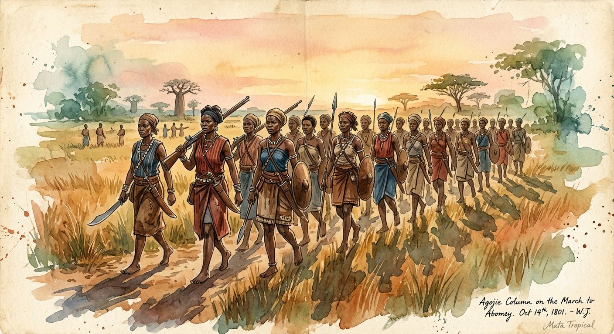
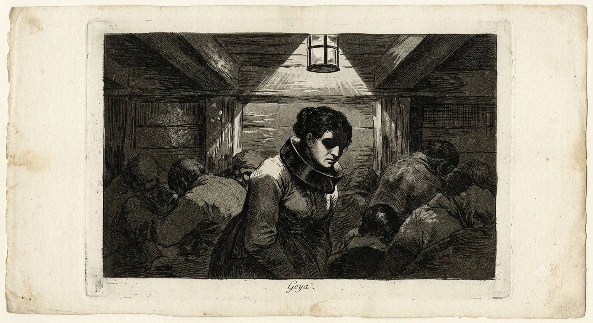
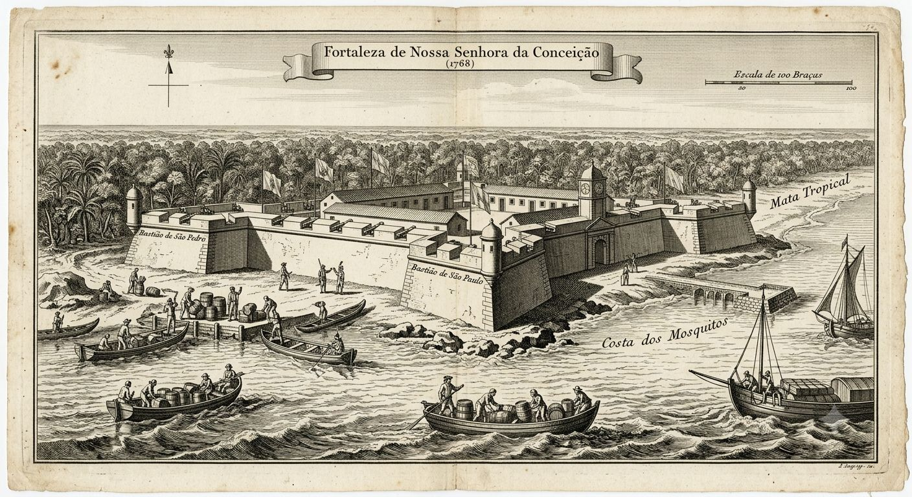

---
title: Afryka Subsaharyjska
tags: [afryka, krolestwa, handel, niewolnictwo, islam, magia, spoleczenstwo, historia]
aliases: ["Afryka Subsaharyjska", Afryka Subsaharyjska (1802), Sub-Saharan Africa, Afryka, Czarna Afryka, Africa]
---

# Afryka Subsaharyjska

Na południe od Sahary żyje sto, może sto dwadzieścia milionów ludzi w setkach państw, emiratów, królestw i wspólnot pasterskich, których Europa przez trzysta lat nie podbiła. Europejskie mapy mają dokładne wybrzeże i białą plamę w środku. Kilkuset białych mieszka tu na stałe — w nadmorskich faktoriach, w Kapsztadzie, w Luandzie — a cała reszta kontynentu rządzi się sama.

Jedynym wielkim interesem, jaki Europa z Afryką prowadzi, jest handel ludźmi: od XVI wieku Atlantyk zabrał z Afryki Zachodniej i Środkowej ponad dziesięć milionów osób. Państwa, które dostarczały jeńców, zbroiły się europejskim towarem; ziemie, z których ich brano, pustoszały przez pokolenia.

Wnętrza nie podbito z trzech powodów naraz: odległości, choroby i magii. Afryka jest matecznikiem mocy, którą Nowy Świat nazwie Voodoo, a jedyne, czym biały człowiek umie jej dotknąć, to ołów.

---

## Kontynent, którego nikt nie podbił

Mapa europejskiej obecności to sznur nadmorskich fortów i faktorii, ani jeden w głębi lądu. Na Złotym Wybrzeżu stoją Cape Coast Castle i Elmina, na Wybrzeżu Niewolniczym Ouidah, w Senegambii Gorée, w Angoli Luanda, na wschodzie Mozambik, na południu Kapsztad. Garnizony liczą po kilkudziesięciu ludzi. Wszystkie żyją z handlu i żaden nie wychodzi za mury bez zaproszenia, bo za murami zaczyna się Afryka, która ich nie potrzebuje.

Wnętrze trzymają potężne, zorganizowane państwa — Oyo, Aszanti, Dahomej, miasta Hausa, Kongo, imperia Luba i Lunda, o których biali nie wiedzą nawet z nazwy — z armiami liczonymi w dziesiątkach tysięcy i z bronią palną kupowaną od tych samych Europejczyków, którzy chcieliby ich podbić. Do tego dochodzi choroba, która zabija przybyszów szybciej, niż zdążą cokolwiek osiągnąć, oraz magia, broniąca każdej piędzi ziemi poza zasięgiem ołowiu.

Afryka roku 1802 jest kontynentem suwerennym w stopniu, jakiego XIX-wieczna Europa wkrótce nie będzie chciała pamiętać. Podbój przyjdzie dopiero za trzy pokolenia, gdy chinina pokona malarię, karabin maszynowy pokona armie, a tani ołów w przemysłowej ilości pokona w końcu magię. W 1802 roku żadnej z tych rzeczy nie ma jeszcze w komplecie.

> [!rules]
> **Afryka Subsaharyjska (1802)**
> **Ludność:** ~100–120 mln
> **Obecność europejska:** nadmorskie forty i faktorie (Gorée, Cape Coast, Elmina, Ouidah, Luanda, Mozambik, Kapsztad)
> **Wielkie państwa:** Oyo, Aszanti, Dahomej, miasta Hausa, Kongo, Luba, Lunda, Etiopia
> **Handel z Europą:** głównie niewolnicy (atlantycki), kość słoniowa i złoto
> **Bariery podboju:** odległość, choroba (malaria, żółta febra), zorganizowane państwa, magia
> **Kontra na magię:** ołów — dławi afrykański czar i mistyczne bestie przy zetknięciu

---

## Magia kobiet i ołów

Afryka jest matecznikiem magii, którą Nowy Świat zna pod nazwą Voodoo. Tu jest u źródła, w setkach lokalnych tradycji od Senegalu po Kongo, i wszędzie rządzi się tą samą regułą: moc należy do kobiet. Kapłanki, żeńskie bractwa, matki-królowe i wyrocznie trzymają to, co duchowe, podczas gdy mężczyźni trzymają włócznię i tron. W wielu ludach prawdziwa władza jest podwójna — król rządzi za dnia, lecz to kapłanka mówi, czy bogowie się zgadzają.

Ta magia jest realna i groźna. Wyrocznia, która przeklnie wioskę, kapłanka, która ześle chorobę, kobieta, która rozmawia z umarłymi i każe im wrócić — to codzienna siła, z którą każda władza w Afryce się liczy. Obok niej żyją mistyczne bestie, stworzenia, których europejski przyrodnik nie ma w żadnym katalogu, gęstniejące w głębi lądu, gdzie biała noga nie postała.

I jest jedna rzecz, która to wszystko wyłącza: ołów. Afrykańska magia i afrykańskie bestie milkną w obecności ołowiu — metal dławi moc przy zetknięciu, gasi czar, ścina bestię do zwykłego zwierzęcia. Europejczycy odkryli to wcześnie i zbudowali na tym cały swój dostęp do kontynentu. Nadmorskie forty są podbite ołowiem; obroża z ołowiu na szyi schwytanej kobiety odcina ją od mocy na czas rejsu, a takie obroże odlewa się masowo, tysiącami, bo bez nich żaden statek nie dowiózłby żywej wiedźmy przez ocean.

Stąd kształt całej europejskiej obecności. Ołów jest tani, powtarzalny, lany w każdej hucie — i właśnie dlatego bije magię rzadką i wrodzoną, tak jak muszkiet bije adepta. Lecz ołów broni tylko punktu. Można obłożyć nim fort i okuć nim jeńca, nie da się obłożyć nim maszerującej armii ani kolonii w głębi lądu. Dlatego Europa od trzystu lat siedzi na skraju Afryki jak pasożyt na ranie: trzyma wybrzeże, faktorię, pokład niewolniczego statku, a wszystko poza zasięgiem ołowiu — czyli niemal cały kontynent — należy do Afrykanów, ich bogów, ich bestii i ich chorób.

Bo choroba dokańcza dzieła magii. Malaria i żółta febra zabijają białych szybciej, niż ci zdążą cokolwiek podbić — wybrzeże Afryki Zachodniej Europejczycy nazywają grobem białego człowieka, gdzie garnizon fortu wymienia się co parę lat, bo poprzedni wymarł. Ołów chroni przed czarem, lecz nie przed komarem.

---

## Handel ludźmi w dwie strony

Afryka eksportuje ludzi w dwóch kierunkach naraz. Większy strumień płynie przez Atlantyk do Nowego Świata, na plantacje cukru, tytoniu i bawełny, i w 1802 roku wciąż sięga osiemdziesięciu tysięcy osób rocznie u szczytu, mimo że w Londynie rośnie ruch abolicyjny, który za pięć lat zakaże Brytyjczykom tego handlu. Mniejszy, lecz starszy o wieki strumień idzie przez Saharę na północ, do Maghrebu i Arabii, karawanami opisanymi przy [[Korsarze Barbarii|regencjach berberyjskich]].

Dostawcami są same państwa afrykańskie. Dahomej co roku wyrusza na zorganizowane polowanie na ludzi — jego elitarne oddziały to Agojie, korpus kobiet-żołnierzy szkolonych od dziecka, które europejscy obserwatorzy uznają za groźniejsze od męskich pułków — i sprzedaje jeńców przez Ouidah po ustalonej stawce za głowę, płatnej w tkaninie, alkoholu i broni. Tą bronią kupuje kolejne polowanie. Oyo finansuje armię eksportem przez własne porty, Aszanti dorzuca jeńców do złota, a niezliczone mniejsze ludy sprzedają pojmanych z wojen sąsiedzkich. Handel sam się napędza: broń kupiona za niewolników służy do brania następnych.

To na tym szlaku ołów pokazuje swoją drugą twarz. Schwytany trafia w obrożę, a jeśli jest w nim moc — kapłanka, wiedźma, ktoś, kto mógłby przekląć ładownię — obroża jest z ołowiu i nie schodzi mu z szyi aż za ocean. Tak rzadka, potężna magia ląduje skuta obok zwykłych ludzi, wyłączona tanim metalem. Diaspora odbuduje ją po drugiej stronie, w Saint-Domingue i na Południu, gdy tylko obroże opadną — lecz to już historia [[Haiti|innych brzegów]].

---

## Sahel i wyżyna — wiary i państwa

Religijnie i magicznie Afryka dzieli się z grubsza na dwie. Las i wybrzeże należą do tradycyjnych kultów i kobiecej mocy. Sahel — pas suchej sawanny pod Saharą — od tysiąca lat należy do islamu, przyniesionego transsaharyjskim handlem, a tamtejsi święci czerpią z tej samej baraki co marabuci Maghrebu, mocy, której ołów nie tyka, bo należy ona do [[Cudotwórcy|cudu]] Abrahama, obcego afrykańskiemu czarowi.

Sahel właśnie wrze. Usman dan Fodio, uczony Fulani z Gobiru, od lat głosi powrót do czystego islamu i potępia władców Hausa jako muzułmanów tylko z nazwy; w 1802 roku jego spór z sułtanem Gobiru jest o włos od wybuchu, a dwa lata później ogłosi dżihad, który zrodzi sułtanat Sokoto, największe państwo Afryki XIX wieku. To kolejny z serii reformatorskich dżihadów Sahelu, tym razem na ogromną skalę. Miasta Hausa, jak czterdziestotysięczne Kano z tkactwem porównywanym do angielskich manufaktur, są centrami tego świata, a Timbuktu, choć politycznie podupadłe pod Marokiem od 1591 roku, wciąż przechowuje w medresie Sankore tysiące arabskich rękopisów.

Na wyżynie Rogu trwa najstarsze chrześcijaństwo kontynentu. Etiopia wyznaje wiarę Tewahedo od IV wieku, własną, monofizycką, oddzieloną od Rzymu i od prawosławia, i nigdy nie dała się podbić. W 1802 roku cesarz z dynastii salomońskiej siedzi w Gondarze jak trofeum, a faktyczną władzę dzierżą regionalni rasowie w epoce zwanej Zemene Mesafint, Erą Książąt — układ bliźniaczo podobny do japońskiego, gdzie cesarz jest świętym symbolem, a wojownik rządzi. Wschodnie wybrzeże od Mombasy po Kilwę żyje pod islamem i rosnącą ręką Omanu, handlując kością słoniową i niewolnikami przez Zanzibar ku Arabii i Indiom.

---

## Kongo, Angola i południe

Afryka Środkowa nosi ślad najstarszego spotkania z Europą. Królestwo Kongo przyjęło katolicyzm w 1491 roku — jego król pisał do papieża i słał posłów do Lizbony — lecz handel niewolnikami rozsadził je od środka, gdy klany konkurowały o europejski towar, sprzedając jeńców z sąsiednich. Dziś król w São Salvador jest postacią symboliczną, a realną władzę mają prowincjonalni panowie, każdy z własną polityką wobec portugalskiej Luandy. Pamięć Kongo wciąż żywi prorokini Beatriz Kimpa Vita, spalona w 1706 roku za głoszenie, że Chrystus narodził się czarny i kongijski — opowieść ustna, nigdzie nie wydrukowana, niezniszczalna.

Luanda, stolica portugalskiej Angoli, jest największym miastem regionu i główną bramą atlantyckiego handlu ludźmi, opisaną szerzej przy [[Portugalia|Portugalii]]. Żyje w niej warstwa luso-afrykańskich rodzin kupieckich, od pokoleń ani w pełni europejskich, ani afrykańskich.

Na samym południu leży jedyna osadnicza kolonia kontynentu. Kapsztad, założony przez Holendrów w 1652 roku, w 1802 roku przechodzi z rąk do rąk między Holandią a Brytanią; mieszka w nim ludność mieszana — Burowie, brytyjscy urzędnicy, muzułmańscy niewolnicy z Malajów, Khoi. W głębi wędrowni Burowie napierają na wschód, gdzie za rzeką Fish trwa od trzydziestu lat wojna graniczna z ludem Xhosa. Dalej na wschodnim wybrzeżu pasie bydło chłopiec z klanu Zulu imieniem Shaka, którego nikt jeszcze nie zna; za jego sprawą za niecałe dwadzieścia lat południe Afryki przejdzie przez demograficzny kataklizm, jakiego ten kontynent dawno nie widział.

---

*Powiązane artykuły: [[Handel Trójkątny]], [[Korsarze Barbarii]], [[Haiti]], [[Portugalia]], [[Wielka Brytania]], [[Voodoo]], [[Cudotwórcy]], [[Punkty rozbieżności]], [[Chronologia]].*

