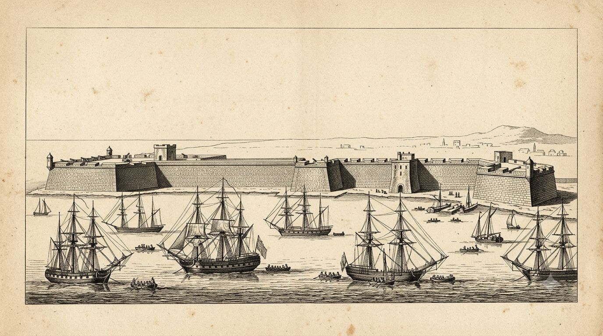
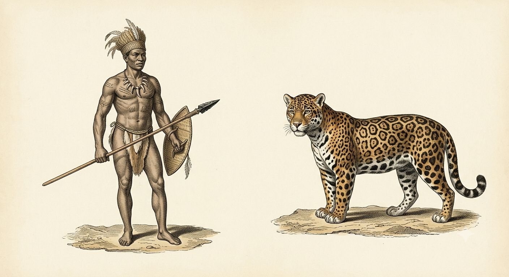
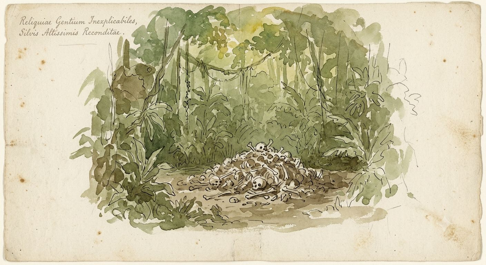

# Ameryka Południowa

Kolonizacja Ameryki Południowej zatrzymała się na obręczy. Wybrzeże, wyżyny andyjskie i pas kilkuset kilometrów w głąb — to wszystko należy do Hiszpanii i Portugalii. Reszta kontynentu, dżungla ciągnąca się przez dorzecze Amazonki i Orinoko, należy do [[Charau-Ka]].

Dwie korony trzymają porty, plantacje i kopalnie od trzystu lat i nie posunęły granicy realnego władania ani o sto kilometrów głębiej niż w pierwszym pokoleniu podboju. Bogactwo kontynentu — złoto, szmaragdy, kora chinowa, cukier — leży w większości w zasięgu tej obręczy. To, czego strzeże interior, zostaje niedotknięte nie z braku chęci, lecz z braku możliwości.

---

## Geografia kolonizacji

Administracja hiszpańska dzieli kontynent na trzy wicekrólestwa. Peru, ze stolicą w Limie, istnieje od 1542 roku i obejmuje wybrzeże Pacyfiku oraz wyżyny andyjskie od Ekwadoru po Chile. Nowa Grenada, ze stolicą w Santa Fe de Bogotá, ustabilizowała się w obecnych granicach w 1739 roku i trzyma północ kontynentu — dzisiejszą Kolumbię, Wenezuelę, Panamę. Río de la Plata, najmłodsze z trzech, wydzielone z Peru w 1776 roku ze stolicą w Buenos Aires, broni ujścia wielkiej rzeki przed portugalską ekspansją z północy.

Portugalska Brazylia rządzi się inaczej — systemem kapitanatów rozciągniętych wzdłuż wybrzeża od czasów kolonizacji w XVI wieku. Stolica przeniosła się z Salvadoru do Rio de Janeiro w 1763 roku. Oficjalnym powodem było złoto Minas Gerais, odkryte pod koniec poprzedniego stulecia i wydobywane w głębi lądu bliżej Rio niż Salvadoru. Nieoficjalnym powodem jest położenie — Rio leży dalej od najgorszych odcinków granicy z interiorem niż porty na północy kolonii.

Andy dzielą kontynent na dwa osobne światy. Wyżynne Peru dziedziczy struktury inkaskie i nigdy nie graniczyło bezpośrednio z terytorium Charau-Ka — góry są zbyt wysokie i zbyt suche dla dżungli, którą Charau-Ka zamieszkują. Niziny Amazonii to inna sprawa. Tam kolonia kończy się dosłownie na brzegu rzeki, a druga strona nie ma nazwy na żadnej oficjalnej mapie.

Cartagena de Indias na wybrzeżu Nowej Grenady jest najlepiej ufortyfikowanym miastem obu Ameryk, z murami budowanymi ponad dwieście lat. Oficjalnie broni portu przed korsarzami. Garnizon wie, że mury służą też jako ostatnia linia, gdyby coś z interioru kiedykolwiek ruszyło na wybrzeże zorganizowaną siłą. Asunción w Paragwaju, najdalej na południe wysunięte miasto graniczące bezpośrednio z ziemią poza kontrolą Korony, nazywa wszystko za rzeką po prostu „tamtą stroną" — nazwa nie wymaga wyjaśnienia nikomu, kto tam mieszka.

Żadna korona nie rozwiązała problemu interioru siłą, bo żadna nie miała ku temu środków. Ekspedycja karna wysłana w głąb dżungli traci ludzi do choroby i wyczerpania szybciej, niż zdąży spotkać wroga, a wroga, którego spotka, nie da się rozbić w jednej bitwie — Charau-Ka nie mają stolicy do zdobycia ani armii do rozgromienia w polu. Podbój na wzór meksykański czy peruwiański wymaga przeciwnika zorganizowanego wokół jednego centrum władzy. Interior takiego centrum nie ma.

> [!rules]
> **Poziom techniki interioru:** poniżej TL0 — Charau-Ka i ludy o zatrutej krwi nie znają metalurgii
> **Zasięg realnej kontroli kolonialnej:** wybrzeże i pas do ok. 200–400 km w głąb lądu, zależnie od regionu; Andy pod pełną kontrolą, Amazonia poza nią niemal całkowicie
> **Ekspedycja karna w głąb interioru:** brak precedensu sukcesu; strata logistyczna i chorobowa przewyższa jakikolwiek możliwy zysk

## Charau-Ka

[[Charau-Ka]] nie budują niczego trwałego. Ich obozowiska przemieszczają się z porą deszczową i suchą, a jedynymi stałymi punktami na terytorium są miejsca rytualne — polany oznaczone stosami kości gromadzonymi przez pokolenia, czasem starszymi niż jakiekolwiek europejskie osadnictwo na kontynencie. Nie znają metalurgii. Ich broń to zaostrzone kości, kamień i uzbrojenie zdarte z martwych kolonistów, noszone bez zrozumienia pierwotnego przeznaczenia — muszkiet trzymany jak maczuga, bo nikt nie nauczył ich ładować prochu.

Rangę w grupie wyznacza liczba przywołanych demonów, nie siła fizyczna. Najstarszy druid bywa fizycznie najsłabszym osobnikiem w stadzie i mimo to nietykalnym — jego wartość leży w tym, co potrafi ściągnąć z otchłani, nie w tym, co potrafi zrobić własnymi rękami. Demonologia jest dla Charau-Ka nie dodatkiem do wojny, lecz jej podstawowym narzędziem: pojedynczy druid, który przywoła choćby jednego [[Daemony|demona]], zmienia bandę z zagrożenia lokalnego w zagrożenie regionalne.

> [!mechanics]
> **System:** Demonologist (GURPS Dungeon Fantasy 9: Summoners) dla druidów Charau-Ka
> **Hierarchia grupy:** ranga proporcjonalna do liczby i mocy przywołanych bytów, nie do cech fizycznych
> **Uzbrojenie zdobyczne:** broń palna w rękach Charau-Ka używana niewłaściwie — traktowana jak broń obuchowa, nie strzelecka

Plotka o czterorękich, gigantycznych królach-gorylach stojących na czele największych band ma jedno źródło: przemycony, nigdy oficjalnie niewydany dziennik jezuickiego misjonarza, krążący w odpisach wśród zakonników, którzy oficjalnie zaprzeczają jego istnieniu. Żaden Europejczyk, który miał widzieć taką istotę z bliska, nie wrócił, by potwierdzić relację z pierwszej ręki.

Charau-Ka omijają konkretne wodospady i gaje, które trzyma się za niebezpieczne z powodów innych niż zwykłe drapieżniki. [[Żywiołaki]] tego świata są instynktownymi strażnikami natury, reagującymi agresją na obecność bytów spoza planu materialnego — a demon przywołany zbyt blisko takiego miejsca budzi coś, co nie rozróżnia między intruzem a przywołującym. Bandy Charau-Ka nauczyły się rozpoznawać te strefy i szeroko je obchodzić. Koloniści i ocalałe ludzkie plemiona odczytują to jako naturalną granicę terytorialną, nie rozumiejąc mechanizmu, który ją wyznacza.

Legenda krążąca wyłącznie wśród samych Charau-Ka, nieznana kolonistom, mówi o białym, pozbawionym barwy praojcu, który pewnego dnia powróci i zjednoczy wszystkie stada pod jednym sztandarem. Legenda jest organiczna, nie zasiana świadomie — a w tym świecie oznacza to, że w przeciwieństwie do króla Artura naprawdę może się spełnić, bo tylko historie ułożone celowo nigdy się nie ziszczają.

Spełniła się już raz, choć żadna europejska kronika nie zapisała tego w ten sposób. Podczas jednego z największych najazdów na pogranicze Nowej Grenady, w połowie zeszłego wieku, hiszpańska ekspedycja karna zgłosiła zabicie przywódcy hordy — istoty opisanej w raporcie jako olbrzymi, pozbawiony pigmentu samiec na czele setek napastników. Oficjalna relacja odnotowała to jako sukces i zamknęła sprawę. Żaden urzędnik nie zestawił tego incydentu z podobnymi zapiskami sprzed stu lat, opisującymi niemal identyczną istotę w innej prowincji. To nie był kolejny albinos w kolejnym pokoleniu. To był ten sam byt, wracający po tym, jak coś, co koloniści wzięli za śmierć, okazało się jedynie przerwą.

## Ludy o zatrutej krwi

Interior nie należy wyłącznie do Charau-Ka. Rozproszone po dżungli plemiona ludzkie, mentalnie i fizycznie bliskie ludom Ameryki Północnej, zawarły swój własny pakt z kontynentem — nie ze [[Smoki|smokami]], lecz z trującą roślinnością, do tego stopnia że ich krew stała się trucizną przy kontakcie z otwartą raną. Koloniści nazywają je zbiorczo zdegenerowanymi, bo nie rozumieją, że to, co widzą jako degenerację, jest wynikiem pokoleń świadomego dostrajania ciała do środowiska, którego żaden Europejczyk nie przetrwałby bez zmiany.

Te ludy są terytorialne, nie nomadyczne jak Charau-Ka, i bronią granic swoich łowisk równie zaciekle jak plemiona Ameryki Północnej bronią swoich rzek. Rywalizują z Charau-Ka o te same zasoby dżungli od pokoleń, lecz rywalizacja rzadko przechodzi w otwartą wojnę. Dżungla jest środowiskiem na tyle wymagającym, że obie strony poświęcają większość energii na samo przetrwanie — głód, choroba i drapieżniki zabijają więcej niż jakikolwiek konflikt międzyplemienny. Charau-Ka, bardziej nomadyczne, częściej po prostu omijają terytoria dobrze bronione, niż ryzykują starcie, które osłabi ich bandę przed kolejnym przemarszem.

Nie każda kolonia przybrzeżna przetrwała z tego samego powodu, co sąsiednia. Część osad odniosła sukces tam, gdzie żaden gubernator nigdy nie dowiedział się dlaczego — w bliskim sąsiedztwie akurat mniej agresywnego z tych ludów, którego obecność ograniczała aktywność band Charau-Ka na danym odcinku wybrzeża. Nikt w Madrycie ani Lizbonie nie zna tej zależności. Zapisuje się ją jako łut szczęścia albo dobrą lokalizację portu, nie jako skutek sąsiedztwa, o którym administracja nie ma pojęcia.

Jezuiccy etnografowie, którzy spędzili dekady wśród ludów interioru, wysuwają teorię budzącą wściekłość na dworach obu koron: że najbardziej cywilizowane ludy przedkolumbijskiego kontynentu — Majowie, Inkowie — były po prostu najbardziej osiadłymi, najmocniej ku miastu skłonnymi odłamami tej samej, szerszej rodziny ludów o zatrutej krwi, tyle że przeniesionymi w góry i na tereny poza zasięgiem najgorszej dżungli, gdzie więź z trującą roślinnością osłabła przez pokolenia do śladowego poziomu. Teoria opiera się na fragmentarycznych echach językowych i rytualnych, nigdy w pełni nie potwierdzonych. Większość oficjalnej nauki kolonialnej odrzuca ją stanowczo — uznanie budowniczych imperiów inkaskiego i majańskiego za odłam tego samego ludu, który dziś nazywa się dzikim, byłoby politycznie nie do przyjęcia dla korony rządzącej w imię cywilizacyjnej wyższości.

Kasta wojownicza tych ludów rzadko walczy bronią w ludzkiej postaci. Najsilniejsi wojownicy posiadają zdolność przemiany w jaguara albo, częściej, nawiązania z konkretnym jaguarem więzi bliskiej temu, co Ameryka Północna zna jako [[Dwudusze|Dwuduszę]]. Grupa jaguarów napotkana w dżungli nie musi być bandą zwierząt. Równie dobrze może być wyprawą wojenną, a strzelec, który otworzy ogień, zanim to sprawdzi, dowiaduje się różnicy zbyt późno.

Ich magia opiera się na nurcie druidyckim, rytualnym, bliskim temu, co praktykują szamani rdzennych narodów Ameryki Północnej, lecz z jedną różnicą kluczową dla mechaniki. Krew przelana w trakcie rytuału — zwierzęca, czasem ludzka, zawsze dobrowolna ze strony ofiarodawcy w obrębie własnego ludu — realnie wzmacnia zasięg i moc obrzędu. Rytuał odprawiony bez krwi działa słabo i lokalnie. Rytuał podlany krwią sięga dalej i trwa dłużej.

Świadome spożywanie trucizn jest praktyką jednocześnie rekreacyjną i wojskową. Regularne, kontrolowane dawki hartują ciało, budując odporność, której żaden kolonista nie osiągnie bez tych samych, rozłożonych na lata rytuałów. W walce te ludy sięgają po truciznę na dziesiątki sposobów — zatrute groty dmuchawek, ostrza nasączone wyciągiem z korzeni, a u najbardziej doświadczonych wojowników sam pot i krew, wystarczające, by zabić przeciwnika dotykającego otwartej rany bez świadomości ryzyka.

> [!mechanics]
> **Rytuał druidycki:** Path/Book Ritual Magic (GURPS Thaumatology); ofiara krwi jako modyfikator obszarowy — dodatkowy zasięg i czas trwania efektu proporcjonalny do ilości przelanej krwi
> **Kasta wojownicza — przemiana:** Morph (jedna forma, jaguar) albo unikalny Ally klasy Dwudusza, analogicznie do więzi rdzennych narodów Ameryki Północnej ze smokami
> **Odporność na truciznę:** Injury Tolerance (Poison Resistance) lub High Pain Threshold jako cecha kulturowo powszechna wśród dorosłych wojowników
> **Krew jako broń kontaktowa:** Toxic Attack (Contact Agent) — otwarta rana dotknięta krwią lub potem wojownika ulega zatruciu

Jedna, konkretna legenda krąży wśród hiszpańskich osadników pogranicza Nowej Grenady, różna od ogólnej reguły zatrutej krwi. Dotyczy jednego klanu, nie całego ludu: potomków rzekomo zaginionej ekspedycji kolonialnej sprzed niemal dwustu lat, która wżeniła się w miejscowe plemię i z czasem przejęła jego więź z trującą roślinnością. Członkowie tego klanu mają podobno jaśniejszą karnację niż sąsiednie ludy, a w ich obrzędach powtarzają się fragmenty słów brzmiących jak zniekształcona hiszpańszczyzna sprzed pokoleń. Nikt tego klanu formalnie nie zlokalizował. Legenda przetrwała mimo to, bo tłumaczy coś, czego czysta biologia nie tłumaczy — dlaczego niektórzy z tych, których korona nazywa dzikimi, noszą imiona brzmiące niepokojąco znajomo.

## Ekspedycje i ślady w historii

Bandeiranci z São Paulo, słynący z polowań na niewolników w głębi kontynentu od XVII wieku, trzymają się sprawdzonych, znanych szlaków. Bandy, które w poprzednich pokoleniach zboczyły w nieznane rejony w poszukiwaniu łatwiejszego łupu, po prostu nie wróciły. Nikt formalnie nie zbadał ich losu — administracja kolonialna woli zapis „zaginęli w dżungli" od dochodzenia, które musiałoby wyjaśnić dlaczego.

Redukcje jezuickie w Paragwaju, samorządne osady Guaranich pod opieką zakonu, są jednym z nielicznych miejsc, gdzie ludzie żyją blisko granicy Charau-Ka bez katastrofy. Miejscowi kapłani przypisują to guarańskim obrzędom ochronnym wplecionym w katolicką liturgię — obrzędom, które, jak podejrzewają nieliczni bardziej dociekliwi bracia zakonni, noszą ślad tej samej, dawnej więzi z roślinnością, jaką mają ludy interioru, tyle że oswojonej i skanalizowanej przez wieki osiadłego rolnictwa. Rzym oficjalnie tego nie potwierdza. Kasata zakonu jezuitów w 1767 roku na ziemiach hiszpańskich zostawia redukcje bez opieki, która je chroniła. W kolejnych dekadach kilka z nich znika z map bez wyjaśnienia, a hiszpańscy urzędnicy wolą nie dociekać dlaczego.

Francisco de Orellana spłynął całą Amazonką w latach 1541 i 1542, szukając legendarnej krainy cynamonu, i zgłosił starcie z wojowniczymi kobietami, od których rzeka wzięła nazwę. Oficjalna historia traktuje to jako przesadzoną relację wyczerpanego podróżnika. Nieliczni badacze tematu podejrzewają coś innego — że Orellana natknął się na oddział wojowników z kasty jaguarowej w trakcie przemiany albo tuż po niej, coś, czego nie potrafił opisać własnym słownictwem, więc opisał to najbliższą znaną mu legendą z greckich kronik.

Lope de Aguirre, hiszpański konkwistador, który w latach sześćdziesiątych XVI wieku zbuntował się podczas nieudanej wyprawy po El Dorado i ogłosił niezależność od Korony, nim zginął z rąk własnych ludzi, jest dziś postacią na wpół legendarną wśród osadników pogranicza — ostrzeżeniem, co dżungla robi z ambicją bez granic. Sama legenda El Dorado wywodzi się z realnego obrzędu ludu Muisca w Kolumbii, w którym nowy władca pokryty złotym pyłem zanurzał się w jeziorze Guatavita. Żadna ekspedycja szukająca złotego miasta niczego takiego nie znalazła, bo miasto nigdy nie istniało. Znalazła za to więcej niż jeden szlak prowadzący prosto w ziemie, w które nikt nie powinien wchodzić bez powodu ważniejszego niż plotka o złocie.

Powstanie Túpac Amaru II w Peru, lata 1780–1783, rozgrywa się wyłącznie na wyżynach andyjskich, z dala od interioru i jego zagrożeń. Korona odetchnęła, że przynajmniej ten bunt nie zmuszał jej do walki na dwóch frontach naraz.

## Gospodarka warta ryzyka

Złoto Minas Gerais, odkryte pod koniec XVII wieku, ciągnie osadników w głąb Brazylii skuteczniej niż jakikolwiek rozkaz Korony. To tam, nie w Amazonii, kolonizacja realnie się pogłębia — złoża leżą wystarczająco blisko wybrzeża, by ominąć najgorsze odcinki interioru, choć nie na tyle blisko, żeby górnicy czuli się w pełni bezpiecznie.

Szmaragdy z kopalni Muzo w Kolumbii, eksploatowanych przez Koronę hiszpańską od połowy XVI wieku, należą do najczystszych na świecie. Górnicy przysięgają, że część kamieni wydobywanych najgłębiej ma barwę odrobinę zbyt intensywną, by uznać to za zwykły przypadek natury geologicznej.

Kora chinowa z peruwiańskich wyżyn, znana jako lek na febrę od XVII wieku, jest jednym z niewielu towarów kontynentu, których zdobycie nie wymaga wejścia na ziemie Charau-Ka. Legenda przypisuje jej odkrycie hrabinie Chinchón, rzekomo uleczonej z gorączki korą podaną przez miejscowych — większość dzisiejszych badaczy uważa tę historię za późniejszy wymysł bez podstaw w źródłach. Handlarze korą na peruwiańskim pograniczu twierdzą, że najsilniejsze drzewa rosną najbliżej granicy terytorium ludów o zatrutej krwi. To nie przypadek. Ich rytuały są na wpół druidyckie i regularnie zraszają glebę krwią jako częścią obrzędu wzrostu — praktyka, która realnie wzmacnia okoliczną roślinność, korę chinową włącznie, choć żaden europejski botanik jeszcze tego nie powiązał.

Plantacje trzciny cukrowej wybrzeża Brazylii, gospodarcze serce kolonii, nie potrzebują ani jednego kilometra w głąb lądu. Korona portugalska nigdy nie musiała rozwiązywać problemu Charau-Ka siłą, bo gospodarka kolonii nigdy tego nie wymagała — a nawet gdyby zdecydowała się spróbować, żadna dostępna jej armia nie poradziłaby sobie z przeciwnikiem bez stolicy, bez pola bitwy i bez granicy, którą dałoby się przekroczyć raz na zawsze.

## Znaki w krajobrazie

Rzeka w porze deszczowej bywa lokalnie czerwonawa w miejscach oddalonych od jakiegokolwiek naturalnego źródła osadu. Koloniści winią muł znoszony z górnego biegu. Ludy interioru wiedzą więcej — to spływ z wielkich, sezonowych rytuałów wzrostu, podczas których krew ofiarna wlewana jest do dopływów raz w roku, zawsze o tej samej porze, zawsze w tych samych miejscach.

W głębi jednej z granicznych prowincji znaleziono opuszczony portugalski fort, w pełni zaopatrzony, z klatkami skonstruowanymi na coś większego niż zwierzę gospodarskie. Garnizonu nigdy nie odnaleziono. Raport zamknięto jako dezercję zbiorową, choć żaden oficer, który go podpisywał, nie potrafił wyjaśnić klatek.

Nieformalny pakt między Madrytem a Lizboną zakłada wzajemne informowanie się o poważnych incydentach granicznych z Charau-Ka. To jedyny znany przypadek, w którym dwie rywalizujące korony kolonialne dzielą się czymkolwiek dobrowolnie, bez traktatu i bez targów o terytorium.

Niektórzy koloniści twierdzą, że słyszeli w głębi puszczy śpiew w języku, którego nie mówi żadne znane plemię — melodię obcą, a mimo to niepokojąco bliską starym pieśniom liturgicznym, jakby ktoś nauczył się ich od misjonarzy i przerobił po swojemu. Nikt tego nie zbadał z bliska. Nikt, kto poszedł zbadać, nie wrócił z odpowiedzią.

## Stan na 1802 rok

Każde z trzech hiszpańskich wicekrólestw traktuje problem Charau-Ka jako sprawę sąsiada. Peru zrzuca go na Nową Grenadę, Nowa Grenada na Brazylię, a żadna metropolia europejska nie stawia go wyżej niż daleki, drugorzędny punkt na liście priorytetów wobec wojen napoleońskich toczonych o kontynent, na którym te wojny się rozgrywają. Interior kontynentu czeka, obojętny na to, czyja flaga powiewa nad portem sto mil od jego granicy.

---

*Powiązane artykuły: [[Hiszpania]], [[Portugalia]], [[Nowa Hiszpania]], [[Rdzenne narody Ameryki Północnej]], [[Smoki]], [[Daemony]], [[Żywiołaki]], [[Fey]], [[Europejskie czarostwo]], [[Punkty rozbieżności]], [[Chronologia]].*

