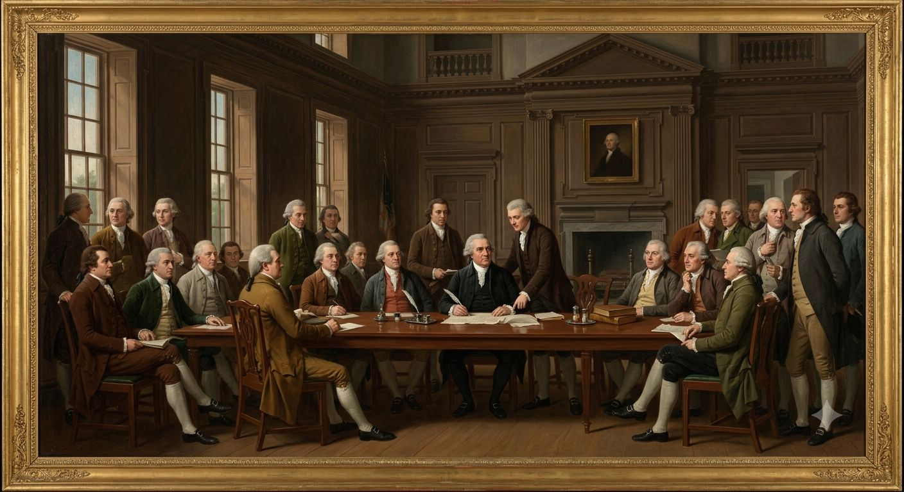
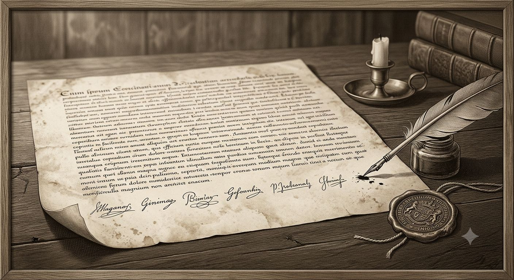

---
title: Amerykańska Konstytucja
tags: [usa, prawo, polityka, historia, konstytucja]
aliases: ["Amerykańska Konstytucja", Pierwsza poprawka, Pierwsza Poprawka, Konstytucja Stanów Zjednoczonych, US Constitution, Bill of Rights, Karta Praw]
---

# Amerykańska Konstytucja

Konstytucja Stanów Zjednoczonych weszła w życie w 1789 roku, a jedenaście poprawek — dziesięć z Karty Praw i jedna dodatkowa z 1795 roku — to cały jej dorobek do roku 1802. Tekst nie wspomina magii ani jednym słowem. Sędziowie i prawnicy interpretują go tak, jakby to milczenie było wyborem, nie przeoczeniem — a w praktyce oznacza to, że każdy stan rozstrzyga sprawy [[Cudotwórcy|Cudu]], [[Voodoo]] i podejrzanej magii na własną rękę, bez jednej federalnej linii.

Ten dokument omawia fundamenty ustroju skrótowo — pełny obraz partii, sądów i polityki Jeffersona niesie [[Stany Zjednoczone]] — i skupia się na tekście samej konstytucji: co mówi litera prawa i gdzie jej zasięg okazuje się w tym świecie szerszy, węższy albo dokładnie taki sam jak w historii, którą zna każdy student prawa.

---

## Fundamenty (1787–1789)

Konwencja w Filadelfii latem 1787 roku zastąpiła słabe Artykuły Konfederacji nowym ustrojem: trójpodział władzy, Kongres dwuizbowy, prezydent wybierany przez Kolegium Elektorów, sądownictwo federalne na czele z Sądem Najwyższym. Ratyfikacja zajęła dziewięć miesięcy; dokument wszedł w życie w marcu 1789 roku.

Kompromis trzech piątych, wpisany w artykuł pierwszy, każe liczyć każdego zniewolonego jako trzy piąte osoby przy ustalaniu reprezentacji w Izbie i głosów w Kolegium Elektorów. Klauzula ta nie wspomina magii, lecz jej matematyka nie zna wyjątku — zniewolona kobieta, której duszę Kościół uznaje za wątpliwą, a której krew po Haiti podejrzewa się o [[Voodoo|moc]], liczy się w spisie tak samo jak każda inna.

Ta sama sekcja dziewiąta artykułu pierwszego zakazuje Kongresowi zabraniania importu „osób, które poszczególne stany uznają za właściwe przyjąć" przed 1808 rokiem — eufemizm dla [[Handel Trójkątny|handlu niewolnikami]], drugi wielki kompromis konwencji obok trzech piątych. Klauzula wygasa sama z siebie: od 1 stycznia 1808 roku Kongres będzie mógł, i zrobi to, zakazać dowozu nowych niewolników z Afryki. Wewnętrzny handel między stanami klauzula nie dotyczy i przetrwa do wojny secesyjnej.

## Karta praw (1791)

Dziesięć pierwszych poprawek weszło w życie w grudniu 1791 roku, cztery lata po samej konstytucji, jako cena za ratyfikację w stanach nieufnych wobec silnego rządu centralnego.

### I Poprawka — wyznanie, słowo, prasa, zgromadzenia

*„Congress shall make no law respecting an establishment of religion, or prohibiting the free exercise thereof; or abridging the freedom of speech, or of the press; or the right of the people peaceably to assemble, and to petition the Government for a redress of grievances."*

W realnej historii to abstrakcja: rząd nie może faworyzować jednego kościoła ani zabraniać praktyk drugiego, bo żadna wiara nie ma dowodu przewagi nad inną. W tym świecie dowód istnieje. [[Cudotwórcy|Cud]] jest realny i sprawdzalny, a mimo to konstytucja nie pozwala rządowi orzekać, czyj Cud pochodzi z nieba, a czyj jest oszustwem — więc prawdziwy uzdrowiciel z Cane Ridge i szarlatan z sąsiedniego namiotu stoją przed prawem jako równi.

Żaden sąd federalny nie zmierzył się jeszcze z pytaniem, czy stanowe prawo zakazujące „oszukańczego uzdrawiania" przetrwa kontrolę konstytucyjną, jeśli przy okazji ukarze prawdziwego cudotwórcę. Wirginia i Karolina Południowa rozstrzygają to poza konstytucją — zakazem nocnych zgromadzeń zniewolonych i tępieniem bębnów, w praktyce łamiąc wolność zgromadzeń i wyznania, bo Bill of Rights, jak dziś interpretowany, chroni wolnych białych obywateli, nie ludzi traktowanych jako własność. Amerykańska prasa, podzielona na organy partyjne, testuje granicę wolności słowa inaczej: gazeta federalistyczna, która nazwie republikańskiego kaznodzieję szarlatanem, ryzykuje proces o zniesławienie, jeśli oskarżony okaże się mieć prawdziwy dar — precedensu w żadną stronę jeszcze nie ma.

### II Poprawka — broń

*„A well regulated Militia, being necessary to the security of a free State, the right of the people to keep and bear Arms, shall not be infringed."*

Klauzula o milicji ma w tym świecie cięższy ciężar gatunkowy niż w naszym. Za Missisipi stoją [[Rdzenne narody Ameryki Północnej|rdzenne narody]] sprzymierzone ze [[Smoki|smokami]], a stanowa milicja pogranicza to jedyna realna obrona osadnictwa — Kentucky i Tennessee domagają się federalnych funduszy na broń wielolufową zdolną razić bestię, zanim ta zbliży się na odległość ataku, a Jefferson, wierny hasłu małego rządu, odmawia.

Prawo do posiadania broni nie obejmuje w praktyce wolnych Czarnych Amerykanów. Wirginia zakazuje im trzymać broń bez zezwolenia — dokładnie ten sam paragraf konstytucji, który uzbraja białego farmera przeciw smoczej granicy, milczy o obywatelu, którego stan uznaje za obywatela drugiej kategorii.

### III Poprawka — kwaterowanie wojska

*„No Soldier shall, in time of peace be quartered in any house, without the consent of the Owner, nor in time of war, but in a manner to be prescribed by law."*

Poprawka pozostaje tym, czym była: reakcją na brytyjskie kwaterunki sprzed wojny o niepodległość, bez zastosowania praktycznego w 1802 roku. Żaden aspekt magii tego świata jej nie dotyka. Sądy nigdy jej nie testowały i nie będą miały powodu przez dziesięciolecia.

### IV Poprawka — przeszukanie i konfiskata

*„The right of the people to be secure in their persons, houses, papers, and effects, against unreasonable searches and seizures, shall not be violated, and no Warrants shall issue, but upon probable cause."*

Marszałkowie federalni nie dysponują żadną metodą wykrywania magii na odległość — to rzemiosło [[Inkwizycja|europejskiej Inkwizycji]], nieprzeniesione na kontynent amerykański. Pytanie, czy przyszła metoda takiego wykrywania liczyłaby się jako przeszukanie wymagające nakazu, pozostaje czysto teoretyczne; żaden sąd go nie postawił, bo narzędzie jeszcze nie istnieje.

Dla zniewolonych czwarta poprawka nie działa wcale. Kwatery na plantacji przeszukuje się bez nakazu, bez podejrzenia i bez konsekwencji, a od 1800 roku robi się to częściej, odkąd Wirginia szuka dowodów praktyk przywiezionych z [[Haiti]].

### V Poprawka — rzetelny proces

*„No person shall be [...] deprived of life, liberty, or property, without due process of law; nor shall private property be taken for public use, without just compensation."*

Klauzula o odszkodowaniu za przejęte mienie rodzi pytanie prawne, którego nikt jeszcze nie zadał głośno: jeśli stan zakaże praktykowania Voodoo, a plantator argumentuje, że zdolności zniewolonej kobiety podnosiły wartość jego „własności", czy zakaz liczy się jako wywłaszczenie wymagające odszkodowania? Logika prawa niewolniczego dopuszcza takie pytanie. Żaden plantator jeszcze go formalnie nie postawił przed sądem — sprawa jest zbyt haniebna nawet jak na standardy epoki, choć prawnicy w Charlestonie wiedzą, że argument istnieje.

### VI Poprawka — proces karny

*„In all criminal prosecutions, the accused shall enjoy the right to a speedy and public trial, by an impartial jury [...] to be confronted with the witnesses against him [...] and to have the Assistance of Counsel."*

Prawo do konfrontacji ze świadkiem nie przewiduje świadka, którego wiarygodność zależy od tego, czy naprawdę widział to, co zeznaje, czy tylko tak mu się wydawało pod wpływem manifestacji. Europejskie sądy inkwizycyjne mają na to własne metody — eliksir prawdy z [[Alchemia|arsenału alchemików]], zeznanie wymuszone głodem informatora w celi z soli i żelaza. Żadna z nich nie przetrwałaby amerykańskiego standardu dobrowolnego zeznania; piąta poprawka zakazuje zmuszania do samooskarżenia, a sąd federalny odrzuciłby dowód uzyskany taką metodą bez wahania, gdyby ktokolwiek próbował go przedstawić.

### VII Poprawka — proces cywilny

*„In Suits at common law, where the value in controversy shall exceed twenty dollars, the right of trial by jury shall be preserved."*

Techniczna klauzula bez zastosowania fantastycznego. Pozwy cywilne powyżej dwudziestu dolarów trafiają przed ławę przysięgłych tak samo, jak trafiałyby w świecie bez smoków i Cudów.

### VIII Poprawka — kary okrutne

*„Excessive bail shall not be required, nor excessive fines imposed, nor cruel and unusual punishments inflicted."*

Żaden sąd federalny nie skazał dotąd nikogo za demonologię ani nekromancję — sprawy tego kalibru nie dotarły jeszcze do systemu prawnego młodej republiki. Spalenie na stosie, wciąż praktykowane w cieniu w niektórych zakątkach Europy, złamałoby ósmą poprawkę bez dyskusji, gdyby stanowy sąd kiedykolwiek je zarządził. Lincz na Południu wobec podejrzanych o praktyki przywiezione z Haiti łamie tę samą zasadę już dziś, bez procesu, bez wyroku i bez nikogo uprawnionego, by się odwołać.

### IX Poprawka — prawa nieenumerowane

*„The enumeration in the Constitution, of certain rights, shall not be construed to deny or disparage others retained by the people."*

Poprawka najbardziej filozoficzna z dziesięciu rodzi w tym świecie pytanie, którego żaden prawnik jeszcze nie sformułował w pozwie: czy prawo do praktykowania realnej, sprawdzalnej magii — nienazwane wprost w żadnym innym miejscu konstytucji — jest jednym z praw „zachowanych przez lud"? Kongres nigdy nie uchwalił ustawy federalnej dotyczącej magii wprost. Dziewiąta poprawka zostawia otwarte, czy to milczenie oznacza brak regulacji, czy przyzwolenie.

### X Poprawka — kompetencje stanów

*„The powers not delegated to the United States by the Constitution, nor prohibited by it to the States, are reserved to the States respectively, or to the people."*

To najważniejsza poprawka tego dokumentu dla kogokolwiek grającego w tym świecie. Federalizm, zaprojektowany żeby rozstrzygać spory o cła i drogi pocztowe, stał się przypadkiem konstytucyjną podstawą całej różnorodności prawnej wobec magii. Wirginia zakazuje zgromadzeń i tępi bębny. Pensylwania milczy, a kwakrzy traktują sprawę jako kwestię sumienia, nie prawa. Nowa Anglia nie ma w ogóle regulacji, bo purytańska nieufność wobec każdej magii „nie-boskiej" załatwia sprawę bez potrzeby ustawy. Żaden stan nie musi tłumaczyć się przed żadnym innym — dziesiąta poprawka gwarantuje to wprost.

## XI Poprawka (1795)

*„The Judicial power of the United States shall not be construed to extend to any Suit in law or equity, commenced or prosecuted against one of the United States by Citizens of another State, or by Citizens or Subjects of any Foreign State."*

Ratyfikowana w reakcji na sprawę Chisholm przeciwko Georgii z 1793 roku, chroni stany przed pozwami cywilnymi wnoszonymi przez obywateli innych stanów lub obcych mocarstw. Zastosowanie pozostaje wąskie i techniczne — dotyczy głównie sporów o długi wojenne. Teoretycznie zamyka drogę francuskiemu poddanemu, który chciałby pozwać stan amerykański o skonfiskowany ładunek kontrabandy, gdyby taki spór kiedykolwiek trafił przed sąd federalny. Nikt jeszcze nie spróbował.

## Poprawka na horyzoncie

Kongres uchwali w grudniu 1803 roku, a stany ratyfikują do czerwca 1804, dwunastą poprawkę — techniczną naprawę mechanizmu Kolegium Elektorów po kryzysie wyborczym 1800 roku, gdy Jefferson i Burr otrzymali tyle samo głosów elektorskich i sprawę musiała rozstrzygnąć Izba Reprezentantów. Poprawka rozdzieli głosowanie na prezydenta i wiceprezydenta osobno. Nie ma żadnego związku z magią — to czysty mechanizm ustrojowy, spóźniona łatka na błąd projektowy sprzed szesnastu lat.

## Poprawki proponowane, nigdy nieuchwalone

Żadna z poniższych nie ma szans przejść przez Kongres w obecnym układzie sił. Wszystkie krążą w pamfletach, debatach stanowych legislatur i korespondencji polityków — materiał gotowy dla kampanii osadzonej w tym okresie.

**Certyfikacja cudotwórców.** Grupa kongresmenów z Nowej Anglii, zaniepokojona skalą Drugiego Wielkiego Przebudzenia, proponuje federalny rejestr uznanych cudotwórców prowadzony przez komisję świecką. Projekt ginie w komisji w ciągu miesiąca — każdy prawnik w Kongresie widzi natychmiast, że to jawne pogwałcenie pierwszej poprawki, a południowi kongresmeni obawiają się, że taki rejestr obejmie też zniewolonych.

**Federalna milicja pogranicza.** Delegacja z Kentucky i Tennessee domaga się poprawki nakazującej Kongresowi finansowanie i uzbrojenie stanowych milicji przeciw zagrożeniom rdzennym i „bestiom pogranicza" — eufemizm, którego żaden oficjalny dokument nie rozwija wprost. Jefferson odrzuca projekt jako sprzeczny z duchem małego rządu, a Wschodnie Wybrzeże nie czuje zagrożenia, którego nigdy nie widziało na oczy.

**Ustawa o nadzorze nad niewolnikami.** Karolina Południowa i Georgia lobbują za poprawką rozszerzającą stanowe zakazy praktyk voodoo na poziom federalny, z jednolitą karą śmierci w całej unii. Północ odrzuca to jako precedens niebezpiecznego rozszerzenia władzy federalnej nad instytucją niewolnictwa — nie z sympatii do zniewolonych, lecz z obawy, że ten sam mechanizm posłuży kiedyś przeciw nim.

**Poprawka o pełnym człowieczeństwie.** Garstka kwakrów i abolicjonistów z Pensylwanii formułuje projekt tak radykalny, że nie ma nawet formalnego sponsora w Kongresie: skoro zniewoleni ludzie manifestują prawdziwe zdolności voodoo na równi z wolnymi, dowodzi to duszy i rozumu równego białemu obywatelowi, a więc podważa samą podstawę prawną niewolnictwa. Argument krąży w prasie abolicjonistycznej. Żaden kongresmen nie odważy się go wnieść formalnie przed rokiem 1802.

**Poprawka przeciw metodom inkwizycyjnym.** Kilku kongresmenów Nowej Anglii, pamiętających Salem sprzed stu dziesięciu lat, proponuje zapis zakazujący jakiejkolwiek władzy w Stanach Zjednoczonych — federalnej czy stanowej — stosowania „europejskich metod dochodzenia w sprawach o czary", z domysłem wymierzonym w plotki o imigrantach sprowadzających praktyki [[Inkwizycja|Inkwizycji]] do Nowego Świata. Projekt umiera z braku poparcia, bo większość Kongresu uznaje zagrożenie za urojone.

**Klauzula tytułów magicznych.** Rozszerzenie klauzuli konstytucji zakazującej tytułów szlacheckich (Art. I, Sek. 9) o wyraźny zakaz uznawania statusu [[Smoczy Magowie|Smoczego Maga]] za odpowiednik arystokracji. Sponsorowana przez kongresmenów Nowej Anglii podejrzliwych wobec francuskich émigrés z [[Nowy Orlean|Nowego Orleanu]]. Ginie, bo nikt nie potrafi zdefiniować prawnie, czym różni się wzmocnienie krwią od zwykłego bogactwa.

**Federalizacja handlu smoczą krwią.** Powołanie się na klauzulę handlu międzystanowego (Art. I, Sek. 8) w celu przejęcia przez Kongres kontroli nad przepływem [[Alchemia|destylatu]] przez granice stanowe. Popierana przez wschodnie porty chcące podatku od tranzytu. Blokowana przez Kentucky i Tennessee, gdzie handel krwią finansuje lokalną milicję pograniczną nieformalnie, bez raportowania do Waszyngtonu.

**Ustawa patentowa na receptury alchemiczne.** Rozszerzenie klauzuli patentowej (Art. I, Sek. 8) o ochronę formuł eliksirów jako własności intelektualnej. Filadelfijscy aptekarze naciskają, twierdząc że francuscy i hiszpańscy alchemicy kradną amerykańskie odkrycia. Umiera w komisji — ujawnienie formuły w zgłoszeniu patentowym oznacza jej upublicznienie, na co żaden poważny alchemik się nie zgodzi.

**Immunitet mowy przed przymusem magicznym.** Rozszerzenie klauzuli Speech or Debate (Art. I, Sek. 6) o wyraźną ochronę kongresmenów przed zeznaniami wymuszonymi eliksirem prawdy lub podobnym środkiem. Zgłoszona po plotce, nigdy niepotwierdzonej, że lobbysta z Nowego Orleanu próbował takiej metody na senatorze z Georgii. Przechodzi przez komisję sądownictwa, ginie na głosowaniu plenarnym — większość uznaje problem za teoretyczny.

**Zawieszenie habeas corpus wobec podejrzanych o nekromancję.** Rozszerzenie klauzuli zawieszenia (Art. I, Sek. 9) o kategorię przestępstw magicznych obok rebelii i inwazji. Sponsorowana przez kongresmena z Marylandu po serii niewyjaśnionych zgonów na wsi. Odrzucona jednogłośnie przez komisję sprawiedliwości — nikt w Kongresie nie widział jeszcze przypadku nekromancji na terytorium Stanów i nikt nie chce tworzyć precedensu bez dowodu.

**Traktatowa klauzula smocza.** Wymóg zgody Senatu kwalifikowaną większością na każdy traktat z narodem rdzennym, którego terytorium obejmuje uznane łowisko smocze. Proponowana przez frakcję Jeffersona jako sposób spowolnienia nieautoryzowanych cesji ziemi przez lokalnych negocjatorów wojskowych. Blokowana przez samych wojskowych na pograniczu, którzy nie chcą czekać miesiącami na ratyfikację przy każdej drobnej umowie.

**Zakaz religijnego testu odwrócony.** Rozszerzenie Art. VI o wyraźne stwierdzenie, że udokumentowany status [[Cudotwórcy|Cudotwórcy]] również nie może być warunkiem objęcia urzędu. Reakcja na plotki, że legislatura Karoliny Południowej nieformalnie faworyzuje kandydatów z potwierdzonym darem. Ginie, bo formalnego dowodu na taką praktykę nikt nie przedstawił.

**Mandat ołowiu w racjonowaniu federalnym.** Propozycja objęcia standardami zawartości ołowiu żywności rządowej — więzienia federalne, okręty marynarki, forty graniczne — jako środek przeciw nieautoryzowanym praktykom. Wnoszona przez kongresmenów z Głębokiego Południa, chcących rozszerzyć wirginijską praktykę na cały aparat federalny. Odrzucona przez północnych delegatów jako zbędne rozszerzenie władzy federalnej nad żywieniem obywateli — prawdziwym powodem sprzeciwu jest niechęć do finansowania czegokolwiek związanego z niewolnictwem, czego nikt nie mówi głośno.

**Przyspieszona naturalizacja szlachty magicznej.** Skrócenie okresu oczekiwania dla europejskich rodów z udokumentowaną, dogasającą linią [[Sorcery]]. Lobbowana przez samych émigrés z Luizjany chcących pewności prawnej. Podejrzewana przez Republikanów o otwieranie drzwi arystokratycznej infiltracji młodej republiki — ginie z przewagą kilku głosów.

**Pobór demonologów.** Uprawnienie Kongresu do wcielania praktykujących nekromantyczne kolegium [[Europejskie czarostwo|europejskiego czarostwa]] do służby wojskowej w razie wojny, na wzór francuskiego Legionu magów. Zgłoszona przez jastrzębie skrzydło Federalistów obawiających się starcia z Anglią. Umiera natychmiast — żaden kongresmen nie chce przyznać publicznie, że w Stanach w ogóle mieszkają praktykujący nekromanci.

**Klauzula prywatności przed wglądem.** Rozszerzenie ochrony przed przeszukaniem o wyraźny zakaz stosowania metod jasnowidzenia bez nakazu, na wypadek gdyby taka metoda kiedykolwiek dotarła do Ameryki. Sponsorowana przez prawnika z Massachusetts jako zapis prewencyjny. Wyśmiana w prasie federalistycznej jako rozwiązanie problemu, który nie istnieje — ginie bez głosowania.

**Kapelan Kongresu a establishment.** Wyzwanie prawne, nigdy nieprzegłosowane jako poprawka, krążące jako projekt: czy opłacanie kapelana Izby i Senatu z budżetu federalnego łamie klauzulę ustanowienia, jeśli kapelan okaże się udokumentowanym Cudotwórcą, którego modlitwa realnie wpływa na obrady. Sprawa dociera do podkomisji, tam umiera — nikt nie chce testować, czy obecny kapelan ma dar.

**Kompakt międzystanowy o polowaniach granicznych.** Wyraźne upoważnienie dla stanów pogranicza do zawierania kompaktów międzystanowych (formalnie już dozwolonych za zgodą Kongresu, Art. I Sek. 10) w sprawie skoordynowanej obrony przed atakami zza granicy terytorialnej. Popierana przez Ohio i Kentucky. Utyka w Senacie — wschodnie stany nie chcą precedensu ułatwiającego stanom pogranicza samodzielną politykę wojskową bez nadzoru federalnego.

**Jednoznaczny zakaz spalenia.** Osobna klauzula zakazująca egzekucji przez spalenie, niezależnie od interpretacji zakazu okrutnych kar. Wnoszona przez kongresmena z Pensylwanii po doniesieniach z Europy o praktykach [[Inkwizycja|Inkwizycji]]. Odrzucona jako zbędna — większość Izby uważa, że ósma poprawka już to pokrywa.

**Federalne uprawnienia śledcze wobec oszustw cudotwórczych.** Nadanie Kongresowi prawa do wzywania świadków i prowadzenia dochodzeń w sprawach fałszywych cudotwórców działających w więcej niż jednym stanie. Popierana przez kupców z miast portowych zmęczonych wędrownymi szarlatanami. Blokowana przez kongresmenów pogranicza, dla których każdy wędrowny kaznodzieja to potencjalny wyborca.

**Jurysdykcja nad przemytem transgranicznym krwi.** Rozstrzygnięcie z góry, które terytorium sądowe — federalne czy stanowe — ściga przemyt destylatu przez świeżo nabyte terytoria, zanim staną się stanami. Bezpośrednia konsekwencja zakupu [[Terytorium Luizjany|Luizjany]]. Odkładana w nieskończoność — nikt w 1802 roku nie wie jeszcze, czy zakup w ogóle dojdzie do skutku.

**Wyłączenie paktów demonologicznych z wolności wyznania.** Najbardziej radykalna z całej listy: wyraźne stwierdzenie, że pierwsza poprawka nie chroni paktów z bytami z Zewnątrz jako praktyki religijnej. Zgłoszona przez purytańskie skrzydło Nowej Anglii. Ginie natychmiast — przyjęcie takiego zapisu wymagałoby, żeby Kongres najpierw formalnie uznał, że demonologia jest realna, czego żadna ze stron sporu nie chce zrobić z powodów zupełnie przeciwnych.

**Rekompensata za utracone linie krwi.** Fundusz federalny dla starych rodów, których linia [[Sorcery]] wygasła w wyniku udokumentowanej ingerencji państwa — głównie odszkodowanie za francuskie konfiskaty sprzed emigracji, przeniesione na grunt amerykański przez émigrés szukających precedensu. Odrzucona z miejsca — Kongres nie zamierza tworzyć funduszu odszkodowawczego za majątek utracony na obcej ziemi, w obcej rewolucji.

**Zakaz eksperymentów nad duszą.** Wyraźny zakaz badań nad naturą duszy prowadzonych metodą masowego eksperymentu, echo praktyk przypisywanych niektórym odłamom sprzed [[Gildie Śmierci|wojny z Gildiami Śmierci]]. Zgłoszona przez duchownego-kongresmena z Connecticut, bardziej jako gest symboliczny niż realna potrzeba. Umiera cicho — nikt w Ameryce nie prowadzi takich badań, więc zakaz nie ma czego zakazywać.

**Klauzula wolnego portu dla uchodźców magicznych.** Zobowiązanie federalne do przyjmowania bez pytań każdego uciekiniera przed europejskimi polowaniami na czarownice. Wnoszona przez abolicjonistów i kwakrów jednym tchem z argumentami o Haiti i wolności sumienia. Ginie — Południe odmawia poparcia czegokolwiek, co mógłoby precedensowo rozszerzyć się na inne kategorie uchodźców, których wolałoby nie przyjmować.

> [!rules]
> **Zróżnicowanie prawne wg stanu (GURPS, Legality Class dla praktyk magicznych)**
> **Wirginia, Karolina Południowa, Georgia:** LC0 dla podejrzanej magii afrykańskiej — karane śmiercią bez procesu w praktyce
> **Pensylwania, New Jersey:** LC2 — tolerowane jako sprawa sumienia, brak regulacji karnej
> **Nowa Anglia:** LC1 — nieformalna, lecz silna presja społeczna i kościelna zamiast prawa pisanego
> **Prawo federalne:** brak regulacji wprost; dziewiąta i dziesiąta poprawka pozostawiają sprawę otwartą
> **Cudotwórcy:** chronieni pierwszą poprawką we wszystkich stanach, niezależnie od koloru skóry w teorii — w praktyce ochrona nie sięga zniewolonych

---

*Powiązane artykuły: [[Stany Zjednoczone]], [[Codzienne życie w Stanach Zjednoczonych]], [[Cudotwórcy]], [[Voodoo]], [[Haiti]], [[Rdzenne narody Ameryki Północnej]], [[Inkwizycja]], [[Alchemia]], [[Handel Trójkątny]], [[Punkty rozbieżności]], [[Chronologia]].*

