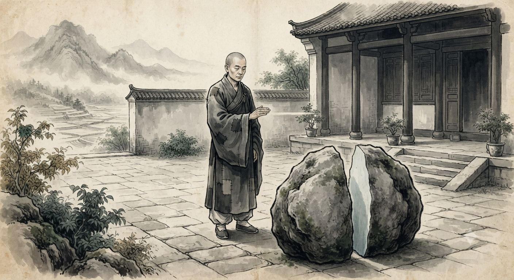
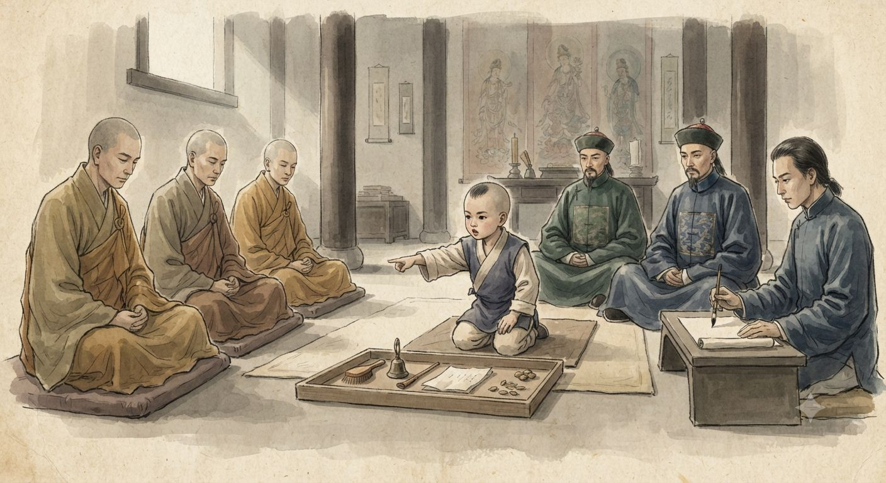
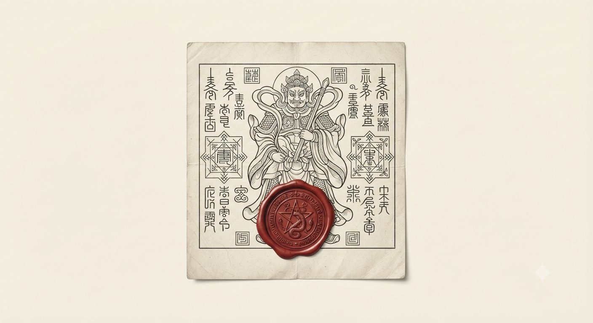

---
title: Buddyzm
tags: [religia, magia, chiny, japonia, tybet, mnisi, mechanika, gurps]
aliases: [Buddhism, Chan, Zen, Amidyzm, Czysta Kraina, Lamaizm, Biały Lotos, Nichiren]
---

# Buddyzm

*Nota niepodpisana, dołączona do skrzyni z manuskryptami sprowadzonymi przez faktorię w Kantonie, bez roku: „Czternaście fragmentów, trzy kraje, żaden wspólny język poza tym, który każdy z tłumaczy uznał za najbliższy prawdzie. Nie ujednoliciłem terminologii. Mnich z Shaolin i mnich z Kioto nie zgodziliby się, że mówią o tym samym, a ja nie mam prawa decydować za nich."*

---

### Fragment traktatu medytacyjnego, przypisywany szkole chan, bez daty ani autora

Ciało jest granicą, którą myli się z sobą samym. Dziesięć tysięcy godzin siedzenia nie dodaje niczego — ujmuje. Ujmuje myśl o oddechu, potem oddech myślany, potem myślącego.

Co zostaje, gdy zejdzie ostatnia warstwa, nie ma imienia w żadnym języku, którym się o tym pisze, choć starzy nazywali to Umysłem Pierwotnym, jakby nazwa cokolwiek zmieniała.

Ciało, które przeszło tę drogę do końca, przestaje słuchać praw, którym podlegają ciała nieprzebudzone. Kamień pęka pod dłonią, bo dłoń i kamień przestają być dwiema rzeczami na chwilę wystarczająco długą. Kto szuka w tym mocy, nie zajdzie dalej niż złamany paznokieć.

---

### Nauka o mantrze Amidy, zapisana przez ucznia mnicha z prowincji Fujian

Mistrz Huian powtarzał, że droga chan jest dla tych, którzy mają dziesięć tysięcy godzin i żelazne kolana. Zwykły człowiek ma pole do obrobienia, dzieci do wykarmienia i śmierć bliżej, niż mu się wydaje.

Dlatego istnieje imię Amidy. Wypowiedziane szczerze, choćby raz, choćby przez umierającego złodzieja, otwiera Czystą Krainę temu, kto sam nigdy by tam nie doszedł. Moc mieszka w ślubowaniu złożonym przez Amidę eony temu, zanim jakikolwiek żywy język zdołał je powtórzyć.

Uczeń zapytał, czy to nie czyni chan zbytecznym. Mistrz Huian odpowiedział, że rzeka i studnia obie noszą wodę, i że pytanie, która jest prawdziwsza, zadaje ktoś, kto nigdy nie był spragniony.

---

### Kōan z klasztoru w prowincji Ōmi, zapisany z dwiema glosami uczniów, Japonia

Mnich zapytał mistrza Genrin: „Słyszałem, że dawni mistrzowie cięli powietrze mieczem i zabijali na odległość. Jak to możliwe?"
Genrin odpowiedział: „Zapytaj miecz."
Mnich zapytał miecz. Miecz milczał.
Genrin powiedział: „Dobra odpowiedź."

*Glosa pierwszego ucznia:* Mistrz kpi z pytającego, bo pytanie o technikę jest już pomyłką — kto pyta o cięcie, jeszcze nie ciął.

*Glosa drugiego ucznia:* Nie kpi. Miecz naprawdę odpowiedział. Ci, którzy słyszą tylko ciszę, nie są gotowi na resztę rozmowy.

---

### Fragment kroniki klasztoru Xitan, prowincja Henan, prowadzonej nieprzerwanie od 1053 roku

Opactwo założono na zboczu, które mnich-geomanta uznał za miejsce, gdzie żyła smoka zwalnia bieg — zapis z roku założenia nie podaje jego imienia, tylko tytuł: Nauczyciel Kamieni.

Rok 1231: opat Deshan rozłupał głaz wielkości wołu jednym uderzeniem otwartej dłoni podczas pokazu dla urzędnika prowincji, który przyjechał zamknąć klasztor za niepłacenie podatku. Podatku nie zapłacono. Klasztor nie zamknięto.

Rok 1508: mnich Huaisheng, trzeci w randze, przeciął powietrze przed sobą i powalił trzech bandytów bez dotknięcia ich ostrzem. Kronikarz odnotował to jednym zdaniem, bez komentarza, jakby wydarzenie nie zasługiwało na więcej.

Rok 1687: nowicjusz Baoyu trenował osiemnaście lat i osiągnął tyle, ile poprzednicy w dziesięć. Przełożony zapisał to jako ostrzeżenie, nie pochwałę.

Rok 1779: klasztor po raz pierwszy od założenia nie ma nikogo zdolnego do Cięcia Powietrza. Kronikarz pyta, czy to wina uczniów, czy samej góry, i nie odpowiada.

---

### Wiersz pożegnalny (jisei) mistrza miecza i mnicha Sōkan, Japonia

Ostrze, które trzymałem sześćdziesiąt lat,
nigdy nie było moje —
teraz oddajÄ™ je powietrzu,
które zawsze było ostrzejsze.

*[dopisek ucznia, innym atramentem]: Mistrz zmarł nazajutrz we śnie, bez rany, bez choroby, jakby postanowił.*

---

### Nota urzędnika Lifanyuan (Biura do Spraw Peryferyjnych) o wyborze jedenastego Panczenlamy, Tybet, 1795

Trzej kandydaci, wszyscy poniżej piątego roku życia, przeszli próbę rozpoznania przedmiotów należących do poprzednika. Chłopiec z Tsangu wskazał różaniec, dzwonek i wadżrę bez wahania, choć nigdy ich wcześniej nie widział — tak przynajmniej twierdzą świadkowie, z których żaden nie jest bezstronny.

Dwór cesarski zatwierdził wybór dopiero po losowaniu ze złotej urny wprowadzonej przez Pekin, bo Syn Nieba nie ufa już samym mnichom w sprawach tak ważnych jak następstwo. Czy w chłopcu z Tsangu jest cokolwiek z poprzednika, czy tylko tytuł i pamięć, którą otoczenie wmawia mu od urodzenia, nie rozstrzygnie żaden urzędnik, a rozstrzygnięcie nie leży zresztą w jego kompetencji.

---

### Mantra recytowana przy młynkach modlitewnych, region Amdo, zapisana fonetycznie przez podróżnika

Om mani padme hum — powtarzane, jak mówią miejscowi, tyle razy, ile obrotów zrobi młynek, a młynek liczy się nie w setkach, lecz w tysiącach dziennie dla tych, którzy mają na to czas.

Nikt, kogo pytałem, nie umiał przetłumaczyć słów dosłownie. Klejnot w lotosie, powiedział jeden. Współczucie, które się kręci, powiedział drugi, i roześmiał się, jakby usłyszał to pierwszy raz we własnych ustach.

---

### Fragment pisma sekty Białego Lotosu, skonfiskowany podczas obławy w Hubei, 1798

Maitreja nadchodzi, a znak jego nadejścia już płonie w piersi każdego, kto oddycha prawidłowo i pości we właściwe dni. Stara era kończy się w ogniu. Kto to zrozumiał, bierze miecz oczyszczający bez wahania, bo zwłoka jest jedynym prawdziwym grzechem, jaki został.

Bracia, którzy przyjęli czerwony dym w medytacji, widzieli twarz Maitrei tak wyraźnie, jak widzi się twarz sąsiada. Ci, którzy nie przyjęli, niech nie osądzają tego, czego nie doświadczyli.

---

### Raport urzędnika prowincji Syczuan do tronu, 1800

Wojownicy sekty noszą na szyi papierowe talizmany z pieczęcią przywódcy i twierdzą, że żadne ostrze ich nie przetnie. Trzej żołnierze cesarscy zeznali niezależnie od siebie, że miecz odbił się od jednego z buntowników bez zadania rany, choć cios był silny i celny.

Proszę o instrukcję, czy raportować to jako fakt bojowy, czy jako panikę żołnierzy niedoświadczonych w tłumieniu powstań chłopskich. Osobiście skłaniam się ku drugiemu, lecz trzej niezależni świadkowie to więcej, niż zwykle daje panika.

---

### Relacja byłego jezuity, niegdyś astronoma przy dworze pekińskim, list do korespondenta w Rzymie, 1788

Rozpuszczenie Towarzystwa piętnaście lat temu zostawiło mnie bez zakonu, ale nie bez pytań, które zadawałem sobie od czterdziestu lat w tym kraju. Opisywałem Waszej Wielebności mnicha z gór Wutai, który zatrzymał upadający kamień dłonią, nie ruszając się z miejsca — widziałem to sam, trzeźwy, w pełnym świetle dnia.

Zapytałem go wprost, jaki duch mu w tym pomaga, jakiego opiekuńczego bytu wzywa. Spojrzał na mnie tak, jak patrzy się na dziecko pytające, kto pcha rzekę. Odpowiedział, że nie wzywa niczego i nikogo, że przyzywanie czegokolwiek z zewnątrz byłoby dowodem, iż jeszcze nie zrozumiał, że na zewnątrz nie ma nic, do czego warto by sięgać.

Nalegałem — wszak nasza teologia zna duchy, demony, aniołów, a ludowe wierzenia tego kraju pełne są istot równie kapryśnych. Odpowiedział, że słyszał o takich istotach z ust chrześcijańskich kupców i że współczuje krajom, które muszą prosić coś zewnętrznego o to, co każdy człowiek nosi już w sobie. Nie wiem, czy mówił z pokorą, czy z pogardą. Może oba te słowa znaczą dla niego to samo.

---

### Notatka kompilatora, ostatnia w teczce

Czternaście fragmentów i żaden mnich, żaden lama, żaden kaznodzieja Białego Lotosu nie wspomina feyów, protoplanu ani niczego, co znałby uczony z Salamanki czy Paryża. Tam, gdzie europejski mistyk przyzywa, targuje się albo pakt zawiera, tutejszy mistrz twierdzi, że nie ma z kim się targować.

Nie umiem rozstrzygnąć, czy to prawda, czy najstarsza i najlepiej strzeżona tajemnica tej sztuki — że nazwanie źródła mocy jest już jej utratą, więc każdy, kto osiągnął dość, by wiedzieć, przestał mówić. Zostawiam to bez rozstrzygnięcia, tak jak zostawiłem teczkę o feyach dwadzieścia lat temu, i z tego samego powodu: nikt mi nie dał prawa decydować za tych, którzy milczą z wyboru, nie z niewiedzy.

---

> [!mechanics]
> **Status doktrynalny:** żadna z tradycji przedstawionych wyżej nie odwołuje się do feyów ani protoplanu — połączenie z [[Fey|energią feyów]] opisane w [[Sztuki walki]] i [[Punkty rozbieżności]] jest wiedzą MG, nie wiedzą postaci; żaden NPC-buddysta jej nie potwierdzi, a większość zaprzeczy wprost, jak mnich z gór Wutai
> **Szkielet mechaniczny mnicha:** identyczny jak w [[Sztuki walki]] — Trained By A Master i/lub Chi Talent, umiejętności chi, wsparte Meditation i Philosophy (chan, zen albo czysta kraina jako specjalizacja)
> **Tulku i dziedziczenie mocy:** nierozstrzygnięte — prowadzący decyduje, czy wcielenie niesie realny bonus mechaniczny (np. przyspieszone nabywanie umiejętności chi), czy wyłącznie status społeczny i dostęp do nauczycieli
> **Amulety Białego Lotosu:** traktować jako Ritual Magic o niskim, niepewnym poziomie (część działa, część nie) albo jako wzmocnienie wiarą tłumu analogiczne do mechaniki [[Cudotwórcy]] — kanon nie rozstrzyga, które

---

*Powiązane artykuły: [[Chiny dynastii Qing]], [[Sztuki walki]], [[Japonia]], [[Feng shui]], [[Fey]], [[Sorcery]], [[Cudotwórcy]], [[Alchemia]], [[Punkty rozbieżności]].*

