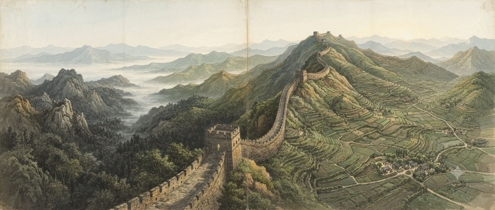
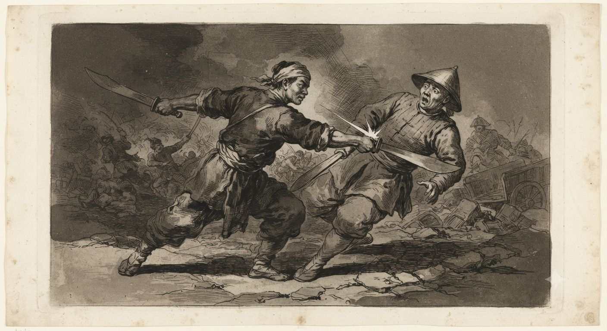
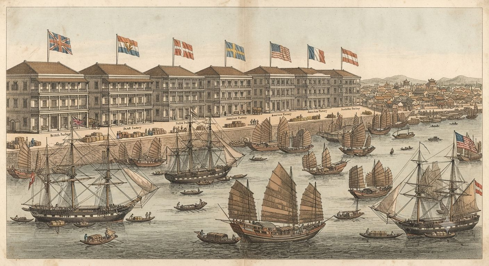

# Chiny dynastii Qing

Cesarstwo Qing rządzi terytorium trzynastu milionów kilometrów kwadratowych i trzystu do trzystu pięćdziesięciu milionów ludzi — jedną czwartą całej ludzkości. Żadne inne państwo roku 1802 nie zbliża się do tej skali. Sieć kanałów, dróg cesarskich i poczty działa sprawniej niż cokolwiek w Europie, a egzaminy urzędnicze utrzymują biurokrację bez odpowiednika na świecie.

Od 1796 roku płonie jednak środkowe Cesarstwo. Bunt Białego Lotosu obejmuje Hubei, Syczuan, Henan i Shaanxi, a mandżurskie chorągwie, które trzy pokolenia temu podbiły Azję Wschodnią, nie radzą sobie z chłopskim powstaniem. W Kantonie europejscy kupcy czekają w wyznaczonych faktoriach na przyzwolenie do handlu, uzbrojeni w towary, których Chińczycy nie chcą, i coraz bardziej zainteresowani substancją, której sprzedawać nie wolno.

---

## Cesarz Jiaqing i cień Heshena

Cesarz Qianlong abdykował 9 lutego 1796 roku po sześćdziesięciu latach panowania, bo nie chciał rządzić dłużej niż jego dziadek Kangxi. Tron przekazał synowi Yongyan, który przyjął dewizę Jiaqing — lecz przez kolejne trzy lata sam dalej podejmował decyzje, przyjmował petycje i dyktował reskrypty. Umarł dziewięćdziesięcioletni 7 lutego 1799 roku, największy ekspansjonista w dziejach Chin: podwoił terytorium, pobił Dzungarów, zajął wschodni Turkiestan, umocnił zwierzchność nad Tybetem i Birmą. Zostawił też po sobie Heshena.

Heshen (和珅) był faworytem Qianlonga przez dwadzieścia trzy lata — pięknym młodym strażnikiem, który stał się Wielkim Sekretarzem i wszechwładnym pośrednikiem dostępu do cesarza. Każdy gubernator, każdy kandydat na urząd, każdy kupiec szukający łaski płacił jemu. Majątek skonfiskowany po jego aresztowaniu szacowano na osiemset milionów do miliarda taelów srebra — osiem do dziesięciu razy więcej niż roczny dochód skarbu.

Jiaqing aresztował go piętnaście dni po śmierci ojca. Sąd orzekł w tydzień; Heshen dostał jedwabny sznur, zaszczyt pozwalający na samobójstwo zamiast publicznej egzekucji. Gest był politycznie czytelny — Jiaqing pokazał, że rządzi, i zarazem zabrał skarbowi środki, którymi tamten mógłby finansować swoich stronników. Korupcja, którą Heshen uosabiał, była wbudowana w system, gdzie urzędnik zarabiał mało, a na reprezentację wydawał dużo.

Sam Jiaqing nie przypomina ojca. Brak mu ekspansjonistycznych ambicji i artystycznych pasji Qianlonga, który napisał czterdzieści tysięcy wierszy; jest pracowitym, rozsądnym i osobiście skromnym administratorem, a jego rządy nazwą później epoką naprawy po Heshenie. Bunt Białego Lotosu pochłonie energię pierwszej połowy panowania.

> [!rules]
> **Cesarstwo Qing (1802)**
> **Cesarz:** Jiaqing (嘉慶帝, Yongyan), lat 42, panuje faktycznie od 1799
> **Terytorium:** ~13 mln km² (Chiny właściwe + Mandżuria + Mongolia + Xinjiang + Tybet + Tajwan)
> **Populacja:** ~300–350 mln (szacunki — brak nowoczesnego spisu)
> **Stolica:** Pekin (~1 mln mieszkańców)
> **Waluta:** taele srebra (duże transakcje), miedziane wen (codzienność)
> **Roczny dochód skarbu:** ok. 40–80 mln taelów

---

## System konfucjański — biurokracja jako cywilizacja

Chiński system egzaminów urzędniczych (科舉, *kējǔ*) działał nieprzerwanie od dynastii Sui, od 605 roku. Każdy mężczyzna z dostatecznymi środkami na naukę mógł do nich przystąpić i przez umiejętności wejść do administracji. Były trzy szczeble: egzaminy powiatowe wyłaniały klasę szenyuanów (biała szata, prestiż, brak stanowiska), prowincjonalne co trzy lata dawały stopień *juren* uprawniający do niższych urzędów, a stołeczne w Pekinie, zwieńczone audiencją cesarską, przyznawały tytuł *jinshi* — może dwustu, trzystu ludziom na rok. Przez cały cykl przewijały się setki tysięcy kandydatów; przechodził mniej więcej jeden na stu.

Kandydat musiał znać na pamięć Cztery Księgi i Pięć Klasyków konfucjańskich, a esej pisać w ściśle uregulowanej formie *baguwen*, bez miejsca na własne odchylenie; kaligrafia liczyła się równie mocno co treść, a komentarz poza kanonem groził dyskwalifikacją za herezję. System nagradzał doskonałą pamięć i opanowanie formy; nowatorstwo leżało poza jego celem.

Rzeczywistym centrum władzy była Rada Wojenna (*Junjichu*) — kilkunastu najwyższych urzędników spotykających się z cesarzem o świcie. Sześć Ministerstw obsługiwało sprawy cywilne, skarbowe, rytualne, wojskowe, karne i roboty publiczne, a osiemnaście prowincji miało gubernatorów i generalnych gubernatorów, często zarządzających dwiema prowincjami naraz. Teoria mówiła, że decyzje płyną z tronu; w praktyce Pekin był za daleko, a gubernator miał za dużo swobody, więc różnicę między nędzną pensją a kosztami urzędu pokrywała szara strefa płatności.

---

## Qi, feng shui i sztuki tajemne

Magia Państwa Środka opiera się na *qi* (氣) — życiowej energii, którą hartuje się dyscypliną, oddechem i latami ćwiczeń, daleko od europejskich cudów czy dziedzicznej [[Sorcery]]. Kto ją opanuje, przekracza granice tego, co ciało i krajobraz powinny móc.

[[Feng shui]] (風水) jest najpowszechniejszą z tych sztuk i jedyną w pełni szanowaną przez dwór. Mistrz geomancji czyta przepływ qi przez teren i ustawia mu na drodze budynki, groby i bramy. Pekin, Zakazane Miasto i cesarskie mauzolea rozplanowano co do piędzi według tych reguł — źle ustawiony pałac osłabia dynastię równie realnie jak przegrana bitwa. Każdy zamożny ród zatrudnia geomantę przy budowie domu i pochówku przodków.

Sztuki walki to druga gałąź. W klasztorach i tajnych szkołach mistrzowie hartują qi tak długo, że ich ciosy kruszą kamień, a najlepsi tną powietrze na odległość — technikę tę nazywa się [[Cięcie Powietrza]]. W trzystumilionowym kraju jest ich ledwie tysiące, rozsianych wszędzie: wśród mnichów, strażników karawan, wiejskich nauczycieli. [[Buddyzm|Mnisi buddyjscy]] i taoistyczni alchemicy dorzucają własne ścieżki — uzdrawianie, długowieczność, panowanie nad oddechem i strachem.

Nad tym wszystkim ciągnie się Wielki Mur, a jego rola sięga znacznie dalej niż kamień. Mur jest barierą działającą w obie strony. Broni przed najazdem z północy, lecz przede wszystkim ściąga nieszczęście na każdego, kto przekroczy go z bronią: armie najeźdźców więdną od chorób, klątw i złych zrządzeń losu, które kronikarze przypisują samej budowli. Mongołowie pamiętają, że ich przodkowie złamali Mur tylko wtedy, gdy ktoś otworzył im bramę od środka.

W głębszym sensie Mur to feng shui zaklęte w skali kontynentu. Domyka qi Państwa Środka i zatrzymuje jego pomyślność wewnątrz jak wodę w naczyniu. Skutek bywa dwojaki: gdy czasy są dobre i władca mądry, energia krąży, a Cesarstwo kwitnie jak żaden inny kraj świata; gdy tron słabnie, ta sama zamknięta siła kiśnie bez ujścia, a zaraza, bunt i głód mnożą się za murem, który nie chce ich wypuścić. Bunt Białego Lotosu ma w sobie i ten posmak — moc Cesarstwa, która nie znajduje wyjścia.

To dziedzictwo czyni Chiny twierdzą duchową, której żadna europejska armia nie złamałaby od ręki. Słabość leży gdzie indziej: qi można zatruć.

---

## Bunt Białego Lotosu — imperium w ogniu

Białe Lotosy (*Báilián jiào*) to millenarystyczna sekta buddyjska z tradycją sięgającą XIII wieku. Jej odmiana z końca XVIII wieku głosiła nadejście nowej ery i Maitrei, Buddy przyszłości, i rekrutowała wśród chłopów środkowych Chin zrujnowanych przez powodzie, suszę i korupcję urzędników. Bunt wybuchł w 1796 roku w Hubei i wkrótce ogarnął Syczuan, Henan i Shaanxi; lokalni przywódcy mieli własne armie po dziesiątki tysięcy ludzi, a cesarska odpowiedź była powolna i kosztowna.

Mandżurskie Osiem Chorągwi (*bāqí*), wojskowy kręgosłup dynastii, zawiodło. Potomkowie zdobywców z 1644 roku nie walczyli od pokoleń, żyli z dziedzicznych subwencji i nie umieli prowadzić kampanii w środkowych Chinach. Armia Zielonego Standardu, regularne siły chińskie, sprawdzała się nie lepiej: oficerowie kradli żołd, żołnierze dezerterowali, a kampanie ciągnęły się latami bez rozstrzygnięcia.

Była i przyczyna, o której reskrypty milczą. Część band Białego Lotosu prowadzą mistrzowie qi i nauczyciele sztuk walki, a najtwardszych wojowników chronią amulety i rytuały, po których ostrza ślizgają się jak po kamieniu. Adeptów jest garstka pośród dziesiątków tysięcy chłopów, lecz garstka, która dodaje wierze tłumu realnego ostrza — i której znudzeni, dziedziczni chorążowie nie mają czym odpowiedzieć.

Od 1799 roku Jiaqing zaczął polegać na *xiang yong* — lokalnych milicjach finansowanych i dowodzonych przez miejscową gentry. Model ten okaże się skuteczny i zarazem stanie się precedensem dla decentralizacji, która w XIX wieku rozsadzi Cesarstwo. Bunt trwa szósty rok i pochłonął już może dwieście milionów taelów, dwa do trzech rocznych dochodów skarbu; cesarscy generałowie zmieniają się, kilku stracono za porażki lub korupcję, a ostateczne stłumienie przyniosą dopiero w 1804 roku lokalne milicje. Pomniejsi prorocy mnożą się przy tym na prowincji — jeden z nich, Lin Qing z sekty Niebiańskiej Bramy, jedenaście lat później poprowadzi zuchwały szturm na samo Zakazane Miasto.

---

## System Kantonu — handel na cesarskich warunkach

Wszystkie kontakty handlowe z zagranicą przechodzą przez jeden punkt: Guangzhou, które Europejczycy zwą Kantonem. Edykt z 1757 roku zamknął całą wymianę zamorską do tego portu i do systemu licencjonowanych kupców znanych jako Cohong. Europejski kupiec przypływa na sezon handlowy — od jesieni do wiosny, gdy monsun sprzyja żegludze — nie wolno mu wejść do samego miasta, mieszka i handluje w wąskim pasie faktorii przy rzece Perłowej, a po sezonie opuszcza Chiny. Każdą transakcję prowadzi kupiec Cohong, który bierze marżę i odpowiada przed władzami za zachowanie cudzoziemców.

Chiny sprzedają herbatę, jedwab i porcelanę. Herbata jest największą pozycją: [[Kompanie Wschodnioindyjskie|brytyjska Kompania Wschodnioindyjska]] wozi do Anglii miliony funtów rocznie, płacąc srebrem. Bilans od stulecia wychodzi Chinom na korzyść — srebro z Ameryki przez Manilę i z Europy przez Lizbonę płynie do Państwa Środka. Europejski kłopot brzmi: co sprzedać Chinom, żeby nie płacić samym srebrem. Zegary i mechaniczne cudeńka idą jako prezenty dla cesarza, nie towar masowy; sukna i szkła Chiny mają własne.

Człowiekiem, z którym Europejczycy faktycznie rozmawiają, jest młody kupiec Cohong nazywany przez nich Houqua (Wu Bingjian). W 1802 roku dopiero wchodzi w okres największej potęgi, lecz już udziela kredytów zagranicznym handlarzom i mówi po angielsku na poziomie roboczym; w ciągu kilku dekad stanie się jednym z najbogatszych ludzi świata. Gdy Kompania traci monopol, a prywatni kupcy potrzebują pieniędzy na herbatę, pożycza im Houqua — i wygrywają obie strony.

W 1793 roku Jerzy III wysłał lorda Macartneya do Qianlonga z prośbą o stałe przedstawicielstwo, zniesienie ograniczeń i otwarcie nowych portów. Macartney przywiózł zbiór europejskich wynalazków jako dowód, że ma co oferować, lecz Qianlong odmówił, a jego odpowiedź dla Jerzego III przeszła do historii: Cesarstwo posiada w obfitości wszystko, czego potrzebuje, i nie musi nabywać wyrobów barbarzyńców. Spór protokolarny — Macartney ukłonił się na jedno kolano zamiast wykonać trzykrotny *kowtow* trybutariusza — Qianlong przełknął, lecz odpowiedzi nie zmienił.

Odpowiedź na pytanie o towar przyszła powoli i nielegalnie. Opium, przetworzony sok makowy z Bengalu, jest w Chinach zakazane edyktem od 1729 roku, a ponownie od 1796; mimo to przez Kanton przepływa rocznie cztery do pięciu tysięcy skrzyń przemycanych pod przykrywką, przy przekupionych celnikach. Za kilkanaście lat będzie ich czterdzieści tysięcy, a za czterdzieści — wybuchnie pierwsza wojna opiumowa.

Najgorsza odmiana nie figuruje w żadnym rejestrze. [[Czerwone opium]] to mak podlewany destylowaną [[Smocza krew|smoczą krwią]], surowcem, który [[Kompanie Wschodnioindyjskie|Kompania]] sprowadza zza Atlantyku, z amerykańskich smoków. Jest wielokrotnie silniejsze od zwykłego, a jego prawdziwa trucizna celuje w to, co Chiny mają najcenniejszego — wypala *qi*. Mistrz sztuk walki albo geomanta, który raz po nie sięgnie, w kilka miesięcy traci dyscyplinę budowaną przez całe życie. Gorzka jest sama nazwa: barbarzyńcy ochrzcili swój narkotyk krwią smoka, znaku cesarza i nieba. Ilu kupców rozumie, że handluje bronią pod postacią używki, trudno orzec — kilku w Kantonie wie doskonale. Pekin widzi, że opium rujnuje ludzi i wysysa srebro; że rujnuje także adeptów Cesarstwa, domyśla się na razie garstka uczonych. Srebro zaczyna płynąć w odwrotną stronę, z Chin do Bengalu, a Jiaqing nie wie, jak to powstrzymać.

---

## Społeczeństwo — trzysta milionów ludzi

Na szczycie stoją Mandżurowie, dynastyczna elita — może dwa miliony wśród trzystu trzydziestu — zwolnieni z części wymogów egzaminacyjnych, wyłączeni z zawodów handlowych i utrzymywani z państwowych subwencji; chorąży bez subwencji jest bezradny, bo to zależność wyuczona przez pokolenia. Przytłaczającą większością są Hanowie, ułożeni w konfucjańską hierarchię rang: uczeni, rolnicy, rzemieślnicy, kupcy. Kupiec stoi na dole tej drabiny ideologicznej, choćby był bogatszy od urzędnika — lecz bogaty kupiec opłaci synowi naukę, syn zda egzaminy, a wnuk zostanie urzędnikiem, więc mobilność przez edukację jest realna. Rolnicy to jakieś osiemdziesiąt procent ludności; podatek pogłówny zniósł Kangxi w 1713 roku, co zmniejszyło presję na ukrywanie urodzin.

Kukurydza, bataty i orzeszki ziemne przybyły z Ameryk przez Filipiny w XVI i XVII wieku. Rosną na gruntach zbyt jałowych i górzystych dla ryżu czy pszenicy, więc pozwoliły zasiedlić nowe ziemie, a chińska ludność podwoiła się przez XVIII wiek ze stu pięćdziesięciu do trzystu milionów. Wzrost ludności wyprzedził jednak wzrost produkcji żywności: ziarno i dzierżawa drożeją, a chłopi migrują na nowe ziemie Syczuanu, Yunnanu i górzystego środka kraju — gdzie trafiają na Białe Lotosy.

Krępowanie stóp (*chánjú*, 纏足) — owijanie stóp dziewczynek od czwartego roku życia, aż kości się wygną — jest praktyką Hanów, nie Mandżurów (Qianlong potępiał je wśród Mandżurek). Ideał „złotego lotosu" to stopa długości dziesięciu centymetrów, w praktyce zniekształcenie wymuszające chód o lasce. Zwyczaj jest powszechny wśród zamożnych Hanek i rzadszy u ubogich rolniczek, których praca w polu by go nie zniosła; nie stosują go Hakka, Mandżurki ani wiele ludów południa. Prawna pozycja kobiety jest znikoma: żona podlega mężowi, wdowa teściowi lub najstarszemu synowi.

---

## System trybutarny i sąsiedzi

Qing nie uznaje równości państw. W chińskim porządku świata jest jeden Syn Nieba (*Tianzi*), a wokół kraje, które albo składają hołd jako trybutariusze, albo pozostają barbarzyńcami za granicą cywilizacji. Korea wysyła cztery misje rocznie i jest najlojalniejszym trybutariuszem; Wietnam, Nepal, Birma i Riukiu składają hołd po przegranych wojnach lub pod wspólnym zwierzchnictwem. [[Japonia]] do systemu nie należy — wybrała w XVII wieku izolację, a kontakt ogranicza się do prywatnego handlu przez Nagasaki.

[[Rosja]] jest jedynym europejskim mocarstwem traktowanym niemal jak równy partner: negocjowała z Qing wprost, traktatami z Nerczyńska (1689) i Kiakty (1727), a handel graniczny przez Syberię opłaca się obu stronom. To stamtąd, a nie z Kantonu, dochodzą do Pekinu pierwsze poważne wieści o europejskich wojnach.

---

## Religia i filozofia

Konfucjanizm jest etyką państwa i programem edukacji. Buddyzm mahajany jest powszechny, zwłaszcza w miastach, gdzie klasztory pełnią rolę szpitali, szkół i lichwiarzy; taoizm to religia ludowa kultu lokalnych bóstw i przodków, zielarstwa i alchemii długowieczności. [[Buddyzm|Lamaizm]] tybetański jest religią dynastii, ważną dla Mandżurów i Mongołów, a dalajlama sprawuje teokratyczne zwierzchnictwo nad Tybetem pod militarną supremacją Qing.

Chrześcijaństwo trzyma się resztkami. Jezuici pracowali na dworze od XVI wieku jako matematycy, astronomowie i kartografowie, lecz spór o to, czy chrześcijanie mogą czcić przodków i uczestniczyć w obrzędach konfucjańskich, rozbił misję: papież zakazał tego w 1715 roku, a Kangxi w 1724 wygnał chrześcijan. Kilkadziesiąt tysięcy z nich przetrwało jako podziemna wspólnota.

---

## Chiny a świat w 1802 roku

W oczach Jiaqinga Europa to odległy problem: kilka kompanii próbujących skomplikować system Kantonu, jeden ambasador, który nie umiał się pokłonić, i wieści z Rosji o generale, który podbił kawał Europy — to ostatnie ciekawsze, bo Rosja graniczy z Cesarstwem. W oczach Europejczyków Chiny są największym rynkiem niemożliwym do otwarcia: Kompania traci srebro i szuka towaru, a prywatni kupcy z Filadelfii i Bostonu już wpływają do Kantonu z żeń-szeniem, futrami wydr morskich i meksykańskim srebrem, bo do handlu kantońskiego nie trzeba monopolu, wystarczy statek i ładunek.

Stany Zjednoczone handlują z Chinami od 1784 roku, odkąd przypłynął tu statek *Empress of China*; w 1802 roku kilkanaście amerykańskich domów handlowych pracuje w sezonie przez faktorie. Dla nich Chiny są przede wszystkim rynkiem zbytu, i przez następne czterdzieści lat odróżni ich to od europejskich mocarstw szukających kolonii.

---

*Powiązane artykuły: [[Kompanie Wschodnioindyjskie]], [[Wielka Brytania]], [[Handel Trójkątny]], [[Indie Mogołów i Kompania]], [[Czerwone opium]], [[Feng shui]], [[Sztuki walki]], [[Cięcie Powietrza]], [[Smocza krew]], [[Japonia]], [[Rosja]], [[Punkty rozbieżności]].*

