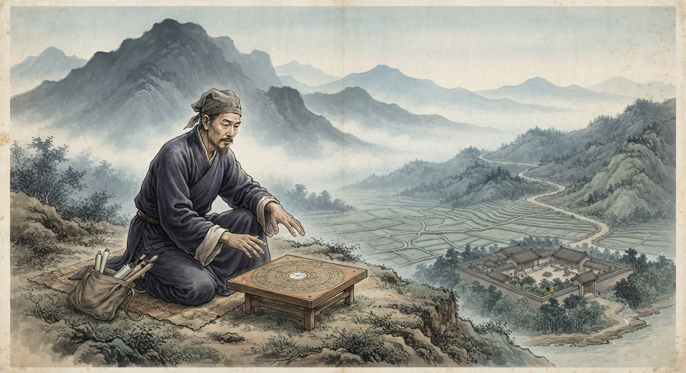
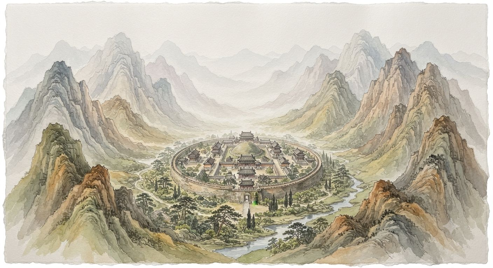
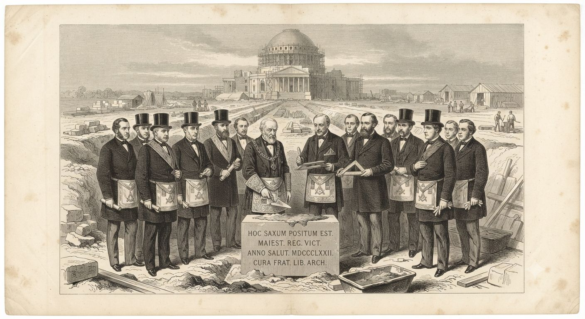

# Feng shui

Feng shui (風水, dosłownie „wiatr i woda") czyta krajobraz jak księgę i ustawia w nim dom, grób czy bramę tak, żeby przepływająca energia przynosiła pożytek zamiast szkody. Geomanta, który to robi, nazwałby swoją pracę rzemiosłem budowlanym opartym na stałych prawach świata. Obserwator z zewnątrz zobaczyłby w tym samym akcie zagęszczanie i kierowanie protoenergii [[Fey|feyów]], którą wieki rytuału i pamięci przodków naniosły na chińską ziemię gęściej niż gdziekolwiek indziej.

## Dwa opisy jednego zjawiska

Geomanta uczy się mówić językiem *qi* (氣), pięciu żywiołów (*wuxing*) i ośmiu triagramów (*bagua*) — słownika starszego niż jakakolwiek dynastia obecnie panująca. W tym słowniku nie ma miejsca na feye, duchy przodków ani protoplan, z którego się wywodzą. Jest przepływ, blokada i równowaga, opisywane tym samym tonem, którym lekarz opisuje krążenie krwi.

Chiny obrosły przez tysiąclecia gęstszą siecią feyów i duchów przodków niż jakikolwiek inny region świata. Feng shui nie przywołuje tych bytów wprost i żaden geomanta nie odprawia egzorcyzmu ani seansu. Zagęszcza i kanalizuje ślad, jaki te byty zostawiają w ziemi, wiek po wieku, tak jak tama kanalizuje rzekę, nie rozmawiając z wodą.

Dwór cesarski zatrudnia geomantów bez wahania, choć ten sam dwór ściga szamanów i czarowników jak heretyków. [[Chiny dynastii Qing|Ceremonia i tradycja]] osłoniły feng shui przed podejrzeniem, którego nie uniknęła żadna inna sztuka tajemna Państwa Środka.

## Rzemiosło geomanty

Sztuka dzieli się na dwie szkoły, które rzadko się zgadzają w szczegółach. Szkoła Form (*xingshi*) czyta krajobraz wprost — góry i rzeki jako żyły smoka (*longmai*), którymi płynie *qi*, a zadaniem geomanty jest znaleźć miejsce, gdzie żyła zwalnia i się gromadzi. Szkoła Kompasu (*liqi*) liczy zamiast patrzeć: kierunek, datę urodzenia mieszkańca i ustawienie triagramów na tarczy kompasu *luopan*, warstwa po warstwie, aż wynik wskaże jedną słuszną orientację drzwi.

Zamożna rodzina zatrudnia geomantę przed każdą ważną budową i każdym pochówkiem. Źle ustawiony dom szkodzi żyjącym. Źle ustawiony grób szkodzi wnukom, które jeszcze się nie urodziły.

Cesarskie mauzolea na północ od Pekinu wybrano dla podkowiastego pierścienia gór, który zamyka *qi* jak dłonie złożone wokół płomienia świecy — *xingshi* w najdroższej postaci, bo błąd kosztowałby losy dynastii, nie jednej rodziny.

Uboższych stać na mniej. Kupiec powiesi nad drzwiami okrągłe lusterko *bagua*, żeby odbić złą energię z powrotem na ulicę, za kilka miedzianych *wenów*. Prawdziwy geomanta bierze za konsultację tyle, ile lekarz za wizytę u zamożnego pacjenta, i tyle samo ryzykuje reputacją, gdy dom mimo jego rad płonie albo ród wygasa.

> [!mechanics]
> **System:** Ritual Magic (GURPS Thaumatology), Path/Book roboczo nazywany Path of Terrain — zbudowany na *qi* zamiast na duchu opiekuńczym, inaczej niż rytuały szamańskie [[Rdzenne narody Ameryki Północnej|rdzennych Ameryki]]
> **Czas rytuału:** od kilku dni przy zwykłym domu do miesięcy pracy kilku geomantów przy budowli rangi cesarskiej
> **Próg wejścia:** brak wymogu wrodzonego talentu w stylu [[Sorcery]] — dostępne po latach nauki u mistrza, jak każde rzemiosło
> **Narzędzie:** *luopan*, wielowarstwowy kompas geomantyczny, jest Focusem rytuału; jego utrata utrudnia nowe rytuały, nie niweczy już założonych

## Wielki Mur — feng shui na skalę kontynentu

Największym dziełem tej sztuki nie jest dom ani grobowiec. Jest nim mur ciągnący się przez osiem tysięcy kilometrów, rozbudowywany i naprawiany przez dynastię po dynastii, aż stał się jednym, zamkniętym obwodem *qi* wokół całego Państwa Środka.

Efekt działa jak naczynie. Dopóki Cesarstwo trzyma się w dobrej kondycji, mur zatrzymuje pomyślność wewnątrz — plony, zdrowie i powodzenie krążą, nie uciekając za linię kamienia. Gdy dwór słabnie, ta sama zamknięta siła nie znajduje ujścia: zaraza, bunt i głód mnożą się za murem, tak jak dziś mnoży je [[Chiny dynastii Qing|Bunt Białego Lotosu]] w środkowych prowincjach.

Barierę czuje każdy najeźdźca. Mongolska jazda, która wielokrotnie docierała pod mur, wielokrotnie się od niego odbijała — klątwa sypała pod kopyta pecha, choroby i złe przeczucia za każdą próbę przekroczenia z bronią bez zgody. Kronikarze zanotowali to jako serię niewytłumaczonych klęsk logistycznych. Żołnierze wiedzieli swoje.

Klątwa nie rozróżnia siły od zdrady. W 1644 roku generał Wu Sangui, broniący przełęczy Shanhai na wschodnim krańcu muru, otworzył bramę mandżurskiej armii Dorgona zamiast staczać z nią bitwę. *Qi*, które od wieków odpychało najeźdźców zbrojną ręką, przepuściło ich bez jednego zawirowania, bo formalnie nikt go nie przekroczył siłą. Tak upadła dynastia Ming, a mur patrzył na własną klęskę bezradnie, jak strażnik oszukany przez kolegę z warty.

> [!mechanics]
> **Efekt obszarowy Wielkiego Muru:** trwała, kumulująca się klątwa na intruzów bez zgody (Curse, Area — GURPS Thaumatology); rośnie z każdą kolejną próbą przekroczenia siłą, słabnie z każdym pokoleniem złego rządu w Pekinie
> **Luka w konstrukcji:** klątwa reaguje wyłącznie na przekroczenie siłą — zdrada i otwarta z własnej woli brama zostają poza jej zasięgiem

## Miara Salomonowa: młodsza gałąź za oceanem

Zachodnia gałąź tej sztuki ma własne imię i własną historię, opisaną szerzej w [[Wolnomurarstwo|Wolnomurarstwie]]. Kilka lóż wciąż praktykuje geometrię przekazaną przez średniowieczne cechy budowniczych katedr — sztukę ustawiania kamienia i proporcji tak, by miejsce sprzyjało. Nazywają ją Miarą Salomonową i wiążą z legendą o Świątyni Jerozolimskiej.

Ameryka dostała tę wiedzę później i w cieńszej warstwie niż Europa. Pierwsza amerykańska loża stanęła w Bostonie dopiero w 1733 roku, transplantowana z angielskiej tradycji, która sama zdążyła już zapomnieć większość operatywnego rzemiosła na rzecz „spekulatywnej" alegorii. Bracia, którzy w 1791 roku zasiadali w komisji planującej nową stolicę nad Potomakiem, znali z dawnej sztuki tyle, ile przetrwało w rytuale i kilku starych rękopisach loży — ułamek tego, co geomanta w Pekinie zna na pamięć po dekadzie nauki.

To nie powstrzymało ich przed próbą. Plan Pierre'a L'Enfanta dla Waszyngtonu — diagonalne aleje przecinające siatkę pod kątami, kręgi zbiegające się w punktach węzłowych, oś biegnąca od Kapitolu po rzekę — nosi ślady geometrii, którą kilku masonów w komisji uznało za świętą proporcję. George Washington, sam Wielki Mistrz loży we Fredericksburgu, położył kamień węgielny Kapitolu 18 września 1793 roku w pełnym rytuale masońskim, z fartuchem i kielnią, które od wieków symbolizują to samo rzemiosło, jakim geomanta wybiera miejsce pod pałac cesarski.

Skutek nie jest kontrolowany tak, jak w Chinach. Rytuał, który w Pekinie dopracowano przez trzy tysiące lat egzaminów, prób i błędów zapisanych w traktatach, w Waszyngtonie odprawiło może dwunastu ludzi, z których większość rozumiała symbolikę dosłownie. Miasto rośnie od tamtej pory w sposób, którego żaden geomanta by nie podpisał — bez powtarzanego odnawiania rytuału, bez pokoleń tej samej rodziny pilnującej tej samej ziemi, bez pewności, czy feye w ogóle odpowiedziały na wezwanie wypowiedziane językiem obcym ich naturze.

Reguła zasiania, znana już z losów króla Sebastiana i króla Artura, głosi, że legenda musi narosnąć sama, pokolenie po pokoleniu, żeby wydać [[Fey|feya]] — ułożona świadomie na jednym posiedzeniu komisji, nawet identyczna z zewnątrz, zwykle się nie spełnia. Nikt nie wie, czy ta sama reguła rządzi geomancją, czy dotyczy wyłącznie feyów w rozumieniu opowieści. Jeśli tak, Waszyngton jest miastem zbudowanym na rytuale, który nigdy nie zadziała, niezależnie od tego, ile pokoleń masonów będzie go powtarzać.

Waszyngtoniacy sami żartują, że miasto nigdy nie robi tego, co powinno — kongresmani kłócą się latami o rzeczy, które gdzie indziej załatwia się w tydzień, a każda kolejna komisja budowlana zmienia plan poprzedniej, jakby coś w samym gruncie opierało się dokończeniu. Czy to zwykła polityka młodej republiki, czy echo rytuału, który nie domknął się tak, jak zakładali bracia z komisji, nie wie nikt — a masoni, którzy położyli kamień węgielny, umarliby raczej z ust zamkniętych niż przyznaliby się do wątpliwości.

Podobne, mniej rozgłoszone próby dotyczą podobno układu placów w Savannah w Georgii i siatki ulic Filadelfii, choć żadna nie doczekała się rozmachu porównywalnego ze stolicą.

> [!rules]
> **Miara Salomonowa:** ta sama Ritual Magic (Path of Terrain) co feng shui, wykonywana jednak przez adeptów o niskim poziomie umiejętności i bez wielopokoleniowego podtrzymania rytuału
> **Skala efektu:** prowadzący decyduje, czy traktować rezultat jako słaby, niestabilny czy całkowicie nieobecny — brak tu utrwalonej tradycji, która w Chinach gwarantuje powtarzalność
> **Otwarta kwestia kanonu:** nie rozstrzygnięto, czy reguła zasiania z artykułu o [[Fey|feyach]] obejmuje też rytuały geomantyczne, czy dotyczy wyłącznie feyów-postaci — od tego zależy, czy Waszyngton kiedykolwiek „zadziała"

## Ciemna strona sztuki

Teoria nie zabrania odwrotnego zastosowania. Praktyka jest rzadsza, bo nikt uczciwy nie chce takiej reputacji.

Geomanta, któremu zapłacono dość, potrafi ustawić grób rywala tak, żeby ściągał *sha qi* — ostre, tnące odgałęzienie energii — zamiast je odpychać. Ród, który nie wie, że go przeklęto, wymiera powoli przez pokolenia, tłumacząc to pechem albo karą niebios.

Rzecz jest trudna do udowodnienia, co czyni ją groźniejszą. Rywalizujące klany oskarżają się czasem nawzajem o „krzywe kopanie grobu" bez żadnego dowodu prócz serii nieszczęść, a niejeden spór w prowincji kończy się bez rozstrzygnięcia, bo żaden urzędnik nie zmierzy *qi* na sali sądowej. Samo podejrzenie wystarcza, by dwie rodziny nie odzywały się do siebie przez pokolenie.

## Uduchowiona ziemia i sztuki walki

Efekt uboczny feng shui interesuje mistrzów [[Sztuki walki|sztuk walki]] bardziej niż samych geomantów. Umiejętności chi — cios kruszący kamień, skok ponad ludzką miarę, [[Cięcie Powietrza|cięcie powietrza]] na odległość — czerpią z tej samej gęstniejącej obecności feyów, którą geomanta zagęszcza i kieruje.

Tam, gdzie wieki rytuału zbudowały gęstą, uduchowioną ziemię, adept sięga po pełnię mocy bez wysiłku. Gdzie indziej ta sama technika słabnie, czasem aż do zera.

Klasztory w typie Shaolin nie stanęły tam, gdzie stanęły, przez przypadek. Fundator wybierał miejsce według tych samych reguł, którymi geomanta wybiera grobowiec — zbocze, na którym żyły smoka się spotykają, dolina osłonięta z czterech stron, źródło płynące w dobrym kierunku. Stulecia medytacji i rytuału, które nastąpiły potem, pogłębiły to, co feng shui już tam znalazło.

Klasztor stary o osiemset lat trenuje mistrzów skuteczniej niż nowo założony na identycznie wyglądającej ziemi. Uduchowienie miejsca jest pracą pokoleń — pojedynczy obrzęd, choćby przeprowadzony najlepiej, nie zdąży zbudować tego samego w jedno pokolenie.

To otwiera pytanie, którego większość mistrzów woli nie zadawać głośno. Skoro geomanta potrafi wzmocnić grobowiec, czy potrafiłby zrobić to samo celowo, na treningowym dziedzińcu, gdzie takiej ziemi nigdy nie było? Nieliczne eksperymenty w tym kierunku kończyły się skromnie — cieniem efektu, który znika po kilku pokoleniach bez podtrzymania.

Poza Chinami rzecz zdarza się rzadziej i nigdy z rozmysłem. Stare pole bitwy, zapomniana świątynia, miejsce nawiedzone od pokoleń bywają wyjątkiem, który znosi karę terenową dla umiejętności chi — ale ten wyjątek narasta sam, bez geomanty, tą samą drogą, którą feye rosną z powtarzanej opowieści.

Nikt jeszcze nie przeniósł chińskiej geomancji na europejską ziemię z zamiarem odtworzenia takiego miejsca. Próby się zdarzały. Żaden z tych, którzy próbowali, nie żył dość długo, by ocenić, czy im wyszło.

> [!rules]
> **Sprzężenie ze sztukami walki:** teren objęty trwałym, wielopokoleniowym feng shui liczy się jako ziemia „uduchowiona" w rozumieniu modyfikatora terenowego dla umiejętności chi ([[Sztuki walki]]) — znosi karę obowiązującą poza Chinami
> **Warunek:** efekt wymaga rytuału podtrzymywanego przez pokolenia w jednym miejscu; próby stworzenia go od zera gasną po kilku pokoleniach bez wzmocnienia
> **Poza Chinami:** to samo zwolnienie z kary powstaje organicznie, bez udziału geomanty, na starych polach bitew i przy sanktuariach nawiedzonych od pokoleń — droga naturalna i droga geomantyczna prowadzą do tego samego skutku, choć nikt nie udokumentował skutecznego przeniesienia tej drugiej poza Chiny

---

*Powiązane artykuły: [[Chiny dynastii Qing]], [[Sztuki walki]], [[Fey]], [[Sorcery]], [[Wolnomurarstwo]], [[Buddyzm]], [[Cięcie Powietrza]], [[Stany Zjednoczone]], [[Punkty rozbieżności]].*
