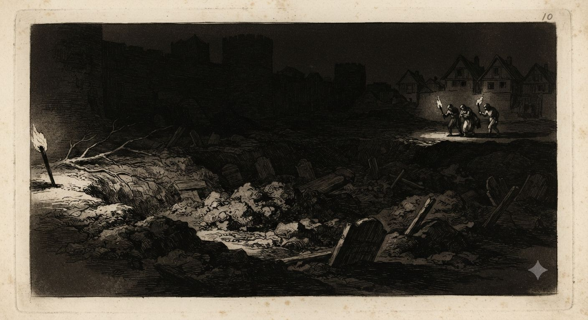
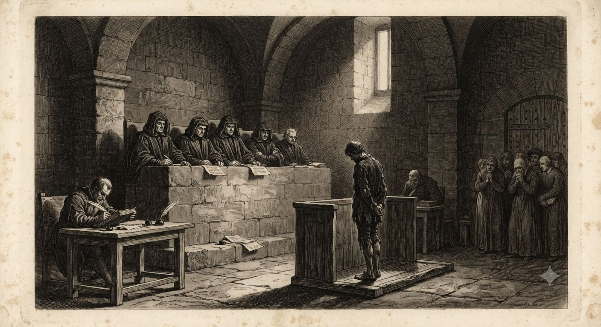
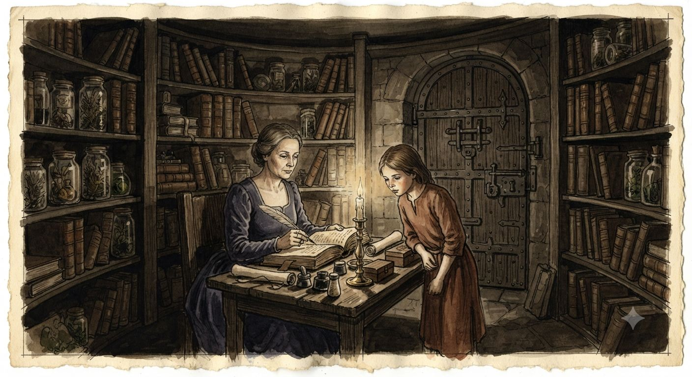

# Gildie Śmierci

Między 1347 a 1353 rokiem dżuma zabiła piętnaście do dwudziestu pięciu milionów ludzi w Europie. To jest historia, którą zna każdy kronikarz epoki. Druga historia, ta która nie trafiła do żadnej oficjalnej kroniki, mówi o tym, co zaraza zbudziła pod ziemią razem z ciałami, które w nią wrzucano.

Kroniki miejskie liczą trupy. Rejestry gildii, listy inkwizycyjne i marginalia przetrwałe wbrew czystkom liczą coś innego: jak wielu zmarłych wstało, zanim ktokolwiek zdążył je pochować, i jak wielu żywych zobaczyło w tym szansę zamiast tragedii. [[Gildie Śmierci]] to nazwa nadana z perspektywy zwycięzców. Ci, których nią objęto, nigdy nie nazwali się tak sami.

---

## Natura nieumarłych przed katastrofą

Nekromancja jest jednym z dwudziestu dwóch kolegiów [[Europejskie czarostwo|europejskiego czarostwa]] i przed 1347 rokiem była kolegium niszowym, nie zakazanym. Uczony czarownik animował ciało tak samo, jak inny wywoływał deszcz — rzadko, kosztownie, z jasno określonym skutkiem.

Zwykły produkt tego kolegium jest prosty. Jedno zaklęcie ożywia jedno ciało; efekt słabnie z dniami, wymaga podtrzymania i kończy się rozpadem, gdy czarownik przestaje go zasilać albo umiera. Taki sługa nie myśli. Wykonuje rozkazy dosłownie, powoli, bez inicjatywy — kopie grób, nosi wodę, stoi na warcie, dopóki go nie odwołają.

Osobną, znacznie rzadszą kategorią są duchy. Nie powstają z zaklęcia — wyłaniają się same, gdy śmierć była gwałtowna, niesprawiedliwa albo obciążona sprawą niedokończoną, a miejsce zdarzenia trzyma pamięć długo. Duch nie ma ciała i nie słucha rozkazów; działa wedle własnej, uwięzionej w chwili śmierci logiki, powtarzając tę samą czynność, aż ktoś rozwiąże sprawę, która go trzyma, albo aż pamięć miejsca wreszcie wyblaknie.

Żadna z tych form nie przygotowała Europy na to, co przyszło z zarazą. Zombie z 1345 roku był powolnym, głupim narzędziem jednego maga. Za osiem lat ten sam rodzaj zaklęcia miał obudzić coś, co samo się utrzymywało i samo się mnożyło.

> [!mechanics]
> **Standardowa nekromancja (przed 1347 i po 1367):** jeden caster, jedno ciało, Maintain Spell wymagane co dobę; bez podtrzymania sługa rozpada się w kilka dni
> **Duchy:** Spirit bez fizycznego ciała, Restricted by Story (powtarza okoliczności własnej śmierci), egzorcyzm lub rozwiązanie sprawy jako jedyne trwałe rozwiązanie
> **System:** GURPS Magic, kolegium Nekromancja; zob. [[Europejskie czarostwo]]

## Zaraza

Dżuma dotarła do Sycylii we wrześniu 1347 roku genueńskimi statkami płynącymi z Krymu. Gabriele de' Mussis, notariusz z Piacenzy, spisał później, jak zaraza miała dotrzeć na te statki — podczas oblężenia Kaffy nad Morzem Czarnym Mongołowie katapultowali przez mury ciała zmarłych na dżumę, licząc, że choroba zrobi to, czego nie zrobiły ich wojska. Genueńscy kupcy uciekli morzem, nie wiedząc, że wiozą coś gorszego niż porażkę.

Choroba szła szybciej niż jakikolwiek posłaniec. Agnolo di Tura, kronikarz z Sieny, opisał miasto, w którym nie starczało rąk do grzebania zmarłych — całe rodziny chowano we wspólnych dołach, warstwami, bez dzwonów i bez płaczu, bo płaczący sami umierali, zanim skończyli żałobę. We własnym domu pochował pięcioro dzieci własnymi rękami.

We Francji karmelita Jean de Venette zanotował, że w Paryżu umierało codziennie tylu ludzi, iż cmentarze rozrastały się w tygodnie, nie w lata. Z Awinionu, gdzie rezydował papież, flamandzki urzędnik kurii Louis Heyligen napisał do przyjaciela w Brugii list, w którym policzył zmarłych na kilkaset dziennie i opisał miasto tak wyludnione, że testamenty przestały nadążać za śmiercią spadkobierców.

Z drugiej strony Morza Śródziemnego arabski uczony Ibn Chaldun stracił w zarazie oboje rodziców i większość swoich nauczycieli. Napisał później, że cywilizacja, którą znał, została zmieciona tak, jakby świat zaczynał od nowa — słowa, które przetrwały jako jedna z najbardziej przenikliwych refleksji epoki nad skalą katastrofy.

Żaden z tych pięciu głosów nie wspomina nekromancji. Piszą o trupach, dołach, dzwonach, które przestały bić, i o rodzinach, które znikały w kilka dni. To wszystko wydarzyło się naprawdę i to wszystko wystarczyło samo w sobie, by złamać kontynent.

## Fala

Czego kroniki nie zapisały, bo tego nie rozumiały: masowa, skoncentrowana w czasie i przestrzeni śmierć wzmocniła nekromancję na skalę, jakiej wcześniej nie znano i potem już nigdy nie powtórzono. Uczeni czarownicy, którzy przeżyli pierwsze miesiące zarazy, nazwali to później Falą — terminem roboczym, nigdy oficjalnie zdefiniowanym, bo nikt nie zdążył go zbadać dość długo, by ustalić, czym naprawdę było.

Skutek dało się zmierzyć od razu. Zaklęcie, które przed 1347 rokiem animowało jedno ciało na kilka dni, nagle utrzymywało się samo, bez podtrzymania, i rozciągało efekt na grupę zwłok naraz — cały masowy grób, nie pojedynczy trup. Duchy, dotąd rzadkie i przywiązane do jednego miejsca, zaczęły powstawać tam, gdzie zmarło zbyt wielu naraz, zbyt szybko, w zbyt wielkim przerażeniu — czasem dziesiątkami w jednym mieście w ciągu miesiąca.

Spontaniczne animacje, których nikt nie wywołał, zaczęły się jeszcze przed pierwszym świadomym eksperymentem. Masowe groby w niektórych miastach nie chciały leżeć spokojnie. Reakcja żywych była natychmiastowa i przerażona — dodatkowe warstwy ziemi, kamienie na mogiłach, księża wzywani do poświęcania dołów, zanim jeszcze ktokolwiek użył słowa „nekromancja".

Uczeni gildii zrozumieli szybciej niż zwykli ludzie, co się dzieje, i podzielili się na dwie reakcje. Jedni chcieli zbadać zjawisko i, jeśli się da, powstrzymać je albo obrócić w lekarstwo na samą zarazę. Inni zobaczyli w tym coś, czego żadne pokolenie czarowników przed nimi nie miało: okno, w którym niemożliwe stawało się osiągalne, i to okno miało się zamknąć, gdy tylko śmiertelność w Europie spadnie do normy.

> [!mechanics]
> **Efekt Fali (1347–ok. 1360, wygasający lokalnie do lat 70. XIV wieku):** zaklęcia kolegium Nekromancja działają bez kosztu Maintain Spell, obejmują obszar zamiast pojedynczego celu, czas rzucania skrócony o połowę; poza strefami masowych grobów i miejscami wielkiej, nagłej śmierci efekt stopniowo wraca do normy
> **Uwaga dla MG:** Fala nie jest bytem ani intencją — jest zjawiskiem tła, jak przypływ; nie da się jej przekupić, obrazić ani z nią negocjować

## Świat gildii sprzed wojny

Przed 1347 rokiem czarostwo w Europie nie miało jednej struktury władzy. Działało jako luźna sieć niezależnych domów — kilku mistrzów, garstka uczniów, biblioteka, laboratorium, czasem wieża albo klasztorne skrzydło wydzielone dla praktyki. Każdy taki dom prowadził własne badania, wybierał własne kolegia i rzadko odpowiadał przed kimkolwiek poza sobą.

Domy łączyły się w gildie dla ochrony, nie dla dowodzenia. Gildia dawała dostęp do wspólnej biblioteki, prawo azylu w sieci innych domów i głos w sporach między czarownikami, zanim spór trafił pod miecz albo pod stos. W zamian dom płacił składkę w wiedzy — nie całą swoją pracę, tylko tyle, ile potrzebne było, by inni uznali go za wartego obrony. Mistrz, który chciał zachować dla siebie najciemniejszą część swoich badań, mógł to zrobić. Płacił za to niższą pozycją w gildii i słabszym wsparciem, gdy przyszła bieda.

Ta zasada nieingerencji miała cenę, którą wojna z Gildiami Śmierci obnażyła brutalnie. Żadna gildia nie wiedziała naprawdę, ilu jej członków przekroczyło granicę, której formalnie nikt nie przekraczał — bo formalnie nikt nie musiał tego ujawniać, dopóki nie prosił o pomoc.

Wejście do takiego domu kosztowało majątek. Nauka trwała latami, księgi kopiowano ręcznie za cenę farmy, a laboratorium potrzebowało metali, szkła i rzadkich składników, których chłopu nie było stać nigdy, a mieszczaninowi rzadko. Do tego dochodził koszt subtelniejszy: obecność wyraźnego daru budziła u zwykłych ludzi niepokój, który trzeba było czymś maskować, a tytuł i majątek maskowały go najskuteczniej. Kto miał ziemię i nazwisko, temu sąsiedzi wybaczali dziwactwo. Kto nie miał żadnego z nich, bywał spalony za mniej.

Dlatego gildie były w większości szlacheckie. Nie z powodu krwi — czarostwo tego świata jest wyuczone, nie dziedziczne, w odróżnieniu od [[Sorcery]] — lecz z powodu tego, kogo było stać na dwadzieścia lat nauki i kogo otoczenie było skłonne tolerować przez ten czas. Gdy część tych domów obróciła się ku nekromancji, upadek pociągnął za sobą nie anonimowych wieśniaków, lecz nazwiska zapisane w kronikach rodowych, herbach i testamentach — realną szlachtę realnych regionów, której zniknięcie zostawiło dziury w liniach dziedziczenia widoczne jeszcze pokolenie później.

## Rozproszone cele

„Gildie Śmierci" sugeruje jedną organizację z jednym dowództwem. Rzeczywistość była rozdrobniona: odłamy dawnych domów, całe upadłe gildie, małe grupki, czasem pojedynczy mag działający sam w opuszczonej wieży. Nie łączył ich wspólny cel — łączyło ich to, że wszyscy sięgnęli po tę samą, nagle potężną gałąź magii, i to, że po kilku latach wszyscy stali się zwierzyną.

Cele, po które sięgali, były równie rozdrobnione jak oni sami.

Najprostszy i najgłośniejszy wariant to głód władzy. Garstka magów próbowała zbudować armię nieśmiertelnych sług i wykroić sobie tron albo miasto — plan prostacki w zamyśle, spektakularny w skutkach, bo pojedynczy szalony czarownik w szczycie Fali potrafił naprawdę zagrozić murom miasta, czego przed 1347 rokiem nie potrafił nikt bez armii za plecami.

Inny wariant nie miał żadnej ambicji politycznej. To była zemsta — jeden człowiek, jedna krzywda, i nagle dostępna moc, by tę krzywdę spłacić z odsetkami przekraczającymi wszelką miarę. Kroniki po latach wspominają wioski wymarłe bez śladu walki i majątki, których dziedzice zniknęli razem ze służbą, bez dowodu, kto i dlaczego to zrobił — tylko poszlaki wskazujące na kogoś, kogo dawno temu skrzywdzono.

Trzeci wariant był najzimniejszy i najmniej zrozumiały dla współczesnych. Część magów potraktowała Falę jako okazję badawczą, nie moralną próbę. Chcieli wiedzieć, czym jest dusza, gdzie się kończy życie, a zaczyna coś innego — i mieli po raz pierwszy w historii środki, by to sprawdzić eksperymentalnie, na dużą skalę, na ludziach, którzy i tak już umierali dziesiątkami tysięcy. Całe wioski posłużyły takim badaniom, bez rozróżnienia na ofiary zarazy i ofiary eksperymentu, bo z zewnątrz jedno i drugie wyglądało identycznie.

Czwarty wariant był najrzadszy i najbardziej niepokojący. Kilku magów, może kilkunastu w całej Europie, zrozumiało, że Fala daje im coś, czego żaden nekromanta przed nimi nie osiągnął naprawdę: szansę na świadomą, trwałą przemianę w nieumarłego z zachowanym umysłem, wolą i pamięcią. Nie ślepe zombie i nie fragmentaryczny duch — coś pomiędzy, uwięzione między śmiercią a życiem, ale wciąż sobą. Do tego wątku wraca ostatnia sekcja tego artykułu.

## Zrzeszanie się w cieniu polowania

Przez pierwsze lata Fali te grupy działały osobno, czasem nie wiedząc nawzajem o swoim istnieniu. Zjednoczyło je dopiero to samo, co miało je później zniszczyć: presja. Gdy reszta gildii i Kościoły zaczęły aktywnie polować, rozproszeni nekromanci zaczęli się chronić wspólnie, wymieniać wiedzą o unikaniu łowców i, w kilku udokumentowanych przypadkach, łączyć siły dla wspólnej obrony konkretnego miejsca — twierdzy, wieży, kryjówki, której nie dało się utrzymać w pojedynkę.

To właśnie ten późniejszy etap, nie wcześniejsze rozproszenie, dał zwycięzcom obraz zorganizowanego wroga i uzasadnił nazwę Gildie Śmierci — nazwę, która objęła jednym słowem coś, co przez większość swojego istnienia było garścią niepowiązanych ze sobą tragedii.

## Ci, którzy walczyli po drugiej stronie

Nie wszyscy czarownicy Europy patrzyli na Falę jak na okazję. Większość gildii, które nie skaziła się nekromancją, potraktowała rosnące zagrożenie jako egzystencjalne — bo zwycięstwo choćby jednej grupy dążącej do władzy przez armię nieumarłych oznaczało koniec dla wszystkich, skażonych i czystych jednakowo.

Ci mistrzowie i domy zaangażowały się w wojnę czynnie, nie tylko obronnie. Kuli [[Magiczne przedmioty|magiczne przedmioty]] chroniące mury miast, dzieliły się wiedzą o rozpoznawaniu skażenia, wysyłały uczniów jako zwiadowców tam, gdzie zwykły żołnierz nie miał szans przeżyć starcia z czymś, czego nie rozumiał. Część z nich zginęła w tej wojnie równie anonimowo, jak zginęli ich przeciwnicy.

Wdzięczność, jaką dostali, była nierówna i często żadna. W niejednym mieście obronę, którą naprawdę zapewnił magiczny krąg wykuty przez lokalny dom czarodziejski, w kronice zapisano jako cud świętego patrona albo skuteczność miejskiej milicji — bo przyznanie, że miasto przetrwało dzięki magii, oznaczało przyznanie, że magia w ogóle działa na taką skalę, a to samo w sobie było niewygodne dla władzy kościelnej i świeckiej naraz. Niejeden dom, który stracił większość swoich ludzi broniąc cudzych murów, został po latach spisany z historii tak dokładnie, że dziś nie wiadomo nawet, jak się nazywał.

Gorsze były przypadki zdrady wprost. Zdarzało się, że lokalny władca, przyjąwszy pomoc czarodziejskiego domu w obronie przed skażonymi, po wygranej oskarżał tych samych obrońców o to samo przestępstwo, które właśnie pomogli powstrzymać — bo żywy, wdzięczny sojusznik-czarownik był politycznie niewygodny, a martwy sojusznik-czarownik dawał posłowi do papieża dowód gorliwości.

Z tych czystych, walczących domów wywodzi się coś, czego żadna oficjalna historia [[Inkwizycja|Inkwizycji]] nie potwierdza wprost, choć nie zaprzecza temu równie stanowczo. Gdy sto trzydzieści lat później w Hiszpanii powstała instytucja mająca systematycznie ścigać to, co naprawdę nadprzyrodzone, jej pierwsi architekci musieli skądś czerpać metodę rozpoznawania prawdziwego skażenia od histerii tłumu — metodę, której zwykli inkwizytorzy sami by nie wymyślili. Nie jest niemożliwe, że część tej wiedzy, a może i część pierwszych rąk, które ją stosowały, wywodziła się z ocalałych, pokutujących linii dawnych czystych gildii, szukających w nowej instytucji miejsca, gdzie ich stara wiedza mogła wreszcie służyć jawnie. Żaden dokument tego nie potwierdza. Żaden też tego nie wyklucza.

## Załamanie wiary

Zaraza uderzyła w Kościół inaczej niż w gildie, ale równie głęboko. [[Cudotwórcy|Cudotwórcy]] wysyłani do ognisk epidemii robili dokładnie to, do czego byli zdolni — leczyli, dopóki starczało im wiary, i w niejednym mieście ich obecność naprawdę gasiła zarazę, zanim zabrała wszystkich. Problem był w skali. Żaden kontyngent, choćby najgorliwszy, nie mógł uleczyć kontynentu.

W jednym z lepiej udokumentowanych przypadków — mieście na północy Włoch, którego nazwy większość późniejszych kopii kroniki już nie podaje — biskup ściągnął dwunastu cudotwórców z okolicznych klasztorów, licząc, że ich połączona wiara zatrzyma epidemię, zanim ta zdziesiątkuje miasto. Zatrzymała ją rzeczywiście, po sześciu tygodniach nieustannej pracy. Z dwunastu cudotwórców, którzy przeżyli fizycznie, ośmiu nigdy więcej nie sprowadziło Cudu. Kronikarz zanotował tylko, że „łaska ich opuściła" — nie wiedząc, że opisuje mechanizm, nie tajemnicę: modlitwa, która nie zdołała uratować wszystkich, złamała tych, którzy patrzyli na to, czego nie zdołali odwrócić.

Skala tej klęski powtórzyła się w setkach miast naraz, w tym samym czasie, na całym kontynencie. Kościół, liczony sumarycznie, stracił w tych sześciu latach więcej cudotwórców niż w niejednej wojnie religijnej następnych stuleci — nie od miecza, lecz od wypalenia. Lokalnie epidemię dawało się zdusić. Całościowo, wobec skali cierpienia, samymi Cudami nikt sobie nie poradził, a religie abrahamowe wyszły z zarazy duchowo osłabione dokładnie w chwili, w której musiały jeszcze przez dekadę walczyć z tym, co ta sama zaraza obudziła pod ziemią.

## Głosy z tamtych lat

Poniższe fragmenty pochodzą z różnych rąk, różnych krajów i różnych momentów konfliktu. Część to relacje realnych, znanych kronikarzy epoki, opisujące wyłącznie zarazę — te są jedynymi, które przetrwały w obiegu publicznym, bo nie wspominają nic, co warto było ścigać. Reszta to zapiski anonimowe, ocalałe przypadkiem, w archiwach klasztornych, prywatnych zbiorach i, w kilku przypadkach, w aktach samej Inkwizycji, która najwyraźniej uznała je za zbyt niekompletne, by stanowiły dowód czegokolwiek.

### Zapis notariusza z Piacenzy, wczesne miesiące zarazy

Statki, które przypłynęły z Kaffy, przywiozły więcej niż chorobę. Marynarze, którzy przeżyli podróż, twierdzili, że słyszeli w ładowniach coś poruszającego się między ciałami, które umarły w drodze — nie od kołysania okrętu. Kapitan portu w Mesynie kazał trzy statki spalić na redzie, zanim ktokolwiek zszedł na ląd. Nie pomogło. Choroba już była na lądzie, przeniesiona przez tych, którzy zeszli wcześniej.

### List urzędnika kurii, Awinion

Pisałem Ci już o liczbie zmarłych, która nie mieści się w rachunkach. Dopiszę teraz rzecz, o której proszę milczeć poza tym listem. Grabarze z jednej z parafii za miastem odmówili dalszej pracy przy zbiorowej mogile, twierdząc, że ziemia w niej „oddycha". Kapelan, wezwany do poświęcenia miejsca powtórnie, wrócił i kazał zasypać dół grubszą warstwą wapna, niż praktyka nakazuje. Nie zapytałem go, dlaczego. Boję się odpowiedzi bardziej niż samej zarazy.

### Rejestr domu czarodziejskiego, region niemiecki, bez nazwiska autora

Trzej z naszych zniknęli w ciągu miesiąca. Pierwszy, twierdząc, że bada przyczyny Fali dla dobra wszystkich, przestał odpowiadać na listy. Drugi zabrał ze sobą połowę biblioteki kolegium Nekromancji, zostawiając notatkę, że wraca, gdy skończy pracę, której nie chce jeszcze dzielić z domem. Trzeci, najmłodszy, po prostu odszedł nocą, nie zabierając nic. Rada domu głosowała nad tym, czy zgłosić ich zniknięcie starszyźnie gildii. Głosowanie przepadło sześć do czterech. Zapisuję to, bo obawiam się, że będziemy tego żałować.

### Zeznanie żołnierza miejskiej straży, spisane przez pisarza sądowego, region burgundzki

Świadek zeznał, iż w noc obrony bramy południowej ujrzał kolumnę zmarłych idącą polem bez żadnego dowódcy widocznego z murów, a mimo to poruszającą się jednym ruchem, jakby wszystkie ciała ciągnęła ta sama ręka. Dwaj magowie z miejscowego domu, których świadek nazwał z imienia znanego tylko sądowi, stali na murach przez całą noc, rzucając zaklęcia, które łamały ten ruch na krótkie chwile. O świcie kolumna się rozpadła. Świadek zeznał, że jeden z magów zmarł tego samego dnia z wyczerpania, a rajcy miejscy w oficjalnym podziękowaniu za ocalenie miasta wymienili wyłącznie straż miejską i patrona kościoła farnego.

### Notatka marginalna w aktach procesowych, dopisana inną ręką niż główny tekst, bez daty

Oskarżony przed śmiercią twierdził, że nie działał sam, lecz z rozkazu kogoś, kogo nazwał tylko „Tym, Który Nie Umarł Do Końca". Sąd uznał to za majaczenie konającego i nie odnotował dalszych szczegółów w protokole głównym. Dopisek na marginesie, sporządzony najwyraźniej później i innym atramentem, brzmi: sprawdzić, czy podobne zeznanie nie pojawiło się w aktach innego procesu, w innej prowincji, w innym roku.

### Fragment dziennika maga, region iberyjski, bez pełnego nazwiska — podpisany tylko inicjałem

Dwadzieścia lat pracy mego domu spłonęło w jedną noc razem z biblioteką, którą budowaliśmy od czasów mego dziada. Trybunał nie odróżnił naszych ksiąg o ziołolecznictwie od ksiąg o nekromancji, bo nie umiał czytać ani jednych, ani drugich — liczyła się tylko obecność pisma, którego nie rozumieli. Ocalałem, bo byłem w podróży. Wracam teraz do domu, którego już nie ma, i zastanawiam się, czy było warto bronić murów miasta, które teraz płaci mi stosem za tę samą magię, którą się broniło.

### Zapiska klasztorna, region włoski, dołączona do lokalnej kroniki innym charakterem pisma

Brat odpowiedzialny za bibliotekę zanotował, że dwunastu przysłanych do miasta uzdrowicieli powróciło do klasztoru, lecz ośmiu z nich nie odprawia już mszy o cudach, bo — jak twierdzi przełożony — „łaska ich opuściła po tym, czego nie zdołali powstrzymać". Zapisano ich odtąd do prac gospodarczych. Kronikarz dodaje bez komentarza, że jeden z ośmiu zmarł rok później, nie chorując wcześniej na nic poza smutkiem.

### Zeznanie mieszkanki wsi, region nadreński, spisane siedemdziesiąt lat po wojnie z Gildiami Śmierci przy okazji lokalnego procesu o czary

Świadkini zeznała, iż jej babka opowiadała o czasach, gdy w lasach za wsią chowali się ludzie „uczeni w martwej mowie", którzy w zamian za żywność leczyli chorych ziołami znanymi tylko sobie. Babka twierdziła, że nie byli źli, tylko ukrywali się przed czymś gorszym od siebie. Sąd uznał to zeznanie za nieistotne dla rozpatrywanej sprawy i nie uwzględnił go w wyroku.

### Notatka niezidentyfikowanego inkwizytora, znaleziona wśród akt archiwalnych sprzed formalnego powstania trybunału, bez daty i podpisu

Trzeci już raz w tym roku natrafiam na wzmiankę o adepcie, który miał przetrwać własną śmierć z zachowanym umysłem. Za każdym razem trop urywa się w tym samym miejscu — świadek umiera, dokument płonie, albo sprawa zostaje przekazana wyżej i nigdy nie wraca. Zaczynam podejrzewać, że ktoś nad nami woli, byśmy tego tropu nie znaleźli, niż żebyśmy go zamknęli.

## Cena zwycięstwa

Do roku 1366 najsilniejsze skupiska nekromantów były rozbite, a Fala słabła lokalnie tam, gdzie masowe groby przestawały rosnąć. Zwycięstwo nie było jednak czyste. Złamanie Gildii Śmierci pociągnęło za sobą koniec jawnych organizacji czarodziejskich w całej Europie — władcy i Kościoły, nie potrafiąc odróżnić domu badającego zioła od domu hodującego armię umarłych, zniszczyły albo wchłonęły w nadzorowanej formie wszystko, co jawnie praktykowało magię.

Najwięcej wiedzy spłonęło w Hiszpanii, bo osiem wieków sąsiedztwa z Al-Andalus uczyniło z niej bramę arabsko-żydowskiej wiedzy tajemnej i najgęściej usianą gildiami ziemię Europy. To ta sama trauma, sto trzydzieści lat później, stanie się jednym z dwóch korzeni [[Inkwizycja|hiszpańskiej Inkwizycji]] — instytucji zbudowanej częściowo po to, by coś takiego nie powtórzyło się nigdy więcej.

Od tej pory czarostwo uczy się w ukryciu, łańcuchem jednoosobowych ogniw, mistrz po uczniu, bez jawnych bibliotek i bez jawnych domów. To jest punkt, od którego magia znika z widoku Europy na cztery i pół wieku, aż do roku, w którym rozgrywa się ten setting.

## Polowania na czarownice

Wspomnienie wojny z Gildiami Śmierci przetrwało w kulturze ludowej dłużej niż w archiwach — jako opowieść uproszczona do jednego zdania: magowie paktują z demonami, a niektórzy wciąż to robią. To zdanie było w gruncie rzeczy prawdziwe. Problem w tym, że po zamknięciu jawnych gildii nikt już nie potrafił odróżnić prawdziwego adepta od sąsiadki, która zbyt dobrze znała się na ziołach.

Im rzadszy stawał się prawdziwy czarownik, tym okrutniejsze robiły się łowy — bo jedna prawda wystarczała, by usprawiedliwić tysiąc fałszywych oskarżeń. Szczyt tej logiki przyszedł niemal trzy wieki po wojnie. Würzburg, Bamberg i Trewir spaliły w latach 1626–1631 tysiące ludzi, niemal samych niewinnych — Rzesza, w której jawne czarostwo stłumiono najkrwawiej ze wszystkich krain Europy, zapłaciła też najwyższą cenę za późniejszą histerię. Salem w koloniach amerykańskich powiesiło w 1692 roku dwadzieścioro, w mieście, które nigdy w życiu nie widziało prawdziwego adepta blisko swoich granic.

Żadne z tych polowań nie znalazło więcej niż garstkę realnego zagrożenia. Oba żywią się tym samym strachem, który narodził się w latach czterdziestych i pięćdziesiątych XIV wieku i nigdy naprawdę nie wygasł — tylko czekał na kolejną epidemię, kolejną suszę, kolejny powód, by ktoś zapytał sąsiada, skąd zna się tak dobrze na chorobach.

> [!rules]
> **Mechanika strachu:** im niższa faktyczna gęstość prawdziwych adeptów w regionie, tym wyższy modyfikator do paniki i fałszywych oskarżeń podczas kryzysu (zarazy, klęski żywiołowej, wojny) — MG może traktować to jako odwrotną korelację, nie wprost proporcjonalną
> **Świadectwo prawdziwego adepta:** ukrywającym się czarownikom opłaca się bardziej milczeć niż bronić sąsiada oskarżonego niesłusznie, bo obrona ujawnia wiedzę, której obrońca nie powinien mieć

## Cień liszy

Żaden nekromanta, o którym wiadomo na pewno, nie osiągnął tego, po co sięgnęła garstka najbardziej zdeterminowanych podczas Fali: świadomej, trwałej przemiany w nieumarłego z zachowanym umysłem, wolą i pamięcią — czegoś pomiędzy bezmyślnym zombie a fragmentarycznym duchem, skazanego na wieczność, ale wciąż sobą.

[[Inkwizycja]] traktuje samą ideę jako informację niebezpieczniejszą niż większość skonfiskowanej wiedzy magicznej i celowo tłumi wzmianki o niej, gdziekolwiek się pojawią — nie dlatego, że wie, iż komuś się udało, lecz dlatego, że nie wie, czy się nie udało. Nikt nie znalazł dowodu sukcesu. Nikt też nie znalazł dowodu porażki wszystkich, którzy próbowali.

To jest największy koszmar organizacji zbudowanej na przekonaniu, że wojnę wygrano ostatecznie: myśl, że gdzieś, w miejscu, którego czterysta pięćdziesiąt lat poszukiwań nie dotknęło, jedna z tych prób połowicznie się powiodła, a jej wynik wciąż czeka, cierpliwiej niż jakikolwiek żywy człowiek potrafiłby czekać, na kolejne okno takie jak Fala. Od zakończenia wojny nie natrafiono nawet na poszlakę. To, samo w sobie, nie uspokaja nikogo, kto zna sprawę dokładnie.

## Chronologia konfliktu

**Wrzesień 1347** — dżuma dociera do Sycylii genueńskimi statkami z Krymu; pierwsze, jeszcze niepowiązane ze sobą doniesienia o niepokojącym zachowaniu masowych grobów pojawiają się w ciągu kilku miesięcy w kilku regionach naraz.

**1348** — zaraza ogarnia większość Europy Zachodniej; pierwsze udokumentowane spontaniczne animacje nieumarłych, nienazwane jeszcze żadnym wspólnym terminem; uczeni gildii zaczynają wymieniać niepokojące obserwacje w prywatnej korespondencji.

**1349–1350** — szczyt śmiertelności w większości krain; pierwsi magowie świadomie eksperymentujący z Falą; pierwsze zniknięcia członków domów czarodziejskich odnotowane w rejestrach wewnętrznych, bez alarmu na zewnątrz.

**1350–1351** — pierwsze starcia zbrojne między czystymi domami a nekromantami, wciąż lokalne i nieskoordynowane; śmiertelność zarazy zaczyna spadać w większości regionów, lecz Fala słabnie wolniej niż sama choroba.

**1351–1355** — okres najgęstszego rozproszenia: grupy dążące do władzy, zemsty i badań nad duszą działają równolegle bez wiedzy o sobie nawzajem; pierwsze próby świadomej przemiany w nieumarłego z zachowanym umysłem, wszystkie bez potwierdzonego rezultatu.

**1355–1360** — nekromanci pod rosnącą presją zaczynają się zrzeszać dla obrony; czyste gildie i Kościoły organizują pierwsze skoordynowane polowania ponadregionalne; najkrwawsze starcia konfliktu, w tym obrony miast wspominane później wyłącznie jako cuda albo zasługi milicji.

**1360–1366** — łamanie ostatnich dużych skupisk; masowe niszczenie bibliotek i domów czarodziejskich, jawnych i czystych jednakowo, bo władza świecka i kościelna traci zdolność odróżnienia jednych od drugich.

**1366–1370** — koniec otwartej wojny; mop-up w postaci pojedynczych łowów na ocalałych; magia znika z jawnego życia Europy na cztery i pół wieku.

**1478** — powstaje hiszpańska [[Inkwizycja]] Królewska, w części zbudowana na traumie tej wojny i, jak twierdzą niektórzy, na wiedzy przekazanej przez ocalałych z czystych gildii.

**1626–1631 i 1692** — echo konfliktu w postaci wielkich polowań na czarownice w Würzburgu, Bambergu, Trewirze i Salem, trzy wieki po zamknięciu pierwotnej wojny.

---

*Powiązane artykuły: [[Europejskie czarostwo]], [[Cudotwórcy]], [[Inkwizycja]], [[Hiszpania]], [[Krucjaty]], [[Fey]], [[Sorcery]], [[Magiczne przedmioty]], [[Punkty rozbieżności]], [[Chronologia]].*

