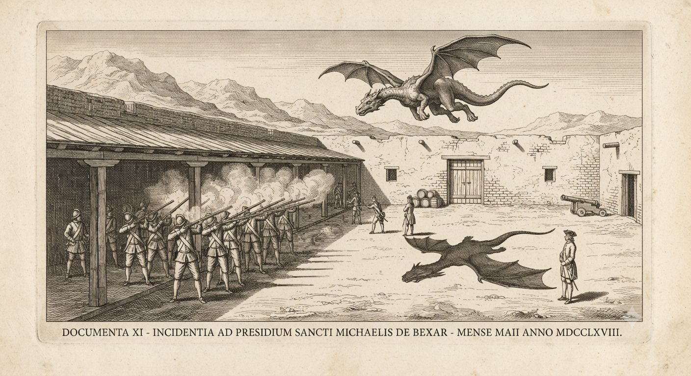
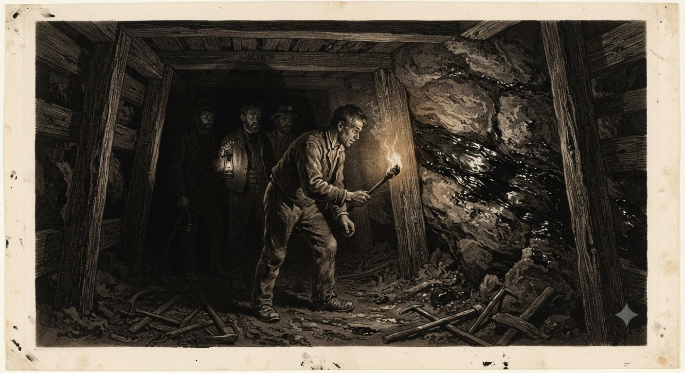
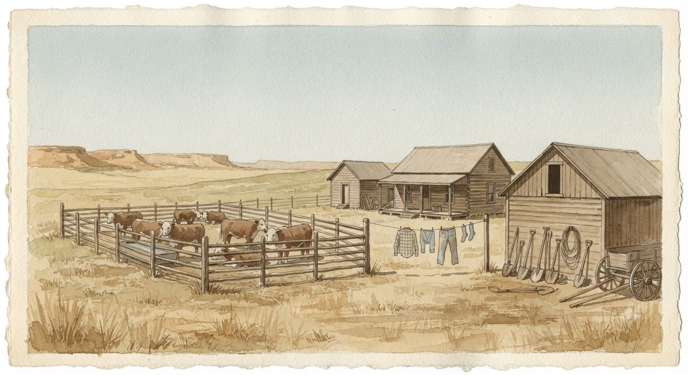

# Nowa Hiszpania

Na mapie w Madrycie Nowa Hiszpania rozciąga się od Gwatemali po ziemie, których żaden Europejczyk nie widział na własne oczy — wicekrólestwo większe niż reszta imperium razem wzięta. Na ziemi rzecz wygląda inaczej. Korona trzyma gęste, bogate jądro w dolinie Meksyku i wokół niego, a cały zachód i znaczna część południa pozostają cienką nitką placówek wbitych w krainę, której nie kontroluje nikt z Madrytu.

Powodem nie jest wyłącznie odległość ani brak ludzi. To ziemia [[Smoki|smoków]] i sprzymierzonych z nimi narodów, a dalej na południu — głębi, gdzie rządzą [[Charau-Ka]]. Korona od pokoleń utrzymuje fikcję, że to kwestia czasu i kolejnej ekspedycji. Urzędnicy na miejscu wiedzą, że to kwestia trwałego stanu rzeczy, którego nikt głośno nie nazwie.

---

## Jądro i granica

Rdzeń kolonii leży gęsto: Dolina Meksyku z stolicą liczącą sto trzydzieści tysięcy mieszkańców i własnym uniwersytetem, pas górniczy Bajío z Guanajuato i Zacatecas, Puebla, Oaxaca, korytarz do portu w Veracruz. Tu mieszka większość ludności kolonii, tu płynie srebro, tu siedzi [[Inkwizycja|Inkwizycja]] i sądy audiencji.

Wokół tego jądra ciągnie się sznur prowincji granicznych — Teksas, Coahuila, Nuevo León, Nuevo Santander, Nueva Vizcaya, Sonora, Nowy Meksyk, obie Kalifornie — administrowanych osobno, słabo zaludnionych i bronionych garniami żołnierzy, którym nikt nie obiecuje zwycięstwa, tylko przetrwanie. Na zachodzie i na dalekiej północy mapa po prostu się urywa: białe plamy, na których kartograf wpisuje *tierra incógnita* i ma rację.

> [!rules]
> **Wicekrólestwo Nowej Hiszpanii (1802)**
> **Stolica:** Meksyk, ~130 000 mieszkańców, uniwersytet od 1551 roku
> **Populacja całości:** ~5,5–6 mln (szacunek zbliżony do późniejszego spisu Humboldta); większość rdzenna i mieszana
> **Jądro skolonizowane:** Dolina Meksyku, Bajío, Puebla, Oaxaca, korytarz Veracruz — gęste osadnictwo, kopalnie, plantacje
> **Pogranicze (Provincias Internas):** Teksas, Coahuila, Nuevo León, Nuevo Santander, Nueva Vizcaya, Sonora y Sinaloa, Nowy Meksyk, Kalifornie — cienka linia presidiów i misji
> **Niepodbite:** zachód kontynentu za linią gór, dalekie północne pustkowia, pas dżungli na południu (Chiapas–Petén)
> **Status prawny zachodu i głębokiego południa:** formalnie wicekrólewski, faktycznie poza zasięgiem administracji

## Provincias Internas i urząd milczenia

Komendantura Generalna Provincias Internas, wydzielona z wicekrólestwa w 1776 roku, dowodzi całym pograniczem osobno od reszty administracji — sygnał, że Madryt sam uznał granicę za odrębny problem wojskowy, nie kolejną prowincję cywilną. Pedro de Nava trzymał ten urząd od 1790 roku, prowadząc go jak markiz pograniczny, którego jedynym realnym zadaniem jest nieoddawanie ziemi, nie jej zdobywanie. W 1802 roku przekazuje komendę bratankowi, Nemesio Salcedo y Rábago — nazwisko, które brzmi znajomo każdemu, kto śledzi sprawy znad Missisipi: jego krewny, Manuel de Salcedo, tej samej wiosny obejmuje gubernatorstwo hiszpańskiej [[Terytorium Luizjany|Luizjany]]. Rodzina Salcedo trzyma w 1802 roku obie krawędzie hiszpańskiej Ameryki Północnej naraz.

Pod komendanturą działa urząd bez którego korespondencja z Madrytem dawno by się załamała — biuro określane nieoficjalnie jako komisariat gór i pustkowi. Jego jedyną realną funkcją jest formułowanie raportów tak, by „brak incydentów" znaczyło dokładnie to, co potrzebne, nie to, co się wydarzyło. Uczciwy raport o starciu ze smokiem albo o utraconej placówce zmuszałby Koronę do wyboru między wojną, na którą nie stać, a przyznaniem się do granic własnej suwerenności. Urzędnik na tym stanowisku nie kłamie wprost — po prostu nigdy nie pisze zdania, którego nie da się obronić przed inspektorem z Madrytu.

Z tego samego powodu mapy pogranicza są celowo niedoprecyzowane. Kartograf, który narysuje Provincias Internas zbyt dokładnie, zaczyna mimowolnie rysować drugą mapę — miejsc, gdzie zgłaszano smoki, czyli miejsc, gdzie władza Korony faktycznie się kończy. Takie szkice bywały konfiskowane, a ich autorom tłumaczono to względami wojskowymi.

## Komanczeria

Na linii, której od pokoleń nie udało się przesunąć na zachód od San Antonio, Teksas należy faktycznie do Komanczów. Kapitan José Ruiz de Lara, opisując w 1791 roku atak [[Smoki|smoka pustynnego]] na swój presidio, zanotował, że na tej granicy stoją smoki i jeźdźcy Komanczów razem — czego nie dokończy bestia, dosięgnie strzała z galopu. Jedenaście lat później nic się nie zmieniło.

Pokój wynegocjowany w 1785 roku przez Juana Bautistę de Anzę z komańczańskim wodzem Ecueracapą trzyma się do dziś, choć sam Ecueracapa umarł w 1793 roku. Mało kto w Madrycie zna jego pełną treść — bo traktat niesie cichy, niepisany dodatek: Korona zobowiązała się nigdy nie organizować polowań na pustynne smoki w obrębie ziem komańczańskich. Złamanie tego przez pojedynczego, zachłannego łowcę krwi było i bywa zapalnikiem najazdów, które oficjalne raporty tłumaczą byle czym — kradzieżą bydła, zniewagą, starym sporem.

Jednym z niewielu Hiszpanów, którym ufają zarazem wodzowie pokoju i sama granica, jest Pedro Vial — odkrywca, który w latach 1786–1789 wytyczył szlaki między Santa Fe, San Antonio i Saint Louis. Jego trasy nie są przypadkowe: każda z nich z premedytacją omija znane gniazda i terytoria, których Vial nigdy nie opisał Koronie tak dokładnie, jak mógłby. Wie więcej o granicy niż ktokolwiek w komendanturze, i trzyma większość tej wiedzy dla siebie.

Nie każdy intruz dostaje ostrzeżenie. W marcu 1801 roku hiszpańscy dragoni zabili w Teksasie Philipa Nolana, amerykańskiego handlarza koni, który wracał na pogranicze od lat mimo zakazów. Oficjalnie ścigano przemyt koni i nielegalne wejście na terytorium Korony. Po cichu wiadomo więcej: Nolan zwiadował też szlaki, którymi amerykańscy kupcy znad [[Terytorium Luizjany|Missisipi]] liczyli przemycać [[Smocza krew|smoczą krew]] na wschód, omijając hiszpański zakaz. Jego ocalały towarzysz, Ellis Bean, siedzi w 1802 roku w więzieniu w Chihuahui i jest przesłuchiwany dokładnie o to, ile wiedział jego dowódca.

Dalej na południe od Komanczerii Korona trzyma inny rodzaj bufora. Polityka osad pokojowych dla Apaczów, wprowadzona przez Bernarda de Gálveza w 1786 roku — racje żywności i broń w zamian za spokój przy garnizonach — działa też jako pas, który po cichu przejął rolę dawnej strefy buforowej przed pustynnymi bestiami. Żaden traktat tego nie nazywa wprost, ale komendantura liczy na te osady tak samo, jak liczy na mur presidiów.

> [!rules]
> **Presidio na pograniczu (parametry dla GURPS)**
> **Garnizon typowy:** 30–80 żołnierzy, zaopatrzenie nieregularne
> **Obrona przed smokiem pustynnym:** zadaszone dziedzińce i stajnie (atak z powietrza); pojedynczy wartownik ginie, nim przeładuje — potrzebna salwa wielu luf naraz (zob. [[Smoki]])
> **Obrona przed Komanczami:** fortyfikacja stała przeważnie wystarcza; zagrożenie realne w otwartym terenie i przy transportach
> **Status linii San Antonio – zachód:** faktycznie terytorium komańczańskie, nie hiszpańskie

## Srebro, nauka i to, co Inkwizycja każe milczeć

Kopalnia Valenciana pod Guanajuato, własność hrabiego de Valenciana, jest najbogatszą żyłą srebra na świecie. Górnicy schodzący coraz głębiej donoszą czasem o czymś poza srebrem — szklistej, czarnej skale, która zda się „pić światło pochodni". Standardowa instrukcja [[Inkwizycja|Świętego Oficjum]] dla takich znalezisk jest krótka: zapieczętować chodnik, zgłosić, nie badać. Nikt jeszcze nie sprawdził, czy ktoś tę instrukcję kiedykolwiek złamał.

W kontrze do tego stoi Real Seminario de Minería, założony w 1792 roku przez Fausto Elhuyara — który dziewięć lat wcześniej współodkrył wolfram, zanim przybył do kolonii jako dyrektor generalny górnictwa. Szkoła uczy chemii racjonalnej, wolnej od Inkwizycji i od podejrzenia o herezję, i jest pomyślana jako droga do bogactwa mineralnego, której Korona nie musi tłumaczyć Świętemu Oficjum. Między starymi alchemikami, ukrywającymi się od pokoleń w cieniu [[Alchemia|gildii, które dawno przestały istnieć jawnie]], a nowymi chemikami Elhuyara panuje cicha, wzajemna pogarda — jedni uważają drugich za szarlatanów, drudzy za reakcjonistów.

Wokół fortuny rodu Conde de Regla, której założyciel Pedro Romero de Terreros sfinansował w swoim czasie akwedukt stolicy, krąży rodzinne podanie o czymś w skale, co miało dać początek powodzeniu kopalni. Kościół zbadał sprawę dekady temu i uznał ją za nieszkodliwy zabobon. Akt tego dochodzenia nikt od tamtej pory nie otworzył ponownie, a rodzina nie kwapi się, by o nie pytać.

Na Uniwersytecie Meksykańskim leży inna, cichsza zagadka. Katalogowanie nahuaskich i majańskich kodeksów urwało się w XVI wieku, gdy przydzielony do tej pracy zakonnik popadł w obłęd, a zastępcy nigdy nie wyznaczono. Od dwustu pięćdziesięciu lat nieprzetłumaczone teksty leżą w zamkniętym archiwum, których zawartości nie zna już nikt żywy.

## Czystość krwi

Inkwizycja w Nowej Hiszpanii ma osobny, niepisany powód, by ścigać [[Smoczy Magowie|Smoczych Magów]] surowiej niż gdziekolwiek indziej w imperium. Burgundowy uśmiech nie jest dla niej tylko dowodem nielegalnej alchemii — podważa dosłownie *limpieza de sangre*, doktrynę czystości krwi, na której opiera się cały kolonialny porządek urzędów i tytułów. Magicznie przekształcona krew jest skandalem teologicznym głębszym niż przemyt.

To tworzy sojusz interesu, którego żadna ze stron by nie nazwała sojuszem. [[Rdzenne narody Ameryki Północnej|Rdzenni]] ścigają Smoczych Magów, bo mordują ich przodków na surowiec; Inkwizycja ściga ich, bo plamią doktrynę krwi. Obaj tropiciele działają niezależnie, czasem na tej samej granicy, czasem za tym samym człowiekiem — i żaden z nich nie wie, że ma sojusznika.

## Guadalupe i ksiądz z Dolores

Sanktuarium Matki Boskiej z Guadalupe na Tepeyac jest czymś więcej niż miejscem pielgrzymek. Wśród kreolskiego i metyskiego kleru, który je obsługuje, utrzymuje się rzadka, ciągła linia [[Cudotwórcy|cudotwórców]] — niezależna od hierarchii peninsularnej, zakorzeniona w pobożności, której Madryt nie wyhodował i nie kontroluje. Dla kreolskiego duchowieństwa jest to źródło cichej dumy; dla peninsularnych urzędników kolejny dowód, że kolonia ma własne życie duchowe, którego do końca nie rozumieją.

W Dolores, w Bajío, miejscowy proboszcz Miguel Hidalgo y Costilla hoduje winorośl i jedwabniki wbrew zakazom Korony i czyta książki, których Inkwizycja nie pochwala. Krążą szepty, że dotarł też do starych akt kościelnych o wygasających liniach magii krwi wśród hiszpańskiej elity regionu — wiedzy, jakiej prosty proboszcz nie powinien mieć. Co z niej wyniknie, nie wiadomo. Osiem lat dzieli rok 1802 od chwili, w której jego nazwisko stanie się czymś więcej niż nazwiskiem parafialnego księdza.

## Pacyfik i cienie z północy

Galeon manilski wciąż łączy Acapulco z Filipinami raz w roku, jak robi to od 1565 roku, wioząc srebro w jedną stronę i jedwab, porcelanę i osobliwości w drugą. W tym ładunku, którego nikt w Madrycie nie nadzoruje uważnie, trafiają się rzeczy z dalekiego zachodu świata — amulety [[Feng shui|feng shui]], kontrabandowe [[Czerwone opium|czerwone opium]] — szlakiem starszym niż samo wicekrólestwo.

Z drugiej strony kontynentu nadciąga niepokój nowszy. Rosyjscy traperzy z Kompanii Rosyjsko-Amerykańskiej, czynnej od 1799 roku, schodzą wzdłuż wybrzeża z Alaski i donoszą przełożonym o „niemożliwych ptakach" widzianych nad północną Kalifornią. W Meksyku rodzi się podejrzenie, że Rosja poluje na ten sam surowiec, którego Hiszpania nie tyka z powodów religijnych — strach geopolityczny innego rodzaju niż zwykła rywalizacja o ziemię.

Misje Alta California, zakładane przez Junípera Serrę aż do jego śmierci w 1784 roku i prowadzone od tamtej pory przez Fermína de Lasuéna, istnieją wyłącznie jako cienka nić wzdłuż wybrzeża. Misjonarze rozumieją, choć nie piszą tego wprost do Madrytu, że Kalifornia nigdy nie będzie niczym więcej niż sznurem portów — góry i doliny w głębi lądu należą do czegoś, czego żadna misja nie nawróci.

## Cisza nad misjami

Misjonarze północnego pogranicza odnotowują rzecz, której nikt w 1802 roku nie potrafi wytłumaczyć. Indianie misyjni — skupieni, osiadli, formalnie pod opieką Korony — umierają na epidemie częściej niż wciąż niezależne bandy Komanczów i Apaczów żyjące dalej w głębi terytorium. Zapisuje się to jako ciekawostkę w listach do prowincjała, nie jako obserwację wymagającą wyjaśnienia. Nikt nie ma jeszcze pojęć, którymi dałoby się tę różnicę nazwać.

## Południe, którego nikt nie chce

Na południu wicekrólestwo i sąsiednia Kapitania Generalna Gwatemali milcząco zgadzają się nie kłócić o pas dżungli między Chiapas a Petén. To rzadki przypadek, w którym dwie rywalizujące jurysdykcje kolonialne są sobie wdzięczne za wspólnego sąsiada, którego żadna nie kontroluje — bo dopóki [[Charau-Ka]] trzymają tę ziemię, nie ma o co się sądzić.

W samym sercu tego pasa leży Tayasal, ostatnie niezależne królestwo Majów, podbite przez Martína de Ursúę dopiero w 1697 roku — wieki po reszcie Mezoameryki. W tej wersji świata podbój powiódł się tak późno i tak łatwo tylko dlatego, że Itzowie, osaczeni, przekierowali napady Charau-Ka na sąsiadów, zanim sami runęli. Dżungla na południe i wschód od ruin pozostaje miejscem, którego kolonialni urzędnicy unikają, tłumacząc to „złymi duchami" — nie znając prawdziwej, znacznie starszej nazwy tego, co tam mieszka.

## Mur z adobe

Podróżujący po koloniach jezuiccy intelektualiści, oczytani w relacjach z Dalekiego Wschodu, lubią porównanie: Chiny budują swój [[Wielki Mur]] z zaklęć i wróżb feng shui, Hiszpania swój z adobe, armat i modlitwy, a obie bariery ledwie się trzymają. Łańcuch presidiów jest biednym krewnym Wielkiego Muru — taką samą linią rozpaczliwego powstrzymania, tyle że bez jednej uncji magii w samej konstrukcji.

System intendentur, wprowadzony w 1786 roku i dzielący Nową Hiszpanię na dwanaście jednostek administracyjnych, miał usprawnić zarząd kolonią. W praktyce daje też urzędnikom pogranicza dodatkową warstwę biurokratycznego kamuflażu — „brak incydentów" w raporcie intendenta jest formułą administracyjną, nie faktem, a każdy, kto pracował na granicy dłużej niż rok, wie, jak ją czytać.

## Zniknięcia

Od czasu do czasu żołnierze i misjonarze z głębi Provincias Internas zgłaszają coś, czego oficjalne raporty nie potrafią dobrze nazwać: presidio albo rancho znalezione w pełni wyposażone — bydło w zagrodzie, żywność na półkach, narzędzia na swoich miejscach — i całkowicie wyludnione. Żadnych śladów walki. Żadnego znaku napadu Apaczów ani niczego, co dałoby się przypisać znanej przyczynie.

Oficjalnie wpisuje się to jako dezercję. Żołnierze, którzy znajdują takie miejsca, szepczą później co innego, choć rzadko zgadzają się między sobą co dokładnie. Czy to sprawka czegoś, czego pogranicze jeszcze nie skatalogowało, czy zwykła ludzka ucieczka okraszona zabobonem, pozostaje nierozstrzygnięte — i być może lepiej, żeby tak zostało.

---

*Powiązane artykuły: [[Hiszpania]], [[Terytorium Luizjany]], [[Rdzenne narody Ameryki Północnej]], [[Smoki]], [[Charau-Ka]], [[Alchemia]], [[Smoczy Magowie]], [[Cudotwórcy]], [[Stany Zjednoczone]], [[Punkty rozbieżności]], [[Chronologia]].*

