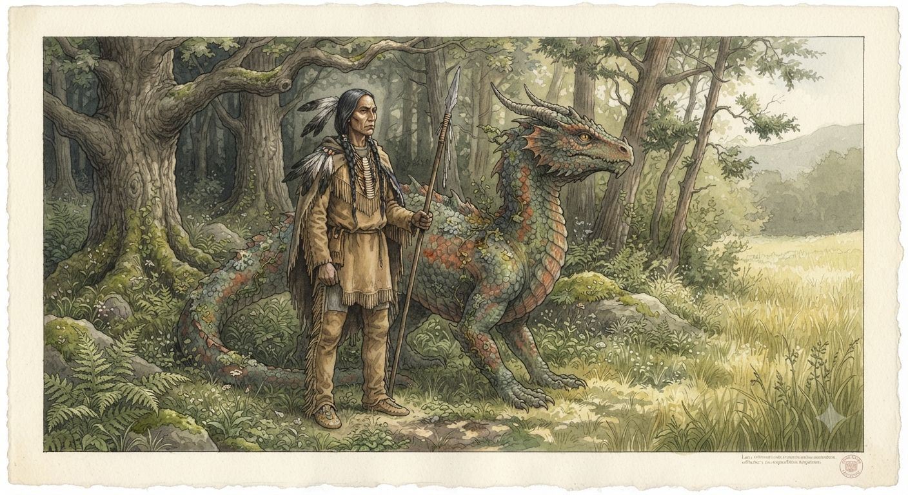
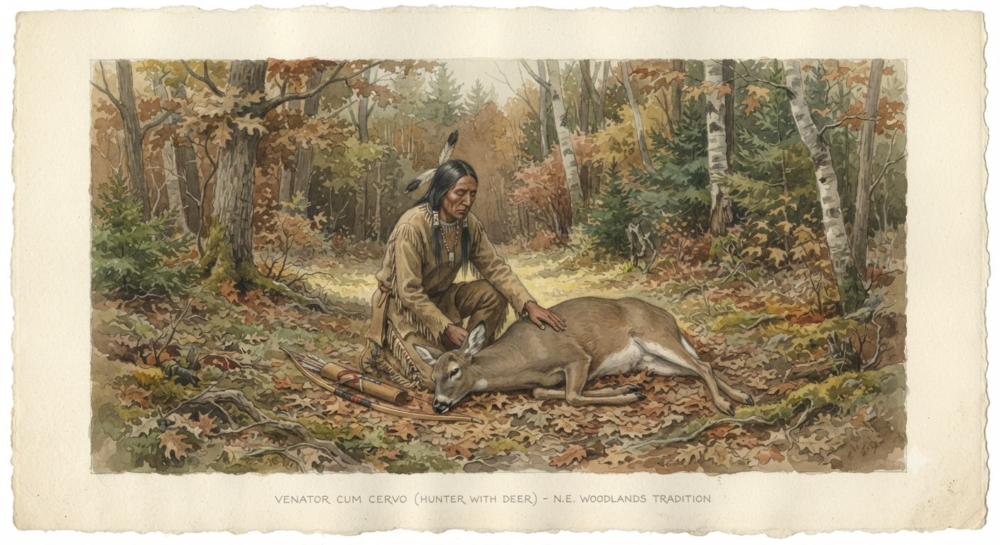
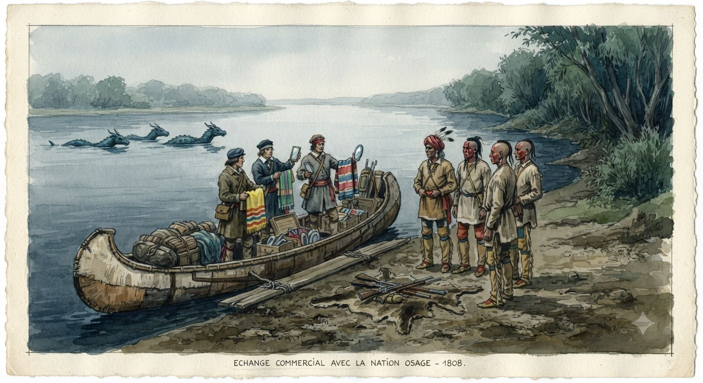

# Rdzenne narody Ameryki Północnej

Przed europejskim kontaktem ziemie na wschód od Gór Skalistych zamieszkiwało od pięciu do dziesięciu milionów ludzi w setkach odrębnych narodów, z własnymi językami, prawem i kosmologią sięgającą tysięcy lat. W 1802 roku żyje z nich od sześciuset tysięcy do miliona. Resztę zabrały ospa, odra, tyfus i dżuma, które przemiatały kontynent od 1492 roku, wyprzedzając osadników o całe dekady i nie pytając o wojnę ani bezpośredni kontakt. „Naród” oznacza w tym artykule wspólnotę etniczno-kulturową o własnym języku i zwyczajach — liczącą czasem dziesiątki tysięcy głów, czasem kilkaset — a „lud” czy „ludność” jej mieszkańców jako zbiorowość liczebną, bez tego politycznego ciężaru.

Rok 1802 dzieli ten świat na dwoje. Na wschód od Appalachów większość narodów jest już zepchnięta w szczeliny między stanami albo na kurczące się terytoria traktatowe. Na zachód od Missisipi leżą wciąż w pełni suwerenne światy, o których Waszyngton wie niewiele — [[Terytorium Luizjany]] należy na papierze do Francji od dwóch lat, a w rzeczywistości do Osagów, Paunisów, Komanczów i dziesiątek narodów, które z Paryżem nie podpisały niczego.

Dwie rzeczy odróżniają tę Amerykę od tej z podręczników. Rdzenni mieszkańcy są smuklejsi, zwinniejsi i silniejsi od osiadłych Europejczyków, urodziwsi i żyją nieco dłużej, choć wciąż śmiertelni. Druga to ten, z kim dzielą kontynent.

---

## Smoki, przodkowie i Dwudusze

Drugim panującym gatunkiem kontynentu są [[Smoki|smoki]]. Bliżej im do drake'ów niż do bestii europejskich legend — większość nie jest w pełni rozumna, nie włada mową, lata, gromadzi błyskotki i toczy zawiłe spory o terytorium i honor. Rdzenne narody widzą w nich przodków, którzy wrócili w innej skórze, i przez tysiące lat oba gatunki trwały obok siebie bez wojny.

Ta symbioza tłumaczy, czemu kontynentu nie podbito tak, jak głoszą podręczniki: każda dolina za rzeką ma obrońcę, którego pojedynczy muszkiet nie powali.

### Cztery przymierza

Smoki dzielą się na typy związane z krajobrazem, a rdzenne konfederacje ułożyły życie wokół tych, z którymi sąsiadują. [[Smoki Leśne]] polują stadnie w puszczach wschodu, plując chmurami kwasu; przy nich żyją narody Wschodnich Lasów — Haudenosaunee, Szaunisi, Lenape, Miami. [[Smoki Rzeczne]] bronią dorzeczy Missisipi i Missouri oraz Wielkich Jezior, a sąsiadują z nimi Osagowie i wioskowi rolnicy znad górnego Missouri. [[Smoki Pustynne]], samotne drapieżniki suchego południowego zachodu, stoją za dominacją Komanczów nad Teksasem i pograniczem [[Nowa Hiszpania|Nowej Hiszpanii]]. [[Smoki Górskie]], największe i najbardziej terytorialne, zamykają Góry Skaliste przed prospektorami, osłaniając narody, których Waszyngton nie zna nawet z nazwy.

Osobno trzymają się [[Cieniste Smoki]] — małe jak kot, sprytne, jako jedyne władające ludzką mową. Bywają oszustami i złodziejami, kręcą się tam, gdzie da się coś ukraść albo podszepnąć, i równie chętnie wokół białych miast co rdzennych obozów.

### Szamani i Dwudusze

Szamani są tu czymś powszechnym — niemal każda społeczność ma kogoś, kto czyta sny, leczy i prowadzi obrzędy, a spora ich część realnie wpływa na pogodę, zwierzęta i bieg choroby. Dwudusza — człowiek, który odnalazł smoka zrodzonego z tej samej duszy — jest rzadszy, lecz nie wyjątkowy: na większy klan przypada ich kilku. Bez rdzennej krwi ta więź jest w praktyce niemożliwa, co zamyka ją przed każdym europejskim adeptem.

To dzięki nim opór wreszcie się opłaca. Sam smok jest groźny, lecz dziki i samotny; dopiero szaman, który skłoni stado do zsynchronizowanego uderzenia, i Dwudusza, który poprowadzi je w bój — człowiek i bestia jak jeden umysł w dwóch ciałach — zmieniają rozproszone drapieżniki w wojsko. Tam, gdzie tych ludzi jest dość, a na zachodzie i w głębi lądu jest, kolumna osadników albo wyprawa po krew po prostu nie wraca.

Nie czyni to magami wszystkich wodzów. Negocjatorzy i mówcy bywają klasą polityczną osobną od szamanów, lecz władza wojenna i władza nad smokami chodzą w parze częściej, niż biali zdają sobie sprawę.

### Wojna o krew

Wszystko zmieniło odkrycie, że destylowana [[smocza krew]] jest najcenniejszym surowcem alchemicznym świata, a płaszcz ze smoczej łuski chroni przed ogniem i kwasem. Ruszył masowy odstrzał, a za nim wojny. W puszczach wschodu [[Smoki Leśne]] wybito niemal do nogi — i tam właśnie narody Wschodnich Lasów straciły swoją tarczę, mniej więcej tam, gdzie tracą ją w podręcznikach. Gdzie smoki przetrwały, granica osadnictwa stanęła.

Rdzenni odpowiadają wojną cichą i nieustanną: zabijają napotkanych łowców krwi i ślą oddziały za znanymi [[Smoczy Magowie|Smoczymi Magami]], laboratoriami i karawanami z fiolkami. Dla osadnika smocza krew jest fortuną; dla rdzennego mieszkańca jej handlarz morduje przodków na surowiec. Tych dwóch poglądów nikt nie próbuje godzić. Jest to jedyna gałąź [[Handel futrami|wymiany]] rozstrzygana wyłącznie wojną.

Jednego wroga symbioza nie powstrzymała. Ospa, odra i tyfus zabiły miliony, zanim padł pierwszy strzał do smoka — bo żaden smok nie obroni przed zarazą, która przychodzi z oddechem kupca. Dzieci ze związków rdzennych i białych rodzą się zdrowe, lecz więź Dwuduszy dziedziczą wyjątkowo i słabo; na pograniczu bywają bezcennymi tłumaczami, którzy nie należą nigdzie.

---

## Ziemia, duchy i prawo

Żaden europejski termin nie oddaje rdzennych kosmologii dobrze. Najbliżej prawdy jest obraz świata jako gęstej sieci relacji między osobami — a osobami są nie tylko ludzie, lecz zwierzęta, rośliny, rzeki, skały, wiatry i przodkowie, każde z własną wolą i własnymi wymaganiami. Polowanie wymaga ceremonii, bo zabicie jelenia kończy relację z konkretną osobą: myśliwy zwraca się do niego przed strzałem i dziękuje po zabiciu, a kości oddaje tak, by uczcić ducha, inaczej duch ostrzeże inne i myśliwy wróci z pustymi rękami. Działa to jako praktyczny system gospodarowania zasobami od pięciu tysięcy lat — a w tym świecie sieć owych relacji bywa namacalna, czego więź ze smokiem jest najdobitniejszym przykładem.

Każdy naród ma na tę moc własne słowo: Haudenosaunee mówią o *orenda*, narody algonkińskie o *manitou*, Siuksowie o *Wakan Tanka* — Wielkiej Tajemnicy dostępnej tylko przez wizje i pośredników.

Z tej kosmologii wyrasta stosunek do ziemi, nieprzekładalny na europejskie prawo własności. Ziemia jest relacją: można jej używać — polować, uprawiać, obozować — lecz nie można jej posiadać, bo więź z nią jest zbiorowa i dziedziczona przez pokolenia. Gdy Lenape „sprzedawali" Manhattan w 1626 roku, oddawali prawo do wspólnego użytkowania, a nie wyłączną własność; to samo nieporozumienie wracało potem w każdym traktacie. „Ziemia jest naszą matką", mówił Tecumseh, i miał na myśli dosłowny stosunek prawny — matki nie wolno sprzedać, a żaden wódz nie ma prawa zrobić tego bez zgody całej rodziny.

Władza wymaga tu zgody. Wódz — sachem, ogimaa, *miko* — jest negocjatorem i gospodarzem rady, a jego autorytet płynie z reputacji i umiejętności budowania konsensusu; nikogo nie może do niczego zmusić. Wielka Rada Haudenosaunee w Onondaga zapadała decyzję tylko przy pełnej zgodzie sześciu narodów, a matrony klanowe wybierały i odwoływały wodzów w dowolnej chwili. Prawo opiera się na klanie: za czyn jednostki odpowiada cały klan, on płaci rekompensatę i on decyduje o losie jeńca, a człowiek bez klanu nie istnieje prawnie. Zabójstwo zaburza równowagę, którą przywraca się rekompensatą, ceremonią, adopcją albo odwetem — to, co Europejczycy biorą za tortury, bywa dla Haudenosaunee procedurą prawną.

Tradycja ustna jest inaczej zorganizowana niż pisana, lecz po swojemu precyzyjna: wampumowe pasy zapisują traktaty i genealogie symbol po symbolu, a ich strażnicy znają treść sprzed stu lat na pamięć. Wiedza jest własnością — jednostki, klanu, towarzystwa ceremonialnego — przekazywaną selektywnie i z zobowiązaniem; kto dostaje pieśń uzdrowicielską, staje się jej strażnikiem zobowiązanym do wiernego jej przekazania.

---

## Haudenosaunee

Konfederacja Haudenosaunee — Ludzi Długiego Domu — łączy sześć narodów: Mohawków, Oneidów, Onondagów, Kajugów, Seneków i, od 1722 roku, Tuskarorów. Powstała przed europejskim kontaktem, gdy Deganawida i Hiawatha przekonali pięć wojujących narodów do przyjęcia Wielkiego Prawa Pokoju: rady ogólnej w Onondaga, zakazu wojen wewnętrznych i konstytucji regulującej stosunki między klanami. W 1802 roku liczy dwanaście do piętnastu tysięcy ludzi po obu stronach granicy.

Rewolucja amerykańska rozdarła Konfederację głębiej niż cokolwiek od jej założenia. Oneidowie i Tuskarorowie stanęli po stronie Ameryki, pozostałe cztery narody po stronie Brytyjczyków; Joseph Brant prowadził rajdy na pogranicze, aż armia Sullivana spaliła w 1779 roku czterdzieści irokeskich miast. Traktat paryski z 1783 roku oddał ich ziemie Ameryce bez konsultacji, a Brytyjczycy nie walczyli o sojuszników. Dziś Haudenosaunee to dwa światy: osada rolnicza Branta nad Grand River w Kanadzie i garść rezerwatów Seneków nad Allegheny i Buffalo Creek, wciśniętych między farmerów a spekulantów ziemią.

W 1799 roku konający z pijaństwa Seneka Handsome Lake przeżył wizję trzech duchów i zaczął głosić Gai'wiio — Dobre Słowo. Zakazał alkoholu, czarów i rozbijania rodziny, kazał trzymać się ceremonii długiego domu i języka, a zarazem — pod wpływem kwakrów — przeszczepiał rodzinę nuklearną i osiadłe rolnictwo w miejsce matrylinearnego długiego domu. W 1802 roku jego nauka rozchodzi się wśród Seneków i dzieli naród: matrony klanowe patrzą nieufnie na porządek, który wzmacnia ojca ich kosztem, lecz alkohol naprawdę niszczy, a pług naprawdę daje jeść.

---

## Narody Wschodnich Lasów i Tecumseh

To tutaj smoki wybito jako pierwsze, więc te narody straciły grunt szybciej niż jakiekolwiek inne — do presji osadniczej z podręczników doszedł odstrzał smoczych sojuszników, a gorycz po tej podwójnej stracie napędza dziś ruch Tecumseha.

Szaunisi byli zawsze ruchliwsi od sąsiadów, a w 1802 roku są rozbici: część nad White River w Indianie po [[Traktat Greenville|traktacie Greenville]] z 1795 roku, część za Missisipi pod opieką Hiszpanów, część przy Fort Wayne. Greenville był ceną klęski pod Fallen Timbers, gdzie generał Wayne rozbił konfederację Miami, Szaunisów i Delaware; Mały Żółw z Miami i wódz Szaunisów Blue Jacket oddali wtedy Ohio za marną roczną annuitę.

Tecumseh, trzydziestoczteroletni w 1802 roku, nie podpisał Greenville i zaczyna objeżdżać kolejne narody z jednym argumentem: ziemia należy do wszystkich rdzennych ludów razem, więc żaden pojedynczy wódz nie może legalnie sprzedać tego, co jest własnością zbiorową, a każda taka umowa jest nieważna. Ten sam argument obejmuje przodków i smoki. Wokół niego gromadzą się ci, którzy myślą podobnie — a militarny sens daje jego konfederacji obietnica zebrania rozproszonych szamanów i Dwuduszy w jedną siłę. Sam jest mówcą i wodzem, nie szamanem.

Jego brat Tenskwatawa jest w 1802 roku chudym pijakiem o złej sławie, który stracił oko w wypadku z łukiem; wizja, która uczyni zeń Proroka, przyjdzie dopiero w 1805 roku. Lenape, niegdyś zwani „Dziadkiem" przez algonkińskie narody, od stu pięćdziesięciu lat cofają się na zachód i w 1802 roku siedzą głównie nad White River i za Missisipi. Miami pod Małym Żółwiem skonsolidowali się w Indianie — sam Mały Żółw, pogromca dwóch amerykańskich armii spod rzeki Wabash, po Greenville osiadł na farmie i przemawia przeciw wojnie, czym dla jednych zasłużył na szacunek, a dla Tecumseha na pogardę.

---

## Pięć narodów Południowego Wschodu

Na południu pięć wielkich narodów — Czerokesi, Krikowie, Czoktawowie (Choctaw), Czikazowie i młodzi Seminole — przeżywa rok 1802 między adaptacją a oporem.

Czerokesi z Appalachów (szesnaście do dwudziestu tysięcy ludzi) są najgłębiej podzieleni. Elita znad granicy przejmuje pług, tartaki, szkoły i angielski język interesu, część posiada nawet zniewolonych Afrykanów; tradycjonaliści z gór odrzucają to jako zdradę, dowodząc, że żadna adaptacja nie uratuje ziemi. Kolejne traktaty oddawały ogromne terytoria, negocjowane z wodzami, których reszta narodu nie uznawała — najgłośniejszym z nich był Doublehead, sprzedający ziemię za osobiste łapówki, którego własny naród skaże na śmierć w 1807 roku, po raz pierwszy egzekwując karę za nielegalną sprzedaż ziemi.

Krikowie to nie jeden naród, lecz konfederacja ponad pięćdziesięciu autonomicznych miast, dzielonych na białe miasta pokoju i czerwone miasta wojny. Po śmierci Alexandra McGillivraya w 1793 roku zabrakło im przywódcy zdolnego balansować frakcje, a w 1802 roku amerykański agent Benjamin Hawkins forsuje „politykę cywilizacyjną" — pług, bydło, tkactwo. Część wodzów przyjmuje to jako realizm, część — zwłaszcza Red Sticks z czerwonych miast — widzi w tym wyrzeczenie się wszystkiego.

Czoktawowie z centralnego Missisipi (dwadzieścia do dwudziestu pięciu tysięcy) uniknęli najgorszej presji dzięki ziemi mniej żyznej i mniej strategicznej od sąsiadów; ich rosnącym głosem jest młody wojownik Pushmataha, który za kilka lat odmówi Tecumsehowi, gdy ten przyjedzie werbować. Czikazowie z zachodniej Tennessee, najmniejsi (sześć do ośmiu tysięcy) i o reputacji najgroźniejszych wojowników południa — Francuzi trzykrotnie próbowali ich złamać i trzykrotnie odeszli z niczym — byli zawsze angielską kartą w grze o Missisipi, a teraz muszą układać się z Waszyngtonem. Seminole to twór najświeższy: Krikowie i inni zbiegowie, którzy zeszli na hiszpańską Florydę i wtopili w siebie uciekinierów z plantacji oraz zbiegłych Afrykanów (Czarni Seminole), żyjąc pod nominalną Koroną Hiszpańską, a faktycznie niezależnie.

---

## Równiny i Luizjana

Za Missisipi rozciąga się świat, którego Waszyngton prawie nie zna. Najpotężniejsi są Osagowie — osiem do dziesięciu tysięcy ludzi, mężczyźni przeciętnie powyżej sześciu stóp wzrostu — władający dorzeczem Missouri. Ich sojusz ze [[Smoki Rzeczne|Smokami Rzecznymi]], które bronią rzeki przed obcymi łodziami, sprawia, że każda wyprawa handlowa czy wojskowa w dolinie Missouri płaci im za prawo przejazdu w jedwabiu, stali, koniach i broni. [[Terytorium Luizjany]] należy formalnie do Francji, faktycznie do nich, Paunisów i Komanczów; ich wielki wódz Pawhuska, pragmatyk handlujący futrami od dekad, w 1804 roku poprowadzi wielką delegację do Waszyngtonu, by Osagów uznano za suwerennych partnerów.

Paunisi znad Platte (dziesięć do dwunastu tysięcy) łączą osiadłe rolnictwo z sezonowymi polowaniami na bizona i słyną z rzadkiej ceremonii Gwiazdy Porannej, składającej w ofierze schwytaną dziewczynę — obyczaju zanikającego pod naciskiem sąsiadów. Lakota, siedem zachodnich pni Siuksów, kończą właśnie transformację, która zrobiła z nich potęgę: koń, przejęty od południowych narodów, zamienił kilkudniowe naganianie bizonów w kilkugodzinne łowy, a wraz z mięsem urosła populacja, mobilność i apetyt na nowe terytoria, które wydzierają Arikarom i Mandanom. Z Waszyngtonem nie mają jeszcze styczności — pierwsze spotkanie z Lewisem i Clarkiem przyjdzie w 1804 roku.

Komancze oderwali się od Szoszonów, gdy przyjęli konia, i w pół wieku stali się panami południowych równin — dwadzieścia do trzydziestu tysięcy ludzi w kilkunastu autonomicznych bandach, których wojownik wypuszczał dziesięć strzał na minutę z galopu, schowany za koniem. Kontrolowali handel końmi od Meksyku po Montanę. To pogranicze [[Smoki Pustynne|Smoków Pustynnych]], i to ich ataki z powietrza obok komanczańskiej kawalerii zatrzymały hiszpańskie presidia na linii, której od pokoleń nie udało się przesunąć: w 1802 roku Teksas na zachód od San Antonio jest faktycznie ziemią Komanczów. Najdalej na północy Mandanowie i Hidatsa, niegdyś węzeł handlowy całych Równin, ledwie trwają — ospa z 1781 i 1801 roku ścięła ich z szesnastu tysięcy do może dwóch, skupionych w dwóch wioskach, gdzie zimą 1804 roku stanie Fort Mandan Lewisa i Clarka.

---

## Życie codzienne

Rolnicze narody wschodu i środka żyją z Trzech Sióstr — kukurydzy, fasoli i dyni, sadzonych razem, bo kukurydza daje tyczkę fasoli, fasola wiąże azot, a dynia tłumi chwasty. Na Równinach wszystko daje bizon: mięso świeże i suszone na *pemmican*, skórę na tipi i ubranie, kości na narzędzia, żołądek na naczynie. Tytoń (*Nicotiana rustica*, dużo mocniejszy od europejskiego) i czarny napój z ostrokrzewu służą wyłącznie ceremonii i dyplomacji.

Szlaki handlowe oplatały kontynent na tysiące lat przed Europejczykami — miedź znad Jeziora Górnego trafiała na Florydę, obsydian z Yellowstone nad Missisipi. Wampum, pasy z polerowanych muszli, służył dyplomacji: pieczętował traktaty i potwierdzał sojusze, a jego fałszowanie szklanymi paciorkami przez Holendrów było jednym z pierwszych przykładów inflacji na kontynencie. Po 1680 roku handel futrami przebudował gospodarkę wszystkich wschodnich narodów — kto kontrolował szlak do Europejczyków, zyskiwał przewagę, a wraz z bronią i suknem przyszły zależność i alkohol.

Uzdrowiciele — *ada-wehi* u Czerokesów, *Midewiwin* u Odżibwów — bywają i pośrednikami z duchami choroby, i trzeźwymi empirykami: kora wierzby na gorączkę, zioła rozszerzające oskrzela, środki odkażające na rany. Lacrosse, grana przez dziesiątki narodów na polach od stu metrów do kilku kilometrów, bywała rozrywką, treningiem wojowników i dyplomacją — meczem zamiast bitwy, by rozstrzygnąć spór.

---

## Polityka 1802

Polityka Waszyngtonu wobec rdzennych narodów ma w 1802 roku dwie twarze. Pierwszą jest ziemia. [[Traktat Greenville|Greenville]] gwarantował narodom grunt na zachód od wyznaczonej linii, lecz linia ta pełznie z każdym rokiem, w miarę jak gubernator Terytorium Indiana, William Henry Harrison, negocjuje cesje z pojedynczymi wodzami zamiast z konfederacjami. Jefferson pisał mu wprost: jeśli narody zadłużą się w rządowych sklepach, ich ziemia posłuży za zabezpieczenie długu. Do 1809 roku Harrison wytarguje siedemdziesiąt dwa miliony akrów.

Drugą twarzą jest „cywilizacja". Jefferson wierzy szczerze, że rdzenni mogą się uratować, przyjmując europejskie rolnictwo i własność prywatną — bo człowiek z pługiem potrzebuje mniej ziemi niż łowca, więc reszta zostanie na sprzedaż. Jego agenci działają w każdym z południowych narodów; wyniki są mieszane, bo większość chce narzędzi i tkanin, lecz nie chce rezygnować z ceremonii i ziemi.

Z grubsza kontakt układa się w cztery wzorce. Na wschodzie panuje zależność traktatowa — życie na wyznaczonej ziemi za roczną annuitę od rządu, który zarazem naciska na kolejne cesje. W głębi lądu i w [[Kanada Brytyjska|Kanadzie]] trwa partnerski handel futrami, w którym rdzenna wiedza jest firmom niezbędna, a polowań na smoki zaniechano jako wojny niemożliwej do wygrania. Na południu i w Luizjanie działa dyplomacja wielomocarstwowa — Osagowie, Czikazowie i Krikowie grają Hiszpanię, Francję i Anglię przeciw sobie. Na Równinach i zachodzie panuje pełna suwerenność, a Stany Zjednoczone są tam ledwie abstraktem na wschodnim horyzoncie.

Pod wszystkim sączy się alkohol, narzędzie polityki tyleż, co towar. Handlarze dawali rum w ramach zapłaty, a agenci wiedzieli, że po alkoholu negocjuje się łatwiej; Jefferson formalnie się temu sprzeciwiał i praktycznie nie robił nic. Handsome Lake, Tecumseh i seneka Red Jacket — każdy z innych pobudek — walczyli z tym samym spustoszeniem.

---

*Powiązane artykuły: [[Stany Zjednoczone]], [[Terytorium Luizjany]], [[Traktat Greenville]], [[Kanada Brytyjska]], [[Handel futrami]], [[Nowa Hiszpania]], [[Smoki]], [[smocza krew]], [[Punkty rozbieżności]], [[Chronologia]].*

