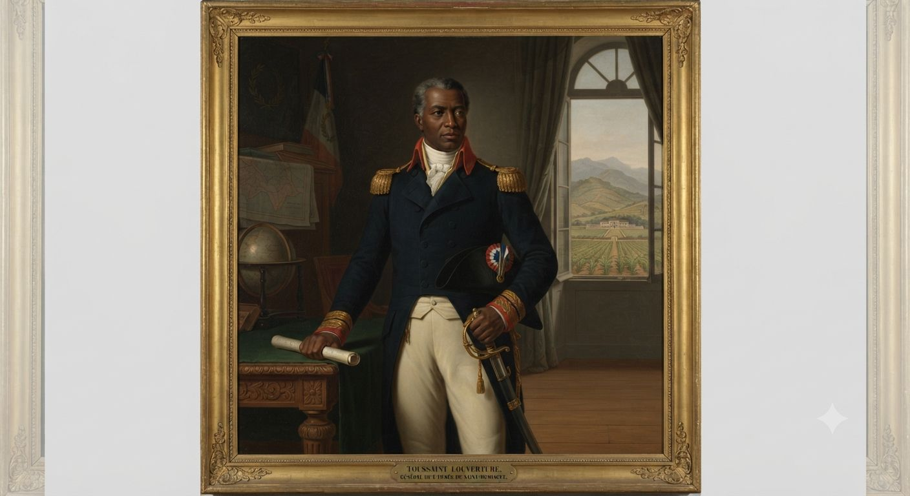
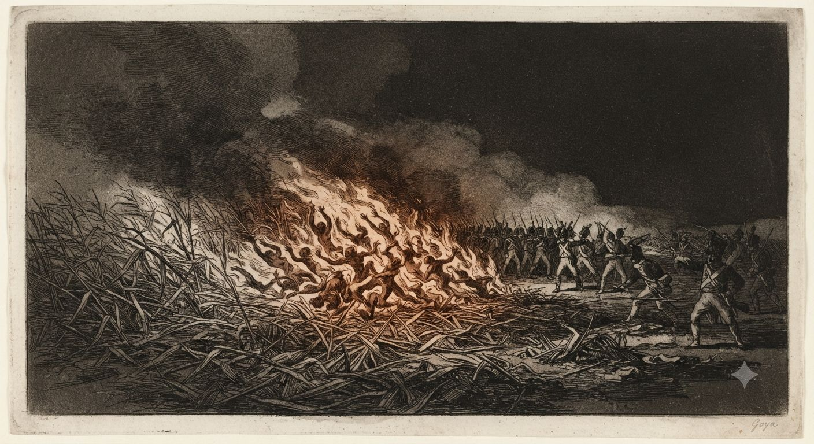
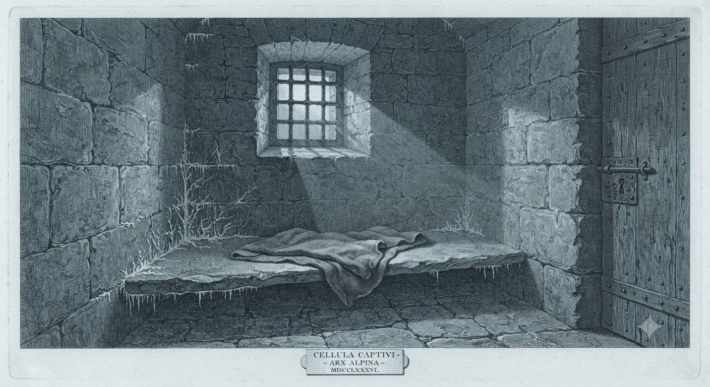

# Toussaint Louverture

Urodzony zniewolony około 1743 roku. Umarł jako więzień w forcie na przełęczy w Jurze siódmego kwietnia 1803 roku, rok przed niepodległością, którą sam zaczął. Między tymi datami zbudował jedną z najdziwniejszych karier epoki: przez dekadę grał Francją, Hiszpanią i Anglią naraz i przez dekadę wygrywał.

Wygrywał też dlatego, że umiał coś, czego nie umiał żaden europejski generał. Ogień go słuchał. Toussaint paktował z [[Daemony|bytami ognia]] — i był to sekret, który zabrał do zimnej celi, gdzie ogień już nie przyszedł.

---

## Plantacja Bréda

Bréda była dużą plantacją trzciny w prowincji północnej, własnością rodziny Noé, zarządzaną przez Bayona de Libertat. Toussaint urodził się tu jako syn Hippolyte'a, który według tradycji rodzinnej był synem afrykańskiego wodza z królestwa Allada w Dahomeju, pojmanego i sprzedanego w niewolę. Prawda to czy późniejsza legenda, dawała mu ramę wodza chwilowo zniewolonego — kogoś, kto odzyskuje należne miejsce, gdy zerwie kajdany.

Miał przy tym szczęście, jakiego nie miało dziewięćdziesiąt pięć procent ludzi na wyspie. Nie ciął trzciny — jednej z najbardziej morderczych prac, jakie zna historia — lecz pasał bydło i doglądał stadniny. Widział słońce i zachował palce.

Jego ojciec chrzestny Pierre Baptiste, wolny człowiek po edukacji jezuickiej, nauczył go czytać i pisać po francusku oraz podstaw łaciny. Gdy Libertat dał mu dostęp do biblioteki, Toussaint czytał więcej: Epikteta, Cezara w przekładzie, Abbé Raynala, którego *Historia handlu obu Indii* prorokowała, że wśród Czarnych powstanie wielki przywódca i zerwie kajdany. Toussaint wracał do tego fragmentu wielokrotnie, jakby Raynal pisał do niego.

W tych samych latach trafił też na księgi, których nie powinien był otworzyć. Skąd je miał, nie wie nikt — jezuicka biblioteka ojca chrzestnego, lata cudzego zaufania i wolny dostęp do papieru dawały dość czasu, by zejść z drogi katechizmu na ścieżkę znacznie starszą.

Libertat wyzwolił go około 1776 roku. Toussaint przez kilka lat prowadził własną farmę kawową, używając przy tym pracy zniewolonych — fakt, który haitańska legenda pomija, a historycy odnotowują sucho. W 1791 roku miał czterdzieści osiem lat, więcej niż większość przyszłych wodzów rewolucji i więcej do stracenia.

---

## Wejście w ogień

Gdy po nocy w [[Bois Caïman]] wybuchło powstanie, Toussaint nie był w pierwszym szeregu. Najpierw pomógł uciec Libertatowi — gest lojalności wobec człowieka, który dał mu wolność — a potem dołączył do oddziałów Jeana-François i Biassou jako oficer medyczny, bo znał się na ziołach i leczeniu. Awansował szybko: był piśmienny, zorganizowany i spokojny tam, gdzie inni panikowali. Jego oddział wygrywał tam, gdzie inne przegrywały.

Od 1793 roku walczył pod barwami Hiszpanii, która z wschodniej części wyspy wspierała czarnych powstańców przeciw Republice. Dostawał stopnie, broń i żywność. Czwartego maja 1794 roku zmienił strony — bo Konwent zniósł niewolnictwo we wszystkich koloniach francuskich, a Francja była jedyną potęgą, która dała wolność zamiast obietnicy. Jeanowi-François i Biassou zostawił list. Nie przepraszał.

---

## Ogień, który słuchał

O jednym Toussaint nie pisał w pamiętnikach i nie mówił przesłuchującym. W świecie, gdzie [[Voodoo]] jest mocą wyłącznie kobiet, on szedł inną drogą — [[Europejskie czarostwo|europejskiego czarostwa]], wiedzy wykutej z ksiąg i z umów zawieranych z [[Daemony|Istotami z Zewnątrz]]. Związał byty ognia i kazał im służyć rewolucji.

W polu wyglądało to jak przewaga nie do wytłumaczenia. Ogień wybuchał tam, gdzie go chciał: w ładowniach prochu, w obozach przed świtem, w suchej trzcinie wokół maszerującej kolumny. Francuscy oficerowie pisali o pożarach, które „zachowywały się jak żywe", o płomieniu pełznącym pod wiatr i o paroksyzmach paniki w szeregach, których nic nie tłumaczyło. Spalone plantacje i podpalane miasta rewolucji bywały zarazem taktyką spalonej ziemi i karmą dla jego bytów.

Bo byty żądają zapłaty. Ogień trzeba podsycać, a Istoty z Zewnątrz trwają tylko tak długo, jak długo mają czym się sycić: strachem, śmiercią, samym płomieniem. Im częściej Toussaint po nie sięgał, tym więcej żądały i tym twardszym go czyniły — dług takiego paktu spłaca się postępującą korupcją charakteru. Część jego bezwzględności bierze się stąd, choć on sam nazwałby to koniecznością.

To go nie czyni czarownikiem pokroju haitańskich mambo. Armie umarłych i mściwe feye, które na [[Haiti]] złamały Francuzów, są dziełem afrykańskich wiedźm; ogień jest jego własny i niczyj więcej. Francja i Kościół demonizowali go jako sługę szatana paktującego z piekłem — i w tym świecie akurat mieli rację, choć nie tę, którą głosili z ambon. Sam Toussaint pozostał szczerym katolikiem, co czyni z jego paktu sekret tym cięższy: człowiek, który modli się i pości, a po zmroku rozmawia z czymś, czego księża każą się wyrzec.

---

## Generał

Europejscy generałowie bili się w liniach na otwartych polach, z marszem mierzonym w milach dziennie. Toussaint bił się w tropikalnych górach, nocą, po ścieżkach, których nie było na mapach. Jego oddziały znikały i pojawiały się o pięćdziesiąt kilometrów dalej, dezinformacja szła przez jeńców, którym celowo dawano uciec, a angielski generał Maitland pisał do Londynu, że Toussaint myśli o trzy posunięcia naprzód tam, gdzie inni myślą o jednym.

Miłosierdzie traktował jak narzędzie. Nie zabijał jeńców i chronił własność plantatorów, którzy złożyli mu przysięgę — bo kapitulacja warta życia przychodziła łatwiej, a chroniona lojalność opłacała się bardziej niż terror. Miał jednak granicę przy buncie we własnych szeregach. Gdy jego siostrzeniec Moïse poprowadził w 1801 roku powstanie robotników przeciw przymusowej pracy na plantacjach, Toussaint kazał go rozstrzelać. Moïse chciał więcej wolności, niż Toussaint mógł dać, nie tracąc dochodu z cukru — a Toussaint nie znosił rozkładu. Krytycy do dziś wyciągają tę egzekucję jako dowód sprzeczności jego rządów; ci, którzy znają jego pakt, czytają ją inaczej.

---

## Gubernator

Po ewakuacji Brytyjczyków w 1798 roku i pokonaniu wolnych ludzi koloru pod Rigaudem w Wojnie Noży Toussaint był faktycznym władcą całego [[Haiti|Saint-Domingue]]. Zwierzchność Francji stała się fikcją: listy z Paryża dostawały uprzejmą odpowiedź, a on robił swoje. Mianował prefektów, naprawiał drogi, otwierał szkoły, płacił pensje w terminie i wznowił eksport cukru oraz kawy — w mniejszych ilościach niż przed rewolucją, lecz dość, by wyspa nie umarła z głodu. Cenę płacił kontrowersyjny kodeks rolny, który przywiązywał dawnych zniewolonych do plantacji za jedną czwartą plonu.

Zawarł nieformalne układy handlowe z [[Wielka Brytania|Wielką Brytanią]] i [[Stany Zjednoczone|Stanami Zjednoczonymi]] — ciche uznanie jego władzy bez uznania niepodległości. Klimat zmienił się, gdy prezydenturę objął Jefferson: Południe bało się, że rewolucja przeskoczy przez Karaiby, więc Stany wycofały się ze współpracy, a Toussaint to zauważył.

Był szczerym katolikiem, rzadkością wśród przywódców rewolucji wyrosłej z Voodoo, i zakazał nocnych ceremonii jako zagrożenia dla porządku. W tym zakazie jest podwójne dno: człowiek tępiący cudzą magię chronił własną. Kapłani Voodoo go nie znosili, lud bał się i czcił po swojemu, a zakazy w praktyce nie działały. Katolicyzm bywał też jego narzędziem — chrześcijańskiemu władcy trudniej odmówić uznania niż wodzowi „pogańskiego kultu".

---

## Konstytucja 1801

W lipcu 1801 roku Toussaint ogłosił konstytucję wyspy: siedemdziesiąt siedem artykułów, urząd dożywotniego gubernatora z prawem wskazania następcy, katolicyzm jako jedyna religia, zniesienie podziałów rasowych w słowach „wszyscy mieszkańcy Saint-Domingue są Czarni, niezależnie od koloru skóry" — i formalna lojalność wobec Francji. Ten ostatni punkt był zarazem dyplomatyczny i szczery: Toussaint nie chciał zrywać z Francją, chciał autonomii, i rozróżniał między Francją rewolucji, która wyzwoliła niewolników, a [[Francja Napoleońska|Napoleonem]], który mógł to cofnąć. Pisał do niego, że „pierwszy z Czarnych wita pierwszego z Białych". Napoleon odczytał konstytucję jako wypowiedzenie posłuszeństwa i miał rację.

---

## Leclerc i Fort de Joux

Szczegóły ekspedycji Leclerca, pożaru Cap-Français i bitwy o Crête-à-Pierrot opisuje artykuł o [[Haiti]].

Wiosną 1802 roku Toussaint widział to, co Leclerc: szybkiego zwycięstwa nie ma żadna strona. Złożył broń w maju z zimnego wyrachowania — w zamian za amnestię, zachowanie rang oficerów i wolność czarnych mieszkańców. Wycofał się do posiadłości pod Ennery, hodował bydło i czekał. Siódmego czerwca 1802 roku generał Brunet zwabił go na rzekome rozmowy listem pełnym zapewnień o szacunku; gdy Toussaint wszedł, zamknięto drzwi i przystawiono bagnety. Tej samej nocy wsadzono go na pokład fregaty. Podobno powiedział wtedy, że ścinając go, obalono jedynie pień drzewa wolności — odrośnie z korzeni, bo są głębokie i liczne.

Fort de Joux stoi na przełęczy w Jurze, tysiąc dwieście metrów nad poziomem morza. Cela była zimna, wilgotna i wąska, racje skąpe, kontakt z rodziną zakazany. Wysłannik Napoleona wypytywał o ukryte złoto, którego nie było; na pytania o pobudki Toussaint odpowiadał długo, o Raynalu i o naturze wolności, i nie zdradził niczego.

Tu pakt obrócił się przeciw niemu. Ogień karmi się ogniem, a w lodowatej celi nie było czym go nasycić — żadnej wojny, żadnego płomienia, żadnego strachu prócz własnego. Daleko od źródła, z długiem niespłaconym, demonolog gasł razem z ciepłem. Artretyzm stał się nieznośny, jedzenie coraz mniejsze, koc i opał — odmawiane albo zwlekane. Prosił o kapelana i przez pierwsze miesiące mu odmawiano; gdy w końcu przysłano księdza, który znał go z wyspy, modlili się razem do końca. Siódmego kwietnia 1803 roku znaleziono Toussainta martwego — zapalenie płuc, wycieńczenie, chłód. Rok przed niepodległością Haiti.

---

## Dziedzictwo

Niepodległość, ogłoszoną pierwszego stycznia 1804 roku, Dessalines proklamował jego imieniem, choć Toussainta już nie było. W XIX wieku stał się raczej cytatem niż człowiekiem: brytyjscy abolicjoniści, z [[Handel Trójkątny|kampanii przeciw niewolnictwu]], stawiali go za dowód, jaki umysł wyrasta z plantacji, gdy da mu się czytać; późniejsi rewolucjoniści uczynili zeń symbol antykolonializmu. To, że ten sam człowiek paktował z ogniem i tłumił cudzą magię, nie pasuje do żadnej z tych wersji — dlatego każda po cichu o tym milczy.

Haiti roku 1802 trudno zrozumieć bez niego. Trudno też bez świadomości, że zostawił po sobie wyspę zwycięską i przeklętą zarazem: wolną, a karmioną wojną, której bramy on i wiedźmy razem otworzyli, lecz domknąć nie umiał nikt.

---

*Powiązane artykuły: [[Haiti]], [[Francja Napoleońska]], [[Stany Zjednoczone]], [[Wielka Brytania]], [[Terytorium Luizjany]], [[Handel Trójkątny]], [[Voodoo]], [[Daemony]], [[Bois Caïman]], [[Punkty rozbieżności]], [[Chronologia]].*
