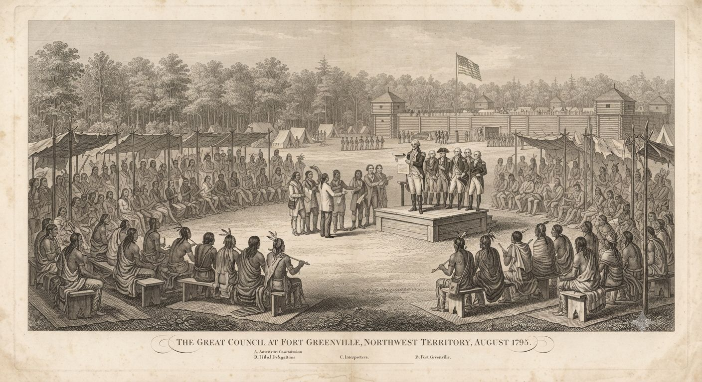
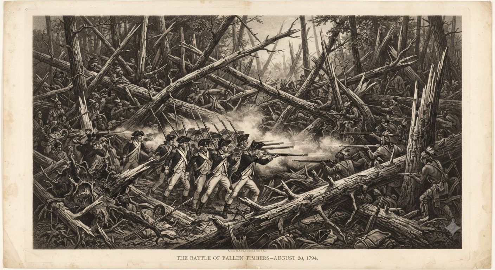
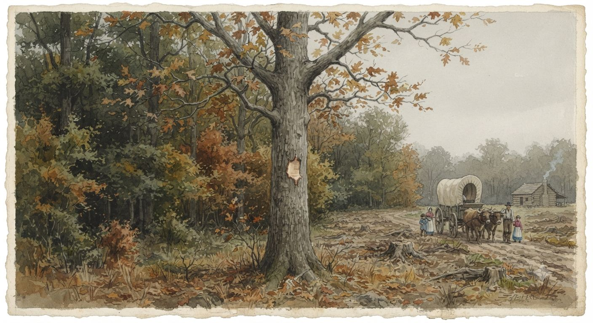

# Traktat Greenville

3 sierpnia 1795 roku generał Anthony Wayne i wodzowie dwunastu narodów podpisali w Forcie Greenville traktat, który zamknął dekadę wojny w Terytorium Północno-Zachodnim i otworzył większość dzisiejszego Ohio dla osadnictwa. Cenę ziemi wartej miliony ustalono na towary za dwadzieścia tysięcy dolarów i roczną annuitę dziewięciu i pół tysiąca. W 1802 roku dokument ma siedem lat i jest fikcją w tym samym stopniu, co prawem — a w kraju, gdzie za oddaną granicą wciąż spada kwas z koron drzew, każda odebrana działka jest sporna dwa razy.

## Dziesięć lat wojny

Traktat paryski z 1783 roku zakończył Rewolucję i przekazał Stanom Zjednoczonym ziemie na północ od rzeki Ohio. Wielka Brytania podpisała go, nie pytając ani jednego z narodów, które tam żyły. Dla Waszyngtonu był to tytuł prawny. Dla [[Rdzenne narody Ameryki Północnej|rdzennych]] był to dokument, którym obce mocarstwo sprzedało cudzy dom, więc konfederacja narodów na północ od Ohio odrzuciła wszystkie powojenne cesje i uznała rzekę za jedyną prawomocną granicę.

Wojnę o Ohio stoczono prawie wyłącznie ołowiem, i jest ku temu powód. [[Smoki Leśne]], które przez wieki osłaniały narody Wschodnich Lasów, wybito tu niemal do nogi jeszcze przed wojną — sto lat polowań na [[smocza krew|krew]] i łuskę zostawiło puszczę wschodu prawie pustą. Tarcza, która na zachodzie wciąż zatrzymuje kolumny osadników, nad Ohio już opadła.

4 listopada 1791 roku nad górnym Wabash Mały Żółw i szaunijski wódz wojenny Blue Jacket rozbili armię generała Arthura St. Claira. Z około tysiąca żołnierzy zdolnych do walki zginęło ponad sześciuset, drugie tyle odniosło rany. St. Clair uszedł konno, gdy kolejne wierzchowce padały pod nim, a konfederacja straciła może pięćdziesięciu ludzi. Gorszej klęski wojsko Stanów Zjednoczonych nie poniesie z rąk rdzennych nigdy — więcej zabitych niż później pod Little Bighorn.

Resztki dawnej tarczy dały o sobie znać i tutaj. Według ocalałych spod Wabash poranna mgła w dniu klęski parzyła płuca, a kilku ludzi zginęło, nim ktokolwiek wystrzelił — ostatnie smoki regionu, prowadzone przez szamanów na zaskoczony obóz.

Odpowiedzią był nowy rodzaj wojska. Anthony Wayne spędził rok na zbudowaniu Legii Stanów Zjednoczonych, pierwszej zawodowej armii regularnej republiki, i przemusztrował ją przez zimę 1793–1794 w Fort Washington. Milicja z Kentucky przegrywała z konfederacją; regularny żołnierz strzelający w zwartym szyku miał wygrać tam, gdzie ona przegrała.

20 sierpnia 1794 roku Wayne dopadł konfederację pod Fallen Timbers, w gąszczu drzew powalonych przez dawne tornado. Naprzeciw około trzech tysięcy regularnych i kawalerii z Kentucky stanęło może półtora tysiąca wojowników i trzystu kanadyjskich milicjantów. Bitwa trwała niecałą godzinę.

Zginęły tam i ostatnie smoki wschodu. Zwarty ogień Legii — setki luf strzelających razem — kosi szereg wojowników i [[Smoki Leśne|smoka]] tym samym tchnieniem; to jedyna broń czarnoprochowa, która bestię zabija, i tego dnia zabiła te, które zostały.

Pobici cofnęli się pod Fort Miami, brytyjski garnizon o milę od pola. Major Campbell zamknął bramy i nie oddał ani jednego strzału. Wojownicy stali pod murami sojusznika, w zasięgu jego muszkietów, i patrzyli, jak Anglia odmawia pomocy. Ten zamknięty most zniszczył sojusz głębiej niż sama bitwa.

Decyzję podjęto wcześniej i gdzie indziej. Traktat Jaya z 1794 roku zobowiązał [[Wielka Brytania|Wielką Brytanię]] do opuszczenia zachodnich fortów, a Londyn nie zamierzał wojować ze Stanami o ziemię, którą sam oddał w Paryżu trzynaście lat wcześniej. Korona przestała zbroić opór, który na wschodnim froncie i tak przegrywał, choćby dosiadał smoków. Konfederacja została z tym sama.

## Negocjacje i podpis

Wayne kazał wznieść Fort Greenville zimą 1793–1794 jako bazę kampanii; po Fallen Timbers stał się stołem rokowań. Rozesłał zaproszenia do wszystkich narodów. Część przyjęła od razu, część czekała do wiosny, sprawdzając, czy Anglia zmieni zdanie. Nie zmieniła.

Rozmowy ciągnęły się od czerwca do sierpnia 1795 roku przy ponad tysiącu stu wodzach i wojownikach. Wayne odczytywał zgromadzonym traktat paryski i traktat Jaya, żeby dobić argument, że Brytyjczyk znika z Ohio i Stany są tu już panem. Przyjmował drobne poprawki, tłumaczył, co możliwe; jego słowa szły przez tłumaczy na kilkanaście języków. Co która strona zrozumiała ze szczegółowych artykułów, pozostaje pytaniem.

3 sierpnia złożono podpisy. Po stronie Stanów: Anthony Wayne, jedyny komisarz. Po stronie konfederacji: wodzowie i starsi dwunastu narodów, każdy odciskający własny znak — totem, krzyżyk, inicjał.

## Warunki traktatu

Artykuł 3 cedował na Stany Zjednoczone większość dzisiejszego Ohio. Linia graniczna zaczynała się przy ujściu rzeki Cuyahoga, tam gdzie dziś stoi Cleveland, szła w górę rzeki do portażu na odnogę Muskingum, mijała Fort Laurens, skręcała na zachód przez Fort Loramie do Fortu Recovery na dopływie Wabash i stąd biegła prosto na południowy zachód, do Ohio naprzeciw ujścia rzeki Kentucky. Wszystko na południe i wschód od tej krzywej przechodziło do Stanów: większość Ohio i klin południowo-wschodniej Indiany.

Ten sam artykuł wyłuskał z pozostawionego terytorium szesnaście działek — strategiczne punkty przy portażach i ujściach. Fort Detroit z otaczającym pasem ziemi, cieśninę Mackinac, ujście rzeki Chicago, gdzie stanie Fort Dearborn, przeprawę przy późniejszym Fort Wayne, Ouiatenon pod dzisiejszym Lafayette, Peoria nad Illinois, bystrza Maumee w miejscu przyszłego Toledo. Enklawy amerykańskiej władzy wbite w ziemię formalnie wciąż rdzenną.

Sercem traktatu był artykuł 5. Stany Zjednoczone gwarantowały narodom spokojne polowanie, uprawę i zamieszkanie na zachód od linii, tak długo, jak im to odpowiada, bez niepokojenia. W tym samym artykule ukryto warunek: gdyby naród kiedykolwiek zechciał sprzedać ziemię, wolno mu ją sprzedać jedynie Stanom Zjednoczonym. Prawo pierwokupu zostawiało rdzennym jednego legalnego kupca, a kupiec dyktował cenę. Z tej klauzuli wyrośnie cały system Harrisona.

Artykuły 3 i 4 ustaliły roczne wypłaty w towarach. Siedem narodów — Wyandoci, Delaware, Szaunisi, Miami, Ottawa, Czipewa i Potawatomi — dostało po tysiącu dolarów. Pięć mniejszych — Kickapoo, Wea, Eel River, Piankeshaw i Kaskaskia — po pięćset. Razem dziewięć tysięcy pięćset rocznie, w towarach wybranych przez agenta i pomniejszonych o koszt transportu. Za tę sumę kupiono ziemię, na której w ciągu dekady stanie stan liczący setki tysięcy mieszkańców.

> [!rules]
> **Traktat Greenville — warunki**
> **Podpisanie:** 3 sierpnia 1795, Fort Greenville (dziś Greenville, Ohio); ratyfikacja Senatu 22 grudnia 1795
> **Strony:** Stany Zjednoczone (gen. Anthony Wayne) i konfederacja dwunastu narodów
> **Cesja:** większość dzisiejszego Ohio i klin południowo-wschodniej Indiany, plus 16 enklaw (m.in. Detroit, Mackinac, ujście rzeki Chicago, przeprawa przy Fort Wayne, Ouiatenon, Peoria, bystrza Maumee)
> **Płatność:** towary za 20 000 dolarów przy podpisaniu, potem 9 500 rocznie — 7 narodów po 1 000, 5 po 500
> **Gwarancja:** spokojne użytkowanie ziemi na zachód od linii
> **Pierwokup:** rdzenni mogą sprzedać ziemię wyłącznie Stanom Zjednoczonym
> **Jeńcy:** obie strony zwracają jeńców

## Linia na papierze i w terenie

Linia Greenville nie istniała w terenie. W kilku miejscach wbito kamienne słupy albo nacięto drzewa; reszta była opisem na papierze. Osadnicy z Kentucky patrzyli na te drzewa i szli dalej.

Naruszenia miały charakter systemu. Rząd federalny zakazywał osadnictwa za linią, stanowe milicje nie chciały gnać osadników z farm budowanych od roku, agenci pisali raporty, których nikt nie czytał. Do 1800 roku kilkanaście tysięcy Anglosasów żyło już na ziemi gwarantowanej rdzennym. Do 1810 będą ich setki tysięcy, a traktat będzie martwą literą.

William Henry Harrison, gubernator Terytorium Indiana od 1800 roku, zamienił prawo pierwokupu w narzędzie. Rządowe sklepy w fortach sprzedawały rdzennym towary i whisky na kredyt; dług rósł, bo nowe potrzeby rosły szybciej niż możliwość spłaty, a ziemia szła pod zastaw. Jefferson opisał mu tę drogę wprost w prywatnym liście: zadłużyć narody, potem przyjąć ich ziemię w rozliczeniu. Do 1809 roku Harrison wytargował tą metodą siedemdziesiąt dwa miliony akrów, za każdym razem od garstki wodzów, których reszta narodu nie uznawała za swoich.

Granica dzieliła też dwa rodzaje ryzyka. Na południe i wschód od niej smoki dawno wybito, więc osadnik bał się najwyżej noża zza węgła. Na zachód i północ kwas wciąż spadał z koron drzew, i tam parcie zwalniało — farmer przekraczał linię tam, gdzie uznał, że smoki już nie wrócą, i czasem mylił się ostatni raz w życiu.

> [!rules]
> **Status ziemi za Linią Greenville (1802)**
> **Tytuł prawny:** amerykański na mocy traktatu; konfederacja Tecumseha odrzuca go jako nieważny
> **Tarcza smocza:** na południe i wschód od linii [[Smoki Leśne]] wybite, osadnictwo względnie bezpieczne; na zachód i północ wciąż obecne, granica osadnictwa realnie tam stoi
> **Wojna o krew:** za linią trwają łowy rdzennych na [[Smoczy Magowie|Smoczych Magów]] i transporty [[smocza krew|destylatu]] — konflikt poza traktatem, nieprzerwany

## Kto podpisał, kto odmówił

### Anthony Wayne

„Szalony Anthony", pięćdziesięcioletni weteran Rewolucji o sławie dowódcy, który wygrywał natarciem, gdy inni się wahali, wygrał pod Fallen Timbers Legią, której budowy nikt przed nim nie podjął. Umarł 15 grudnia 1796 roku w Presque Isle w Pensylwanii, wracając z inspekcji Fort Detroit. Szesnaście miesięcy po Greenville, nim Ohio stało się stanem.

Po nim komendę przejął James Wilkinson, jego zastępca. Wilkinson brał żołd od korony hiszpańskiej jako jej płatny agent i nigdy nie wyegzekwował traktatowej linii; krążyła też pogłoska, że to on otruł Wayne'a, której nikt nie udowodnił ani nie uciszył. Strażnik granicy był na żołdzie obcego mocarstwa.

### Mały Żółw

Mały Żółw (Michikinikwa) z Miami pobił dwie amerykańskie armie nad Wabash, zanim Wayne zbudował prawdziwe wojsko. Przed Fallen Timbers odradzał bitwę i nikt go nie posłuchał. W Greenville trzymał się do 12 sierpnia, dziewięć dni po reszcie, proponując, by granica nie sięgała dalej na północ niż Fort Recovery; Wayne odrzucił to, a Mały Żółw ustąpił w prywatnej naradzie. Od tej pory powtarzał jedno: zbrojnego oporu już nie ma, jest tylko adaptacja.

W 1802 roku ma około pięćdziesięciu pięciu lat, artretyzm i farmę przy Fort Wayne. Oficerowie zapraszają go na kolacje jako żywy dowód „cywilizującej" mocy traktatu. Tecumseh widzi w nim zdrajcę.

Pozostali sygnatariusze poszli podobną drogą. Blue Jacket, który dowodził pod Fallen Timbers, po Greenville wycofał się w handel i żyje gdzieś przy Detroit. Tarhe z Wyandotów, narodu o długiej tradycji mediacji, konsekwentnie opowiada się za pokojem i agenci przyzywają go jako „głos rozsądku". Delaware Buckongahelas podpisał po długich wahaniach, pamiętając stulecie cofania się na zachód.

### Tecumseh

Tecumseh w Greenville nie był. Miał dwadzieścia siedem lat i nie pełnił jeszcze roli wodza, ale jego stanowisko było już gotowe: ziemia należy do wszystkich rdzennych ludów razem, więc żaden pojedynczy naród nie ma prawa sprzedać tego, co wspólne. Każda linia jest fikcją, każdy podpis nieważny.

Ten sam argument obejmuje przodków i smoki. Sprzedać dolinę znaczyłoby sprzedać smoki, które w niej żyją, i przodków, którzy w nie wrócili, a tego nie wolno nikomu.

W 1802 roku, trzydziestoczteroletni, objeżdża Indianę, Ohio i Kanadę, zbierając wokół siebie tych, którzy myślą tak samo. Militarny sens jego konfederacji to obietnica zebrania rozproszonych szamanów i [[Dwudusze|Dwuduszy]] w jedną siłę — pojedyncze stado smoków jest groźne, lecz dzikie, a dopiero człowiek prowadzący je w bój czyni z drapieżników wojsko. Jego brat Tenskwatawa jest na razie pijakiem o złej sławie; wizja, która zrobi z niego Proroka, przyjdzie dopiero za trzy lata.

## Traktat w 1802 roku

Klęska pod Fallen Timbers złamała wschodni front, lecz nie wolę oporu. Tam, gdzie smoki przetrwały — na zachodzie, nad Wielkimi Jeziorami, w głębi lądu — konfederacja wciąż miała oparcie i powód, by walczyć dalej. Dlatego siedem lat później Tecumseh ma z czego budować, a annuita i sklep z whisky są dziś silniejszym narzędziem Waszyngtonu niż armia.

Osadnicy ruszyli do Ohio natychmiast po podpisaniu — flatboatami w dół rzeki z Pittsburgha, lądowaniem przy Cincinnati, Chillicothe i Marietcie, marszem w głąb. W 1800 roku Ohio liczyło czterdzieści pięć tysięcy mieszkańców. W 1803 wejdzie do Unii jako siedemnasty stan z sześćdziesięcioma tysiącami, a do 1810 dobije do dwustu trzydziestu tysięcy. Tempa tego zaludnienia osadnictwo nie znało wcześniej.

Fort Wayne stoi dokładnie na linii, przy zbiegu Maumee i St. Joseph: garnizon, rządowy sklep, kilkuset Miami i Szaunisów w okolicznych wsiach. Agent decyduje, kiedy i w jakiej formie przyjdzie należna annuita, więc opóźniona wypłata jest karą, a zmieniony skład towarów nagrodą. Zobowiązanie zamieniło się w pętlę.

Na mapie z 1795 roku linia jest wyraźna. W terenie 1802 roku rozmywają ją parcele, nowe nazwy i trakty, a za nią toczy się wojna, której traktat nie tknął: ciche łowy rdzennych na [[Smoczy Magowie|Smoczych Magów]] i karawany z fiolkami [[smocza krew|krwi]]. Każda działka odebrana za Ohio jest sporna dwa razy — raz prawem, które rdzenni odrzucają, raz krwią smoków, którą biali zbierają na tej samej ziemi.

---

*Powiązane artykuły: [[Rdzenne narody Ameryki Północnej]], [[Stany Zjednoczone]], [[Kanada Brytyjska]], [[Terytorium Luizjany]], [[Smoki Leśne]], [[Dwudusze]], [[smocza krew]], [[Punkty rozbieżności]], [[Chronologia]].*
