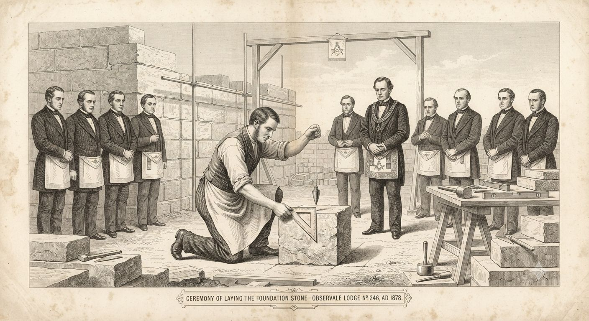
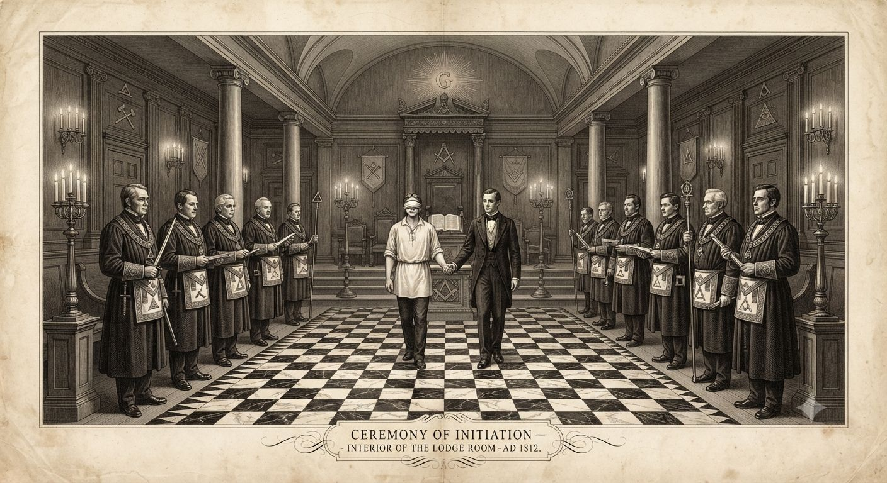
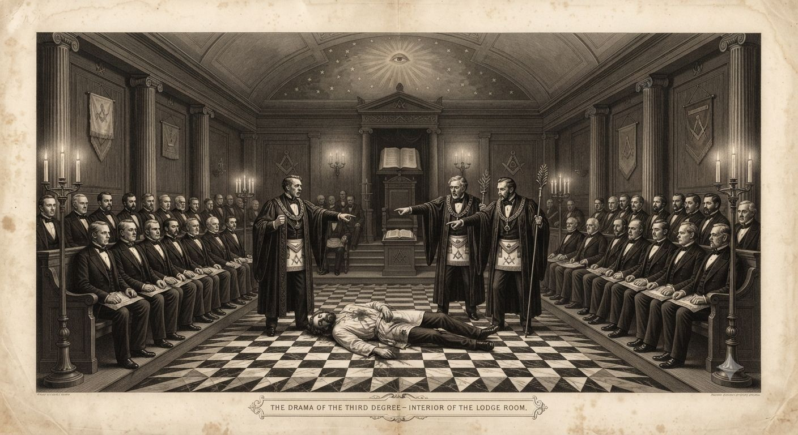

# Wolnomurarstwo

Dwa tysiące lóż działa w 1802 roku od Edynburga po Charleston i od Lizbony po Sankt Petersburg. Wśród braci są trzej prezydenci Stanów Zjednoczonych, kilkudziesięciu europejskich generałów, sędziowie, kupcy i filozofowie. Sieć jest realna i rozległa, a większość tego, co o niej krąży, to wymysł.

Pod alegorią kryje się jednak coś starszego niż samo bractwo. Kilka lóż wciąż uprawia rzemiosło, którego reszta nawet nie rozpoznaje — sztukę układania kamienia tak, by miejsce sprzyjało, zachodnią kuzynkę chińskiego [[Feng shui]].

---

## Od cechów kamieniarskich do lóż

24 czerwca 1717 roku w londyńskiej tawernie Goose and Gridiron cztery loże połączyły się w Wielką Lożę Londynu — pierwszą taką instytucję w dziejach. W nazwie figurowali murarze; w składzie siedzieli arystokraci, prawnicy i kupcy, z których mało kto trzymał w dłoni kielnię.

Formę dało średniowiecze. Cechy budowniczych katedr posługiwały się rytuałami wtajemniczenia i tajnymi znakami, po których mistrz rozpoznawał kwalifikacje czeladnika przybyłego z obcego miasta bez papierów. Pod koniec XVII wieku angielskie „loże operatywne" zaczęły przyjmować ludzi spoza rzemiosła — „wolnych murarzy spekulatywnych", zafascynowanych geometrycznym symbolizmem i braterstwem ponad granicami cechu.

Ekspansja była szybka i systematyczna. Wielka Loża Irlandii powstała w 1725 roku, Szkocji w 1736, pierwsze loże paryskie zakładali Anglicy od lat dwudziestych, a Grand Orient de France sfederował francuskie loże w 1773 roku. Do 1780 roku bractwo działało w Austrii, Prusach, Rosji, Włoszech, Niderlandach, Szwecji i Danii. W Ameryce pierwsza loża stanęła w Bostonie w 1733 roku; Waszyngton wstąpił do loży we Fredericksburgu w 1752 roku, a od 1788 był Wielkim Mistrzem Wirginii. Gdy umarł w grudniu 1799 roku, pochowano go z pełnym rytuałem masońskim — oddali mu go bracia, nie Kongres.

---

## Kątownica, cyrkiel i ukryte rzemiosło

Kątownica i cyrkiel znaczą więcej niż moralną przypowieść. Murarze operatywni znali prawdziwe rzemiosło: jak ustawić kamień, proporcję i orientację, by budowla dobrze siadła na ziemi i na biegnących przez nią siłach. To zachodnia kuzynka chińskiej geomancji, [[Feng shui]] bez tej nazwy, a cechy katedralne nosiły tę wiedzę obok zwykłych sekretów zawodu.

Gdy polowania na czarownice zdławiły jawną magię, murarze zrobili to, czego nie zdołały inne cechy — ukryli się na widoku. Po tym, jak [[Gildie Śmierci]] sprowadziły na [[Europejskie czarostwo|całe rzemiosło tajemne]] stos i topór, otwarte praktykowanie sztuki stało się wyrokiem. Murarze przebrali więc swoje rzemiosło w „spekulatywny" symbolizm: Świątynia Salomona, legenda o Hiramie, Wielki Architekt, święta geometria jako nauka moralna. Prawdziwa treść geomantyczna przetrwała przebrana za metaforę.

Skutki są subtelne i trwałe. Loża wzniesiona we właściwych proporcjach i właściwie zorientowana sprawia wrażenie pomyślnej: zebrania idą gładko, więzi się trzymają, bracia powoli bogacą się i awansują. Katedra albo kwartał miasta postawiony ręką murarzy znających rzemiosło niesie cichą, długą harmonię. [[Wielki Mur]] jest systematycznym pomnikiem tej sztuki w Chinach; europejskie katedry to jej słabsza, mniej świadoma wersja. Najambitniejszą amerykańską próbą pozostaje plan Waszyngtonu z 1791 roku, w którym kilku braci komisji dostrzegło świętą proporcję w diagonalnych alejach i osiach L'Enfanta — pełniejszy opis w [[Feng shui|artykule o feng shui]]. Nic z tego nie przewraca bitew ani nie buduje fortun w tydzień — sztuka działa po cichu, przez pokolenia.

Większość lóż roku 1802 odprawia przy tym pusty rytuał. Sto lat dżentelmenów wstępujących dla kolacji i koneksji rozwodniło rzemiosło, a niemal każdy mistrz szczerze wierzy, że geometria jest wyłącznie alegorią. Garstka starych lóż i pewne ezoteryczne kręgi Rytu Szkockiego nadal budują wedle dawnej miary i wiedzą, co robią. Z zewnątrz nie sposób odróżnić jednych od drugich — na tym właśnie polega ukrycie rzemiosła wewnątrz klubu.

Wrogość Kościoła ma tu ostrzejsze dno niż jawne zarzuty o tajność, przysięgi i mieszanie wyznań. Rzym wyczuwa, że murarska geometria czerpie z czegoś przyziemnego — z własnych sił ziemi, z [[Fey|feyów]] i echa przodków, których dotyka animizm — ze świętości, która nic nie zawdzięcza łasce Bożej. Konkurencyjna świętość, zbudowana z kamienia i kąta zamiast z wiary.

---

## Stopnie i ryty

Trzy stopnie podstawowe tworzą rdzeń każdego rytu. Ucznia (*Entered Apprentice*) wprowadza się z zawiązanymi oczami i odbiera odeń przysięgę milczenia oraz wzajemnej pomocy. Czeladnik (*Fellow Craft*) zgłębia symbolikę geometryczną i nauki o rozumie. Mistrz Masoński (*Master Mason*) dostaje pełnię praw w loży i przechodzi rytuał oparty na legendzie o Hiramie Abiffie, budowniczym Świątyni Salomona zabitym przez trzech zdrajców, którzy chcieli wymusić zeń mistrzowskie sekrety.

Ryt Szkocki nadbudowuje nad tym trzydzieści trzy stopnie o dźwięcznych tytułach — Różokrzyżowiec, Rycerz Kadosz, Wielki Inspektor. Czy wyższy stopień niesie realną wiedzę, czy sam prestiż, zależy od loży: część kręgów studiuje tam serio kabałę, alchemię i tradycję różokrzyżową, a wraz z nią owo dawne rzemiosło, podczas gdy inne traktują stopnie jak ordery do rozdania za zasługi. Dwie sąsiednie loże o tym samym rytuale potrafią mieć zupełnie inny charakter.

Same obediencje różnią się równie mocno. Wielka Loża Anglii jest najbardziej zachowawcza — trzy stopnie, ścisły rytuał, instytucjonalny zakaz polityki, a w praktyce bliżej jej do towarzystwa dobroczynnego niż do spisku. Grand Orient de France po 1773 roku otworzył się na wyższe stopnie i filozofię polityczną, a jego loże towarzyszące (*loges d'adoption*) dopuszczały kobiety do części ceremonii. Ryt Szwedzki, ściśle chrześcijański i monarchistyczny, panuje w Skandynawii i Rosji, odcinając się od deistycznej neutralności Francuzów.

---

## Sieć i jej wartość

Wieczór lożowy w Londynie to przede wszystkim kolacja. Kupiec jedwabiu siedzi obok adwokata, adwokat obok komandora marynarki, a wnoszenie polityki i religii do sali jest formalnie zakazane. W praktyce liczą się kontakty, którym towarzyszy rytualne zobowiązanie wzajemnej pomocy — skuteczniejsze niż znajomość z salonu. Mason przybyły do obcego miasta odwiedza miejscową lożę, pokazuje właściwe znaki i dostaje tymczasowy dach, wprowadzenie do tutejszych kupców i prawników oraz świeże wieści. List polecający zastępuje ceremonialny gest.

Fundusze lóż wspierają wdowy i sieroty po zmarłych braciach, a kilka angielskich lóż utrzymuje własne szkoły i przytułki. Dla klasy kupiecko-rzemieślniczej jest to jedna z niewielu sieci wsparcia działających ponad parafią i ponad granicą państwa.

Wstąpić może wolny mężczyzna z poręczeniem co najmniej jednego brata, po kilkumiesięcznym oczekiwaniu i trzech osobnych wtajemniczeniach, jeśli zadeklaruje wiarę w Boga lub Najwyższą Istotę — Wielka Loża Anglii żąda tego wprost. Kobiety, ateiści i niewolnicy są wykluczeni. Wpisowe i składki sięgają w Anglii dziesięciu do pięćdziesięciu funtów rocznie, mniej w krajach protestanckich i Ameryce, więcej w prestiżowych lożach arystokratycznych. Sekretem pozostają słowa i gesty każdego stopnia, po których mason sprawdza, czy rozmówca naprawdę przeszedł wtajemniczenie; samo istnienie lóż jawne jest aż po drukowane od 1730 roku spisy adresów i terminów zebrań.

---

## Kościół, Napoleon i panika spiskowa

Papież Klemens XII potępił masonerię bullą *In Eminenti* 28 kwietnia 1738 roku, zarzucając jej tajność, podejrzane przysięgi i mieszanie wyznań bez nadzoru; Benedykt XIV odnowił potępienie w 1751 roku. Pod groźbą ekskomuniki katolicyzm i loża są formalnie nie do pogodzenia — co nie przeszkadza dziesiątkom tysięcy katolickich arystokratów i oficerów we Włoszech, Austrii, Francji i Hiszpanii należeć do bractwa. Tam, gdzie inkwizycja działa naprawdę — w Hiszpanii, Portugalii i [[Państwo Kościelne|Państwie Kościelnym]] — ryzyko procesu jest realne, choć niewielu biskupów faktycznie je wszczyna. Concordat [[Francja Napoleońska|Napoleona]] z Piusem VII z 1802 roku przywrócił Kościołowi obecność we Francji, a papieskie potępienie zostawił na papierze; papież ma pilniejsze kłopoty niż egzekwowanie bulli sprzed sześćdziesięciu lat.

Rewolucja spustoszyła Grand Orient — paryskie loże zawieszono w latach 1793–1794, bo jakobini nie ufali stowarzyszeniu łączącemu szlachtę z mieszczanami przy jednym stole. Bractwo odradza się ostrożnie pod Konsulatem. Napoleon sam masonem nie jest, lecz widzi w sieci lóż narzędzie do obsadzenia własnymi ludźmi: jego brat Józef obejmie wkrótce godność Wielkiego Mistrza Grand Orient, a marszałkowie pokroju Murata wstępują do lóż wedle tego samego wzoru — lojalny oficer rodziny, lojalny brat.

Teoria niewidzialnej ręki jest stara i prosta: skoro potężni ludzie należą do lóż, to loże rządzą potężnymi ludźmi. Rozdmuchał ją ksiądz Augustin Barruel, dowodząc w czterotomowym dziele z 1797 roku, że [[Rewolucja Przemysłowa|rewolucję]] — a ściślej rewolucję francuską — uknuł spisek masońsko-iluminacki. Adam Weishaupt rzeczywiście założył w 1776 roku w Ingolstadt Zakon Iluminatów, osobną organizację infiltrującą loże, lecz elektor Bawarii rozbił go dekretami w latach 1784–1785, a opublikowane protokoły śledztwa ujawniły strukturę i nazwiska. Szersza analiza pokazuje rzecz prostszą: wielu rewolucjonistów było masonami, lecz sama sieć nie miała jednolitego programu ani ośrodka zdolnego cokolwiek koordynować. Bractwo miało własne spory, frakcje i kłótnie o niepłacone składki, jak każda ludzka organizacja. W Ameryce, gdzie Waszyngton, Franklin i Monroe nosili fartuch równie naturalnie jak wszyscy dżentelmeni ich klasy, masoneria jest po prostu instytucją publiczną — listy lóż drukuje prasa, a wiceprezydent Burr należy do niej bez pożytku dla gasnącej kariery.

---

## Stan w 1802 roku

W Anglii i Stanach masoneria jest szanowana aż do banału, wpisana w obyczaj klasy wyższej i kupieckiej. Wśród wolnych Czarnych w Ameryce działa osobna linia: Prince Hall, weteran rewolucji z Bostonu, dostał patent wprost od Wielkiej Loży Anglii, gdy białe loże odmówiły, i jego loże pracują w kilku stanach, regularne przez własną sukcesję, choć nieuznawane przez resztę bractwa.

We Francji bractwo odradza się pod okiem Konsulatu i niebawem zostanie przemodelowane w narzędzie scalania nowej kadry administracyjnej. W rozpadającym się [[Święte Cesarstwo Rzymskie|Świętym Cesarstwie]] loże są jedną z niewielu sieci łączących wykształconych ludzi z różnych księstw. W [[Rosja|Rosji]] są mistycznym bractwem lojalnym wobec cara — Katarzyna Wielka zakazywała ich dwakroć, lecz Aleksander I sprzyja odrodzeniu. We Włoszech układ jest zawikłany: loże działają pod patronatem Francuzów, a za kilkanaście lat z ich rytualistyki wyrośnie rewolucyjna *Carboneria*. Sama Wielka Loża Anglii toczy spór dwóch nurtów, Antientów i Modernów, o to, który ryt jest starszy i prawdziwy; pogodzi je dopiero unia z 1813 roku.

Pełny obraz oświecenia, z którego masoneria wyrosła, mieści [[Oświecenie|osobny artykuł]]; rolę bractwa po obu stronach Atlantyku widać też w dziejach [[Wielka Brytania|Wielkiej Brytanii]], [[Stany Zjednoczone|Stanów Zjednoczonych]] i [[Haiti]], gdzie przed rewolucją loże skupiały zarówno białych plantatorów, jak i wolnych ludzi koloru.

---

*Powiązane artykuły: [[Oświecenie]], [[Feng shui]], [[Chiny dynastii Qing]], [[Gildie Śmierci]], [[Europejskie czarostwo]], [[Francja Napoleońska]], [[Wielka Brytania]], [[Stany Zjednoczone]], [[Rosja]], [[Państwo Kościelne]], [[Punkty rozbieżności]].*
