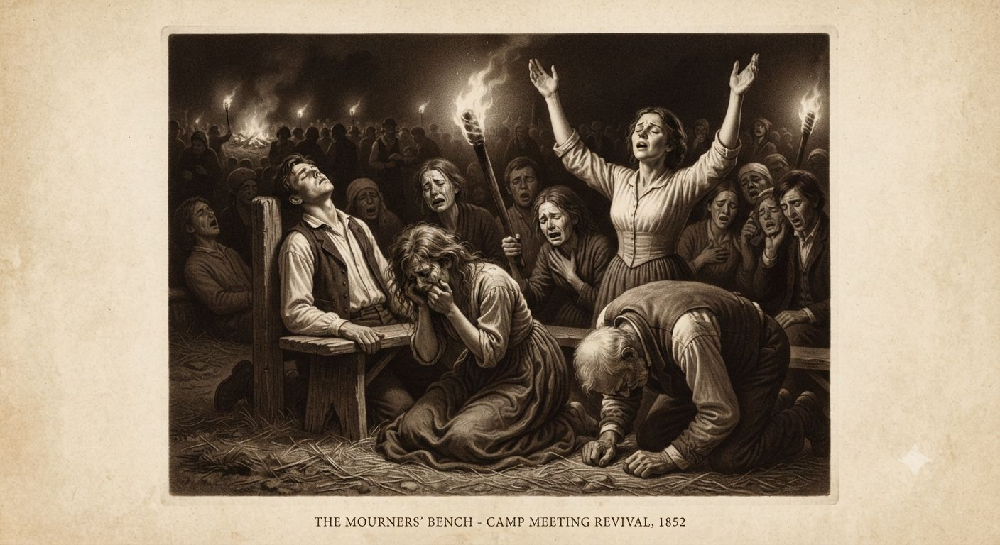
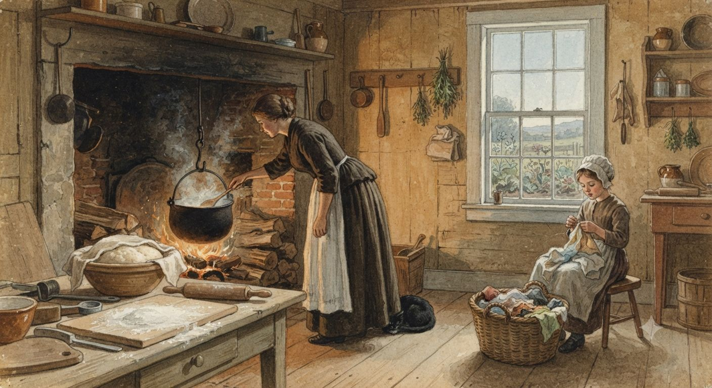
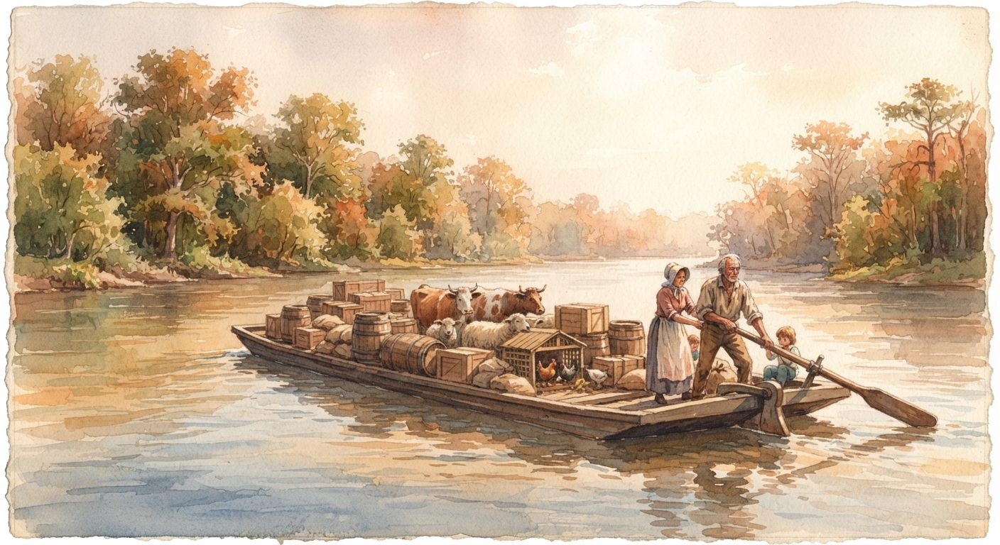

# Codzienne życie w Stanach Zjednoczonych

Spis z 1800 roku doliczył się pięciu milionów trzystu ośmiu tysięcy mieszkańców w szesnastu stanach. Osiemset dziewięćdziesiąt cztery tysiące z nich — niespełna siedemnaście procent — prawo traktowało jako cudzą własność. Dziewięćdziesiąt procent Amerykanów mieszkało na wsi, a tylko pięć miast przekraczało dziesięć tysięcy ludzi. To świat farm, kościołów i dróg z koleinami po kolana, a na tę samą mapę nałożyło się kilka Ameryk, z których każda żyła inaczej.

---

## Geografia i ludność

Ludność rosła szybko — z trzech milionów dziewięciuset tysięcy w 1790 roku do pięciu i jednej trzeciej miliona dekadę później, przyrostem naturalnym i imigracją, którą wojny europejskie zdążyły przyhamować. Granica zachodnia biegła wzdłuż Appalachów na papierze; Kentucky i Tennessee już je przekroczyły, a za nimi leżała [[Terytorium Luizjany|Luizjana]], na razie niczyja z punktu widzenia osadnika.

Niewolnictwo rozkładało się nierówno. Dwie trzecie wszystkich Czarnych Amerykanów, wolnych i zniewolonych, mieszkało w Wirginii i obu Karolinach; Nowa Anglia miała poniżej jednego procenta ludności w niewoli. Ta nierówność dzieliła codzienne życie głębiej niż jakakolwiek granica stanu.

---

## Nowa Anglia

Sześć stanów na północy, z Massachusetts na czele, liczyło nieco ponad milion trzysta tysięcy ludzi i było najgęściej zaludnioną oraz najbardziej piśmienną częścią kraju. Boston z niespełna dwudziestoma pięcioma tysiącami mieszkańców ustępował Filadelfii i Nowemu Jorkowi, lecz pozostawał stolicą handlu i idei, a statki z Salem docierały do Chin i zachodniej Afryki.

Typowe gospodarstwo miało trzydzieści do sześćdziesięciu akrów żyta, pszenicy i kukurydzy oraz sad jabłoni na cydr — bo wodzie gruntowej nie ufano. Na wybrzeżu wszystko obracało się wokół dorsza: solony, szedł na [[Handel Trójkątny|Karaiby]] jako najtańsze białko dla niewolników na plantacjach cukru. W Pawtucket od 1793 roku pracował pierwszy w Ameryce zmechanizowany młyn bawełniany, obsługiwany przez dzieci od siódmego roku życia, lecz to był wyjątek — większość rzemiosła wciąż robiono chałupniczo, w domach, dla kupców dostarczających surowiec.

Dom był drewniany, z jednym ogrzanym pomieszczeniem zimą i resztą zostawioną mrozowi. Jadło się owsiankę albo kukurydziany pudding z melasą o świcie, gotowany garnek fasoli i solonej wieprzowiny w południe, chleb z serem wieczorem; kawa dopiero wypierała herbatę, lecz po dwadzieścia kilka centów za funt nie była codziennym wydatkiem. Dzień pracy latem ciągnął się od świtu do zmierzchu.

Piśmienność była tu najwyższa w kraju — prawo z 1647 roku kazało każdemu miastu powyżej pięćdziesięciu rodzin utrzymywać szkołę. Życie społeczne i polityczne obracało się wokół kongregacjonistycznego zboru, z ławami przypisanymi rodzinom według majątku. Z południa dochodziły wieści o obozowych przebudzeniach z płaczem i drgawkami, które bostońscy ministrowie kwitowali powściągliwą dezaprobatą.

---

## Stany Środkowe

Nowy Jork przegonił właśnie Filadelfię w tempie wzrostu, choć to ona — siedemdziesięciotysięczna — wciąż była największym miastem kontynentu i jego nieformalną stolicą kultury; oficjalna stolica nad Potomakiem wyglądała jak niedokończony plac budowy, bo nim była. Filadelfia miała szachownicę ulic, brukowane arterie i kanalizację w zamożnych dzielnicach, a poza nimi błoto albo kurz; ubodzy marynarze i czeladnicy gnieździli się po ośmioro w izbie w zaułkach za dokami.

Pensylwania była najbardziej różnorodna etnicznie. Niemieccy rolnicy znad Susquehanny — oszczędni, metodyczni, z kamiennymi domami i wielkimi stodołami — dawali krajowi nadwyżki pszenicy i kwaszonej kapusty, która jako prowiant przeciw szkorbutowi szła na statki. Kwakrzy z New Jersey prowadzili jeden z najlepiej zorganizowanych ruchów ukrywania zbiegłych niewolników, całe dekady przed tym, nim nazwano go koleją podziemną.

---

## Południe: Chesapeake i Głębokie Południe

Wirginia była największym stanem, a jej osiemset osiemdziesiąt tysięcy mieszkańców obejmowało blisko czterysta tysięcy zniewolonych — czterdzieści pięć procent. Wielka plantacja nad zatoką Chesapeake była całym kompleksem: ceglana rezydencja, kuźnia, browar, tkalnia, a wokół kwatery pięćdziesięciu do trzystu zniewolonych. Tytoń, który przez półtora wieku napędzał eksport, w 1802 roku tracił grunt — gleba była wyjałowiona, ceny chwiejne — więc plantatorzy przestawiali się na pszenicę. Drobny farmer z dwiema-pięcioma zniewolonymi osobami żył w drewnianej chacie bliżej yeomana niż arystokraty, a co sezon wozy z rodzinami szukającymi taniej ziemi ciągnęły na południowy zachód. Baltimore, rosnące najszybciej z atlantyckich portów, ładowało mąkę do Europy i miało prężną społeczność wolnych Czarnych.

Dalej na południe niewolnictwo było jeszcze gęstsze. W Karolinie Południowej zniewoleni stanowili czterdzieści dwa procent ludności, a w kosmopolitycznym Charlestonie — z teatrami, balami i targiem niewolników przy East Bay Street — połowę. Gospodarka stała na ryżu, uprawianym w zalewanych groblami nizinach techniką przywiezioną przez zniewolonych z Afryki Zachodniej, gdzie znano ją od wieków; praca po kolana w mule, malaria i jedna z najwyższych śmiertelności w Ameryce Północnej. Na wyspach rosła luksusowa bawełna morska, a [[Rewolucja Przemysłowa|odziarniarka bawełny]] z 1793 roku uczyniła opłacalną także krótkowłóknistą bawełnę w głębi lądu — i co rok otwierano pod nią nowe hrabstwa kosztem ziem Czerokesów i Krików.

---

## Pogranicze

Za górami Kentucky rosło o dwadzieścia procent rocznie, bo granica spotykała się tam z tanią ziemią. Pogranicze znaczyło przede wszystkim pracę: karczowanie lasu, budowę chaty z bali uszczelnionej gliną, orkę kamienistej gleby i przetrwanie pierwszej zimy. Jadło się kukurydzę pod każdą postacią i soloną wieprzowinę, a kukurydziana whiskey po dwadzieścia pięć centów za galon była tańsza od herbaty i pewniejsza od studziennej wody. Publiczną ziemię sprzedawano po dwa dolary za akr, lecz minimalna działka i tak przerastała kieszeń większości, więc spekulanci kupowali ją hurtem i odsprzedawali na kredyt rozłożony na lata.

To tutaj, w Cane Ridge w sierpniu 1801 roku, kaznodzieja Barton Stone poprowadził wspólne nabożeństwo kilku kongregacji, na które przyszło dwadzieścia tysięcy ludzi — więcej, niż liczyło największe miasto stanu. Wzór dał rok wcześniej James McGready nad Gasper River, gdzie mniejsze obozowe przebudzenia po raz pierwszy złączyły kazanie z masową ekstazą. Przez tydzień trwały kazania, śpiew, omdlenia i drgawki, a wśród tych tysięcy objawiła się garstka prawdziwych [[Cudotwórcy|cudotwórców]]. Tyle wystarczyło: odtąd każdy wędrowny kaznodzieja obiecywał cuda, a metodyści i baptyści rośli w tempie, którego żaden kościół z establishmentu nie umiał dogonić. Drugie Wielkie Przebudzenie było odpowiedzią pogranicza na chłodny racjonalizm elit.

---

## Życie zniewolonych

W świetle prawa zniewolony był ruchomą własnością, zrównaną z koniem albo pługiem: można go było kupić, sprzedać, zastawić pod kredyt i zapisać w testamencie. Na większości Południa nie miał prawa do uznawanego małżeństwa, do zeznań przeciw białemu ani do nauki czytania.

Praca zależała od regionu. W Wirginii i Maryland chodziło o tytoń i coraz częściej pszenicę, w rytmie całego roku; w Karolinie ryż wymagał takich umiejętności, że za zniewolonych z [[Handel Trójkątny|Senegambii i Sierra Leone]] płacono premię. System zadaniowy na ryżowych plantacjach pozwalał skończyć dniówkę przed zmierzchem i zostawić sobie kilka godzin na własny ogród — w teorii, bo działki rosły z każdym rokiem. Tygodniowa racja to kilka funtów mąki kukurydzianej i trochę solonej wieprzowiny albo śledzie; bez przyzagrodowego ogródka oznaczało to stały niedobór, a kości z plantacyjnych cmentarzy noszą ślady skoliozy, wczesnego artretyzmu i głodu w dzieciństwie.

Nad tym wszystkim wisiał strach białych, w tym świecie nie bez powodu. Po wydarzeniach na [[Haiti]] plantatorzy bali się, że „zaraza [[Voodoo]]" przeskoczy przez Karaiby, a afrykańska magia jest przecież realna i należy do kobiet. W 1800 roku kowal-niewolnik Gabriel omal nie zajął Richmond, nim donos go zdradził; powieszono go z dwudziestoma sześcioma innymi, a Wirginia zaostrzyła prawo o zgromadzeniach, zakazała uczenia czytania i ograniczyła ruch bez przepustki. Do strachu przed buntem doszedł strach przed tym, co bunt mógłby przywołać — więc tępiono bębny, zakazywano nocnych zebrań i mordowano bez procesu każdego podejrzanego o tę sztukę.

---

## Kobiety, dom i rodzina

Gospodarstwem od środka rządziła kobieta, a w nieobecności męża — także z zewnątrz. Dzień żony farmera to trzy posiłki gotowane w pochyleniu nad otwartym paleniskiem, wypiek chleba, masło i ser, konserwowanie żywności na zimę, pranie w ługu, szycie odzieży dla całej rodziny, przędzenie, tkanie i opieka nad dziećmi. W Nowej Anglii uboższe kobiety dorabiały chałupniczo, za kilka centów od pary uszytych butów.

Przeciętna biała kobieta przechodziła pięć do ośmiu ciąż, z których dorastało troje do pięciorga dzieci; na sto porodów sześć do dziesięciu kończyło się śmiercią matki, więc w kręgu znajomych każdej z nich była taka, co umarła rodząc. Rodzono w domu, przy akuszerce lub sąsiadkach. Żona plantatora prowadziła z kolei całe domowe przedsiębiorstwo — spiżarnię, kuchnię, ogród i kwatery zniewolonych — i korespondowała z kupcami w Richmond czy Londynie, choć w polityce pozostawała niewidoczna.

---

## Zdrowie, medycyna i śmierć

Oczekiwana długość życia przy urodzeniu wynosiła trzydzieści siedem do czterdziestu lat, lecz liczbę tę zaniża śmiertelność niemowląt — niemal jedno na pięć umierało w pierwszym roku. Kto dożył dwudziestki, miał przed sobą zwykle jeszcze czterdzieści czy pięćdziesiąt lat, a przykościelne cmentarze były pełne małych nagrobków bez imienia.

Medycyna szkodziła równie często, co pomagała. Najsławniejszy lekarz kraju leczył niemal wszystko upuszczaniem krwi i rtęciowym środkiem przeczyszczającym, a w czasie epidemii żółtej febry puszczał choremu krew litrami; jego pacjenci umierali nie rzadziej od tych, co leżeli w domu i pili wodę, lecz w świecie bez badań klinicznych nikt nie umiał tego zmierzyć. Jaśniejszym punktem była szczepionka przeciw ospie — Jefferson zaszczepił w 1801 roku siebie, dom i blisko dwustu sąsiadów, a część dawki posłał rdzennym narodom. Żółta febra wracała co lato do portów (Filadelfia straciła w 1793 roku co dziesiątego mieszkańca), a malaria była endemiczna na całym wybrzeżu Chesapeake i na ryżowych nizinach; bogatsi uciekali latem na wieś, biedni zostawali.

---

## Drogi, rzeki i poczta

Główna droga pocztowa z Bostonu do Savannah liczyła tysiąc sto mil, z czego utwardzona była może jedna trzecia; reszta to koleiny po osie wozu w błocie i pękająca glina w upale. Dyliżansem z Bostonu do Nowego Jorku jechało się cztery-pięć dni za pięć dolarów; za Appalachami regularnych dróg pocztowych już nie było.

Prawdziwą autostradą były rzeki. Płaskodenne barki spławiały kukurydzę, wieprzowinę i mąkę z Kentucky i Tennessee do Nowego Orleanu w cztery do sześciu tygodni; powrót pod prąd, holowaniem, zabierał trzy do czterech miesięcy, dopóki łódź parowa pozostawała pokazem wynalazcy. List z Bostonu do Savannah szedł blisko dwa tygodnie, a w 1800 roku wychodziło już trzysta pięćdziesiąt gazet i almanachów — ten ostatni, z kalendarzem, fazami księżyca, cenami i przepowiednią pogody, miał w domu każdy farmer, choćby nie miał nic innego do czytania.

---

## Ceny i pieniądz

Pieniądz był kłopotliwy: dolara wprowadzono w 1792 roku, lecz monety były rzadkie, a w obiegu krążyły banknoty stanowych banków, często z dyskontem. Federalnego podatku dochodowego nie było — skarb żył z ceł i z akcyzy na whiskey, którą Jefferson właśnie zniósł.

> [!rules]
> **Ceny i stawki, ~1800–1803 (w dolarach)**
> Robotnik niewykwalifikowany: 0,50–0,75 / dzień; cieśla: ~1,25; marynarz: 10–12 / miesiąc
> Solona wieprzowina: 3–4 centy/funt; mąka pszenna: 4–6 / baryłka; kukurydza: 40–50 centów/buszel
> Whiskey kukurydziana: 25–30 centów/galon; kawa: 20–25 centów/funt; herbata: 0,80–1,50 / funt
> Ziemia publiczna (Ohio, wg ustawy z 1800 roku): 2 / akr, działki od 320 akrów na kredyt; farma w Pensylwanii: 15–20 / akr
> Koń roboczy: 50–80; krowa: 15–25; muszkiet: 8–20
> Zniewolony mężczyzna: 350–500; zniewolony rzemieślnik: 600–800

---

## Wolni Czarni Amerykanie

Sto osiem tysięcy wolnych Czarnych stanowiło trzecią kategorię, między białymi a zniewolonymi, a ich prawa zależały od stanu. W Filadelfii, gdzie skupiło się ich najwięcej w jednym mieście, działał Afrykański Kościół Metodystyczny, szkoły dla czarnych dzieci i towarzystwa wzajemnej pomocy. W Wirginii wolny czarny mężczyzna musiał nosić przy sobie dokument wolności, nie mógł bez zezwolenia trzymać broni ani zeznawać przeciw białemu, a od 1806 roku nie wolno mu było zostać w stanie dłużej niż rok od wyzwolenia. Granica między wolnością a niewolą była cienka i łatwa do przekroczenia siłą — porywacze sprzedawali wolnych ludzi na Południe, gdy tylko udało się zniszczyć ich papiery.

---

*Powiązane artykuły: [[Stany Zjednoczone]], [[Rdzenne narody Ameryki Północnej]], [[Terytorium Luizjany]], [[Nowy Orlean]], [[Haiti]], [[Handel Trójkątny]], [[Kanada Brytyjska]], [[Rewolucja Przemysłowa]], [[Punkty rozbieżności]], [[Chronologia]].*
