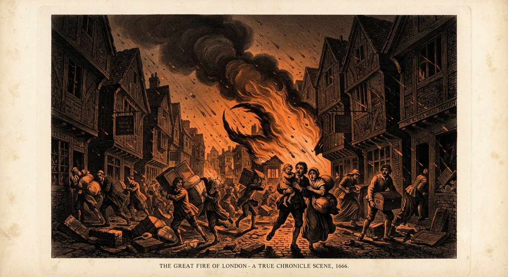
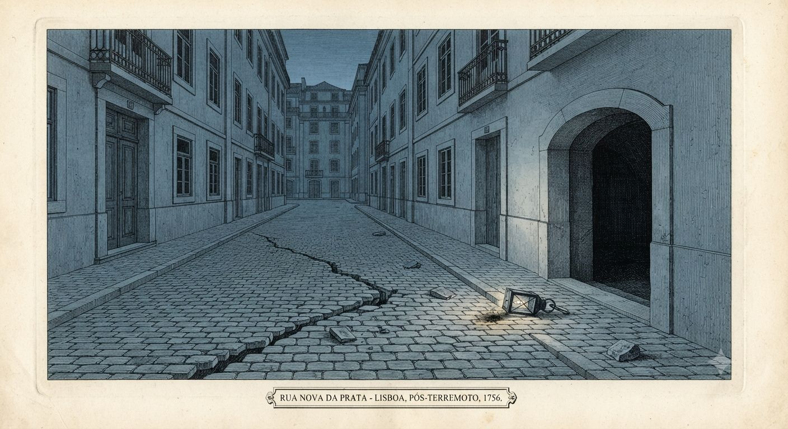
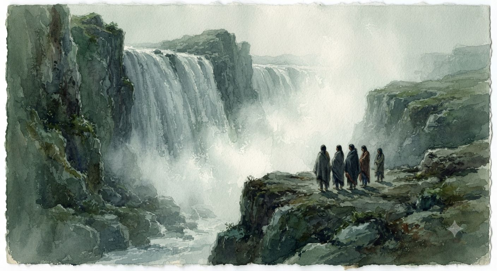

# Żywiołaki

Żywiołaki to chwilowe albo trwałe uosobienia energii ognia, wody, ziemi i powietrza. Rodzi je katastrofa albo natura na tyle dzika i nieprzerwana, że sama staje się źródłem mocy. Nie ma ich wiele — świat liczy je w dziesiątkach, nie w setkach, a większość gaśnie w ciągu dni od powstania.

Nie są inteligentne. Działają instynktownie, zgodnie z naturą żywiołu, z którego powstały, bez planu i bez złośliwości — co nie czyni ich bezpieczniejszymi.

---

## Dwie genezy

Katastrofa jest źródłem najczęstszym. Pożar, trzęsienie ziemi, powódź, potężna burza — gdy zjawisko przekracza pewien próg gwałtowności, zostawia po sobie coś więcej niż zniszczenie. Wielkość takiego żywiołaka rośnie z intensywnością źródła. Ten sam pożar rodzi w pierwszej godzinie coś wielkości człowieka; po trzech dniach niepohamowanego płomienia — coś wielkości ulicy.

Zabicie żywiołaka katastroficznego nie kończy zjawiska, jeśli katastrofa wciąż trwa. Zgładzony wraca w ciągu godzin, dopóki płonie, trzęsie się albo wieje. Dopiero wygaśnięcie źródła — pożar strawiony, wstrząsy ustały — daje szansę, by żywiołak rozwiał się na dobre. Większość tak właśnie kończy.

Druga geneza jest rzadsza i cichsza. Nie każdy żywiołak potrzebuje katastrofy — wystarczy siła natury na tyle nieprzerwana i skrajna, że utrzymuje się latami albo wiekami. Prąd oceaniczny, który nigdy nie słabnie. Wulkan w ciągłej aktywności. Pustynia, po której wiatr przesuwa wydmy bez końca. Taka geneza bywa spokojniejsza od katastroficznej, ale nie musi — zależy wyłącznie od charakteru zjawiska, które ją karmi.

> [!mechanics]
> **System:** Elemental (GURPS Dungeon Fantasy Monsters / Basic Set) jako baza; Terrain Adaptation zgodnie z żywiołem
> **Inteligencja:** IQ 4–6, bez taktyki i mowy — zachowanie czysto instynktowne
> **Skala:** ST i HP skalowane z intensywnością źródła; MG dostosowuje od pojedynczego starcia po zagrożenie obszarowe
> **Trwałość:** żywiołak katastroficzny znika z wygaśnięciem źródła; żywiołak trwały nie znika, dopóki trwa zjawisko, które go karmi
> **Wrogość wobec Daemony:** instynktowna agresja wobec bytów spoza planu materialnego wykrytych w zasięgu — traktować jak Berserk wyzwalany obecnością [[Daemony|Daemona]], nie wolą właściciela terenu

## Ogień i woda

Żywiołaki przeciwnych żywiołów atakują się nawzajem bez rozkazu, nawet gdy nikt nimi nie kieruje. Żywiołak ognia i żywiołak wody, postawione blisko siebie, walczą z instynktu — sprzeczność natury, nie decyzja.

Żywiołak ziemi porusza się wolniej niż idący człowiek. Ucieczka w budynku nie pomaga — czuje kroki przez fundament, nie przez powietrze, więc mury nie dają schronienia, jakie dają przed innym drapieżnikiem. Żywiołak powietrza jest jedynym typem niewidocznym dla oka. Zdradza go wyłącznie to, co porywa: liście, dym, płachty tkaniny wyrwane z linii.

## Wielki Pożar Londynu

Pożar zaczęty w piekarni przy Pudding Lane we wrześniu 1666 roku strawił większość miasta w trzy dni. Katastrofa była na tyle gwałtowna, że zaczęła rodzić żywiołaki ognia, a te wzmagały płomień dalej. Dzienniki urzędników z epoki opisują ogień „zachowujący się jak żywy". Oficjalna kronika obwinia wiatr. Londyńczycy wiedzą swoje.

Zjawisko wygasło z pożarem. Żaden żywiołak nie przetrwał odbudowy miasta — geneza była czysto katastroficzna, bez trwałego źródła podtrzymującego ją po ugaszeniu ostatniego płomienia.

## Lizbona

Trzęsienie ziemi z 1 listopada 1755 roku, w poranek Wszystkich Świętych, zrównało miasto z ziemią. Tu zjawisko nie wygasło z katastrofą. Żywiołaki ziemi zostały pod odbudowanym miastem i wynurzają się do dziś, w 1802 roku — pęka bruk, drży fundament, piwnica potrafi zacisnąć się na człowieku. Inżynierowie markiza Pombala nie umieją tego nazwać. Kapłani nie umieją wygnać.

Kalabria przeżyła w 1783 roku trzęsienie równie krwawe, mniej znane poza Włochami. Obudziło własne żywiołaki ziemi w południowej części półwyspu. Neapol ukrywa ich istnienie staranniej niż Lizbona ukrywała swoje — Burbonowie boją się utraty twarzy wobec reszty Europy bardziej, niż boją się samego zjawiska.

Wenecja nie ma udokumentowanego przypadku, ale ma coś gorszego: pewność, że nigdy by nie odróżniła jednego od drugiego. Miasto budowane na palach wbitych w bagno osiada z naturalnych przyczyn od stuleci — nierówno, nieprzewidywalnie, tak jak osiada każde miasto na miękkim gruncie. Inżynierzy miejscy prowadzą od pokoleń nieoficjalny rejestr „niepokojących" osiadań, nie dlatego że wiedzą o żywiołaku, lecz dlatego że nie potrafią wykluczyć jego istnienia z samej tylko obserwacji gruntu. Niepewność jest gorsza od potwierdzenia — nikt nie wie, kiedy przestać się martwić.

## Miejsca trwałej mocy

Etna i Wezuwiusz karmią swoje żywiołaki ognia nie jedną erupcją, lecz nieprzerwaną aktywnością wulkaniczną — geneza trwała, nie katastroficzna. Mieszkańcy okolicznych wsi nadali im imiona i traktują wybuchy jak humory znanej, kapryśnej istoty, nie jak klęskę żywiołową bez twarzy.

Sahara rodzi żywiołaki piasku, uznawane przez miejscowe ludy za odrębny gatunek od żywiołaków ziemi — szybsze, prawie niewidzialne w burzy, karmione bezkresem pustyni, nie jednym wydarzeniem. Step rosyjski budzi rzadkie żywiołaki powietrza podczas *buranów*, zimowych zawiei — Kozacy nazywają je swoimi zmarłymi, wracającymi po zapłatę za stare krzywdy, choć geneza jest ta sama co na Saharze: nie jedna burza, lecz sam charakter stepu, otwartego i nieprzerwanego.

Wodospad Niagara ma niemal na pewno żywiołaka wody, karmionego wiecznym spadkiem rzeki. Rdzenni mieszkańcy znali go, zanim przybyli Europejczycy.

## Wiara i interpretacja

Kościół katolicki nie uznaje żywiołaków za odrębną kategorię bytów. Klasyfikuje je jako przejaw gniewu Bożego albo działanie [[Daemony|demonów]] — nigdy jako zjawisko naturalne. Egzorcyzm próbowany na żywiołaku ziemi w Lizbonie nie działa, co teologowie tłumaczą na kilkanaście sprzecznych sposobów, żaden w pełni nie przekonuje reszty.

Protestanccy kaznodzieje w [[Stany Zjednoczone|Stanach]], którzy słyszeli o lizbońskim trzęsieniu, cytują je jako dowód boskiej kary za katolicki grzech. Nie wiedzą nic o żywiołakach — budują całą teologię na niepełnej informacji, powtarzaną z ambony jako pewnik.

Wśród [[Rdzenne narody Ameryki Północnej|rdzennych narodów]] żywiołak Niagary bywa mylony z lokalnym duchem opiekuńczym. Rozróżnienie między jednym a drugim jest przedmiotem sporu między starszyzną różnych narodów, nierozstrzygniętego od pokoleń — nie brakiem wiedzy, lecz różnicą tradycji, z których żadna nie ustępuje.

Islam ma własną kategorię bliską żywiołakom: dżinny, stworzone z bezdymnego ognia. Uczeni muzułmańscy spierają się, czy europejski żywiołak ognia i arabski dżinn to ta sama istota widziana przez dwie kultury, czy coś fundamentalnie różnego. Spór nie ma rozstrzygnięcia w tym świecie — dżinny pustyni, jakie spotykali krzyżowcy pod Lewantem, wywodzą się z zupełnie innej genezy niż żywiołaki, z [[Fey|Planu Snów]], nie z katastrofy ani z trwałej siły natury. Z zewnątrz obie kategorie wyglądają podobnie. Żaden uczony żadnej ze stron nie miał okazji zbadać ich razem na tyle blisko, by odróżnić jedno od drugiego z pewnością.

## Zabobon górniczy

Górnicy Rzeszy i Kornwalii mają własny, nieoficjalny system pukania w ścianę chodnika przy zawale, przekazywany z ojca na syna jako sposób „uspokojenia" ziemi. Nie działa. Żaden udokumentowany przypadek żywiołaka ziemi w europejskiej kopalni nie istnieje — zjawisko wymaga katastrofy na skalę miejską albo trwałej siły natury, nie pojedynczego zawału sztolni. Górnicy pukają mimo to. Wiara w metodę przetrwała bez jednego potwierdzonego przypadku, który by ją uzasadniał.

## Ślady i zagadki

Powódź w Holandii z 1421 roku, znana jako Dzień świętej Elżbiety, zatopiła kilkadziesiąt wsi. Lokalne podania mówią o żywiołaku wody wciąż czającym się w zalanych polderach. Holendrzy budują groble z dodatkową marżą bezpieczeństwa, nie tłumacząc głośno dlaczego — praktyka przetrwała cel, dla którego powstała.

W Wenecji krąży legenda o architekcie sprzed dwustu lat, który miał świadomie zaprojektować fundamenty jednego z pałaców tak, by „uspokoić" grunt pod nim. Pałac nigdy nie osiadł bardziej niż budynki sąsiednie. Miejscowi uznają to za dowód. Inżynierowie za zbieg okoliczności. Żadna strona nie ma sposobu, by przekonać drugą.

Wśród ksiąg skonfiskowanych przez [[Inkwizycja|Inkwizycję]] w Portugalii, opisujących pakty żeglarzy z bytami wody i sztormu, krążą fragmenty dotyczące „przywoływania" żywiołaków na zawołanie. Teoretycznie niemożliwe — żywiołaka rodzi katastrofa albo trwała siła natury, nie rytuał wypowiedziany nad stołem. Same księgi istnieją mimo to, a nikt, kto je widział, nie potrafi wytłumaczyć dlaczego ktoś je kiedyś spisał.

## Dawniejszy świat

Wśród naturalnych filozofów krąży teoria nigdy w pełni nieudowodniona: że w dawniejszych wiekach żywiołaków było znacznie więcej, a [[Fey|feyów]] znacznie mniej niż dziś. Świat sprzed gęstego osadnictwa był dzikszy — więcej nietkniętej puszczy, więcej wybrzeży bez portu, więcej rzek bez młyna. Taki świat karmił żywiołaki obficiej, bo ich geneza trwała wymaga właśnie tego rodzaju nieprzerwanej dziczy.

Fey rosną z opowieści, nie z dzikości terenu. Rosnące miasta, gęstniejące tradycje, powtarzane pokoleniami legendy dają im więcej materiału niż kiedykolwiek wcześniej — dokładnie w czasie, gdy cywilizacja odbiera przestrzeń żywiołakom. Teoria nie ma dowodu twardszego niż zestawienie starych kronik z nowymi, ale zestawienie jest uderzające: im starszy dokument, tym częściej pojawia się w nim żywiołak; im nowszy, tym częściej fey.

> [!rules]
> **Rzadkość:** świat liczy żywiołaki w dziesiątkach, nie w setkach; większość MG-owskich kampanii nie spotka więcej niż jednego lub dwóch na całą grę
> **Geneza katastroficzna:** wymaga zdarzenia przekraczającego próg gwałtowności miejskiej skali (wielki pożar, trzęsienie, wielka powódź); mija z wygaśnięciem źródła
> **Geneza trwała:** wymaga nieprzerwanej, skrajnej siły natury (wulkan czynny, prąd oceaniczny, pustynia, step); nie mija, dopóki trwa źródło
> **Rozpoznanie w terenie:** brak niezawodnej metody; nawet po fakcie trudno odróżnić żywiołaka od zwykłego, ekstremalnego zjawiska naturalnego

---

*Powiązane artykuły: [[Portugalia]], [[Fey]], [[Daemony]], [[Krucjaty]], [[Rdzenne narody Ameryki Północnej]], [[Inkwizycja]], [[Punkty rozbieżności]], [[Chronologia]].*
